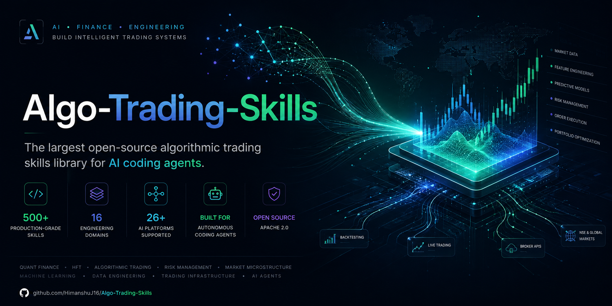

# Algo-Trading-Skills

### The largest open-source algorithmic trading skills library for AI agents

[](LICENSE)
[](#whats-inside--16-categories)
[](docs/ROADMAP_500.md)
[](#whats-inside--16-categories)
[](#compatible-platforms)
[](https://agentskills.io)
[](CONTRIBUTING.md)

**504 production-grade algorithmic trading skills · 16 engineering domains · 5 regulatory & exchange frameworks · agentskills.io standard · Works with Claude Code, GitHub Copilot, Codex CLI, Cursor, Gemini CLI & 26+ platforms · Apache 2.0**

[Get Started](#quick-start) · [What's Inside](#whats-inside--16-categories) · [Frameworks & Standards](#five-regulatory--exchange-frameworks-one-skill-library) · [Platforms](#compatible-platforms) · [Contributing](#contributing)

---

> ⚠️ **Community Project** — This is an independent, community-created project. Not affiliated with Anthropic PBC or any broker, exchange, or vendor referenced in this repository.
> 
> 📈 **Engineering Guidance, Not Financial Advice** — Authorized & lawful use only. These skills encode production engineering practices for trading infrastructure. They do not guarantee strategy profitability and do not eliminate the risk of capital loss in live trading. Only deploy against paper accounts or live environments where risk limits are strictly enforced. See [SECURITY.md](SECURITY.md) and [CODE_OF_CONDUCT.md](CODE_OF_CONDUCT.md).

---

## Give any AI agent the trading-infrastructure instincts of a senior quant engineer

An AI coding agent can write a WebSocket client, a backtest loop, or an order-placement function that looks completely correct — right library calls, clean structure, plausible logic — and still fail catastrophically in production for reasons that have nothing to do with code syntax: a broker invalidates a token overnight in a way its docs don't mention, a backtest silently uses a bar's own close to predict its own direction, a risk limit lives inside the same function it's supposed to constrain, or a WebSocket callback blocks the read loop during exactly the volatility spike a strategy exists to catch.

**Your AI agent doesn't know these failure modes — unless you give it these skills.**

This repo contains **504 structured skills** spanning **16 engineering domains**, each following the [agentskills.io](https://agentskills.io) open standard. The library maps across key financial regulatory & exchange frameworks — SEC Rule 15c3-5, Reg NMS / Reg SHO, FINRA, EU MiFID II / RTS 6 / MAR, UK FCA, ASIC, SEBI, and ISDA OTC derivative standards. Clone it, point your agent at it, and your next trading system deployment gets expert-level quant infrastructure guidance in seconds.

---

## Five regulatory & exchange frameworks, one skill library

Each skill maps to the industry standards, exchange protocols, and regulatory mandates that fit its subject:

| Framework / Standard | Scope | What It Maps | Key Mapped Skills |
|---|---|---|---|
| **US SEC / FINRA** | SEC Rule 15c3-5, Reg NMS Rule 611, Reg SHO, PDT Rule 4210, Form 1099-B | Pre-trade risk controls, order protection, short sale locates, pattern day trading, tax lot reconciliation | `us-reg-nms-order-protection-rule-compliance`, `us-reg-sho-short-sale-locate-requirements`, `sec-rule-15c3-5-risk-controls-us`, `wash-sale-rule-tracking-us` |
| **EU MiFID II / RTS 6 / MAR** | MiFID II Article 48, RTS 6 organizational requirements, MAR market abuse surveillance | System resilience, kill switches, OTR limits, wash trade & spoofing self-detection, double volume caps | `mifid-ii-algo-trading-compliance-eu`, `wash-trade-and-spoofing-self-detection`, `eu-market-abuse-regulation-mar-surveillance` |
| **UK FCA & Senior Managers Regime** | FCA SYSC 25, MIFIDPRU, Senior Managers & Certification Regime (SM&CR) | Algorithmic trading system controls, algorithmic accountability, key person governance | `uk-fca-algorithmic-trading-systems-controls`, `uk-senior-managers-regime-algo-accountability` |
| **Global Regulatory (ASIC, SEBI, MAS, IIROC)** | ASIC MIR, SEBI Algo Circulars, MAS Cyber Hygiene, IIROC Electronic Trading | Regional exchange order tagging, circuit breakers, risk-gate dependencies, kill switches | `asic-market-integrity-rules-automated-trading`, `india-sebi-algo-trading-tagging-requirements`, `mas-singapore-algo-trading-guidelines` |
| **ISDA & OTC Derivatives** | ISDA Master Agreement, SPAN Margin, Options Greeks, Variance Swaps | Collateral management, cross-margining, delta hedging, synthetic TRS exposure, volatility derivatives | `options-margin-span-calculation-global`, `total-return-swap-synthetic-exposure`, `variance-swap-and-volatility-derivative-pricing` |

### Example — Each skill maps directly to regulatory mandates, broker APIs, and institutional standards:

| Skill | Primary Regulatory / Exchange Standard | Broker / Platform Touchpoints | Operational Safety Target |
|---|---|---|---|
| [`order-placement-idempotency`](skills/order-placement-idempotency/) | SEC Rule 15c3-5 / MiFID II RTS 6 | Fyers, Zerodha, Breeze, Upstox, Alpaca, IBKR | Zero duplicate executions on reconnection |
| [`kill-switch-and-drawdown-circuit-breakers`](skills/kill-switch-and-drawdown-circuit-breakers/) | SEC Rule 15c3-5 (Pre-Trade Controls) | Universal / Broker-Agnostic | Instant capital protection on drawdown breach |
| [`wash-trade-and-spoofing-self-detection`](skills/wash-trade-and-spoofing-self-detection/) | EU MAR / FINRA Rule 5210 | Exchange Order Feeds | Pre-trade self-cross prevention & cancellation audit |
| [`us-reg-sho-short-sale-locate-requirements`](skills/us-reg-sho-short-sale-locate-requirements/) | US SEC Reg SHO Rule 203(b)(1) | US Equity Brokers / Prime Brokers | Mandatory pre-short locate verification & buy-in tracking |
| [`withdrawal-velocity-limits-and-anomaly-detection`](skills/withdrawal-velocity-limits-and-anomaly-detection/) | MAS Cyber Hygiene / Custody Risk | Coinbase, Fireblocks, BitGo, HSM | Automated hot wallet freeze on velocity breach |

---

## Quick start

```bash
# Option 1: Git clone (recommended)
git clone https://github.com/HimanshuJ16/Anthropic-Algo-Trading-Skills.git
cd Anthropic-Algo-Trading-Skills

# Option 2: Validate all 504 skills locally
python tools/validate_skills.py   # verifies structure & frontmatter (504/504 pass)
```

Works immediately with Claude Code, GitHub Copilot, OpenAI Codex CLI, Cursor, Gemini CLI, and any agentskills.io-compatible platform.

---

## Why this exists

The quantitative trading and financial software engineering domain requires deep practitioner knowledge across market microstructure, exchange protocols, and risk engineering. AI agents can help build and scale trading infrastructure — but only if they have structured practitioner playbooks to work from. Today's generic LLMs can write Python code and API wrappers, but they lack the operational context that turns generic code into institutional-grade trading systems.

Existing trading libraries give you broker SDKs, indicator formulas, or naive strategy backtests. None of them give an AI agent the structured decision-making workflow a senior quant infrastructure engineer follows: when to use each technique, what prerequisites to check, how to execute step-by-step, and how to verify results in production. That is the gap this project fills.

**Anthropic Algo-Trading-Skills** is not a collection of toy scripts. It is an AI-native knowledge base built from the ground up for the [agentskills.io](https://agentskills.io) standard — YAML frontmatter for sub-second discovery, structured Markdown for step-by-step execution, and reference files for deep technical context. Every skill encodes real practitioner workflows, not generic LLM summaries.

---

## What's inside — 16 categories

The library covers 16 core engineering domains spanning domestic and global markets — crypto exchanges, forex brokers, multi-currency and multi-timezone data handling, regulatory compliance, multi-asset derivatives, execution algorithms, custody/security, cross-strategy portfolio management, market microstructure, alternative-data research, and tax/accounting.

| Domain | Built | Total Tracked | Key capabilities |
|---|---|---|---|
| [`broker-integration`](skills/) | **20** | 20 | Headless auth (REST + Selenium), token lifecycle via live probing, order idempotency, per-broker rate limiting, borrow cost modeling, cost budgeting |
| [`real-time-architecture`](skills/) | **30** | 30 | Producer-consumer tick pipelines, burst-safe buffering, explicit backpressure policy, WebSocket reconnection without duplicate subscriptions |
| [`backtesting-methodology`](skills/) | **35** | 35 | Lookahead bias elimination, walk-forward validation, realistic slippage/fee/latency simulation, synthetic data generation, standardized tearsheets |
| [`financial-ml`](skills/) | **38** | 38 | Leakage-free feature engineering, offline-train/online-infer deployment, triple barrier labeler, sample weighting, model staleness detection |
| [`risk-management`](skills/) | **39** | 39 | Kill switches and drawdown circuit breakers, correlation-aware exposure limits, Kupiec test VaR backtesting, tail risk hedging, risk escalation matrices |
| [`deployment-ops`](skills/) | **30** | 30 | systemd process supervision, paper-to-live promotion checklist, IaC for trading hosts, canary releases, chaos engineering, secrets vault |
| [`global-market-integration`](skills/) | **44** | 44 | Crypto exchange APIs (Binance/Coinbase/Kraken/Deribit/Bybit/OKX), FX (OANDA/MT5), CME Globex, Eurex, HKEX, SGX, ASX, JPX, CBOE, LSE, Xetra |
| [`regulatory-compliance-global`](skills/) | **38** | 38 | US SEC Rule 15c3-5, PDT, FINRA, EU MiFID II/RTS 6/MAR, UK FCA, ASIC, MAS, India SEBI, Canada IIROC, Hong Kong SFC, Japan FSA |
| [`multi-asset-derivatives`](skills/) | **28** | 28 | SPAN margin calculation, futures contract roll automation, real-time Greeks aggregation, perpetual futures funding rates, variance swaps, CDS, quanto options |
| [`execution-algorithms`](skills/) | **33** | 33 | TWAP/VWAP order slicing, POV execution, implementation shortfall minimization, iceberg detection, smart order routing (SOR), dark pool routing, auctions |
| [`data-management-global`](skills/) | **37** | 37 | Global exchange holiday calendars, DST transition handling, multi-timezone session scheduling, multi-currency P&L, ISIN/CUSIP/SEDOL cross-referencing |
| [`crypto-custody-security`](skills/) | **29** | 29 | Wallet key custody, hot-cold split, withdrawal whitelisting, multi-sig approval, HSM integration, Shamir secret sharing, MPC custody |
| [`portfolio-multi-strategy`](skills/) | **30** | 30 | Cross-strategy correlation monitoring, performance-based capital reallocation, strategy retirement criteria, risk parity allocation, meta-strategy signal arbitration |
| [`market-microstructure-latency`](skills/) | **24** | 24 | Colocation latency budgets, PTP clock sync, tick-to-trade measurement, order book signals, adverse selection measurement, FPGA/microwave evaluation |
| [`quant-research-alt-data`](skills/) | **20** | 20 | Satellite imagery signals, credit card transaction data, web-scraped sentiment, supply chain networks, Google Trends, social media bot filtering, transcript NLP |
| [`tax-accounting-reporting-global`](skills/) | **16** | 16 | US wash sale tracking, FIFO vs specific-lot accounting, Section 475 MTM election, crypto tax lot tracking, 1099-B reconciliation, Section 1256 futures tax |

Full indexed list with build status: [`index.json`](index.json). Full 504-entry roadmap with one-line scope for every skill: [`docs/ROADMAP_500.md`](docs/ROADMAP_500.md).

---

## How AI agents use these skills

Each skill costs ~30-50 tokens to scan (frontmatter only) and 500-1,500 tokens to fully load (complete workflow). This progressive disclosure architecture lets agents search all 504 skills in a single pass without blowing context windows.

User prompt: *"My Fyers bot's live orders keep getting placed twice after a timeout"*

Agent's internal process:

```text
  1. Scans 504 skill frontmatters (~30-50 tokens each)
     → identifies order-placement-idempotency and token-lifecycle-live-probing as top matches.

  2. Loads top match: skills/order-placement-idempotency/SKILL.md
     → follows the structured Workflow section: classify timeout as ambiguous (not failed),
       reconcile against broker order book before any retry.

  3. Loads references/workflows.md for full sequence diagrams and
     scripts/order_ledger.py for working helper logic.

  4. Validates results using the Verification section
     → confirms a simulated network timeout no longer produces duplicate executions.
```

Without these skills, the agent guesses at retry logic and doubles order risk. With them, it follows the exact playbook a senior trading engineer would use.

---

## Skill anatomy

Every skill follows a consistent directory structure:

```text
skills/order-placement-idempotency/
├── SKILL.md              ← Skill definition (YAML frontmatter + Markdown body)
├── references/
│   ├── standards.md      ← Broker/framework coverage + regulatory touchpoints
│   └── workflows.md      ← Deep technical procedure reference
├── scripts/
│   └── order_ledger.py   ← Working helper script
└── assets/
    └── checklist.md      ← Printable sign-off checklist
```

### YAML frontmatter (real example)

```yaml
---
name: order-placement-idempotency
description: >-
  Use whenever a bot places, modifies, or cancels live orders and must
  guarantee it never double-executes an order due to retries, timeouts,
  or reconnects
domain: algorithmic-trading
subdomain: broker-integration
tags: ["broker-integration", "fyers-api-v3", "zerodha-kite-connect", "icici-breeze-api"]
brokers_frameworks: ["Fyers API v3", "Zerodha Kite Connect", "ICICI Breeze API", "Upstox API v2", "Alpaca Trading API", "IBKR API"]
version: "1.0"
author: algo-trading-skills-contributors
license: Apache-2.0
---
```

### Markdown body sections

```text
## When to Use          Trigger conditions — when should an AI agent activate this skill?
## Prerequisites        Required tools, access, and environment setup.
## Workflow             Step-by-step execution guide with specific decision points.
## Common Pitfalls      Named, specific failure modes this skill prevents.
## Verification         How to confirm the skill was executed successfully.
## Related Skills       Cross-links to other skills in this repo.
```

`tools/validate_skills.py` enforces this structure in CI (see `.github/workflows/validate-skills.yml`).

---

## Compatible platforms

### AI code assistants
Claude Code (Anthropic) · GitHub Copilot (Microsoft) · Cursor · Windsurf · Cline · Aider · Continue · Roo Code · Amazon Q Developer · Tabnine · Sourcegraph Cody · JetBrains AI

### CLI agents
OpenAI Codex CLI · Gemini CLI (Google)

### Autonomous agents
Devin · Replit Agent · SWE-agent · OpenHands

### Agent frameworks & SDKs
LangChain · CrewAI · AutoGen · Semantic Kernel · Haystack · Vercel AI SDK · Any MCP-compatible agent

All platforms that support the [agentskills.io](https://agentskills.io) standard can load these skills with zero configuration.

---

## Releases & Build Verification

| Version | Highlights | Status |
|---|---|:---:|
| **v1.0.0** | 504 skills · 16 domains · Full Python test suites & documentation · `tools/validate_skills.py` verified | **100% Passed (504/504)** |

---

## Contributing

This project grows through community contributions. Here is how to get involved:

- **Add a new skill** — Follow the template and frontmatter structure enforced by `tools/validate_skills.py` and submit a PR.
- **Improve existing skills** — Update workflows, refine code engines, add unit tests, or extend regulatory mappings.
- **Report issues** — Found an edge case or missing failure mode? Open an issue.

Every PR is reviewed for technical accuracy and `agentskills.io` standard compliance.

---

## Citation

If you use this project in research or publications:

```bibtex
@software{anthropic_algo_trading_skills,
  author       = {Jangir, Himanshu},
  title        = {Anthropic Algo-Trading-Skills},
  year         = {2026},
  url          = {https://github.com/HimanshuJ16/Anthropic-Algo-Trading-Skills},
  license      = {Apache-2.0},
  note         = {504 structured algorithmic trading skills for AI agents,
                  mapped to SEC Rule 15c3-5, Reg NMS, MiFID II, FCA, SEBI, and ISDA standards}
}
```

---

## License

This project is licensed under the [Apache License 2.0](LICENSE). You are free to use, modify, and distribute these skills in both personal and commercial projects.

---

If this project helps your quantitative trading work, consider giving it a ⭐

⭐ **Star** · 🍴 **Fork** · 💬 **Discuss** · 📝 **Contribute**

*Community project by [@HimanshuJ16](https://github.com/HimanshuJ16). Not affiliated with Anthropic PBC or any broker referenced in this repository.*
