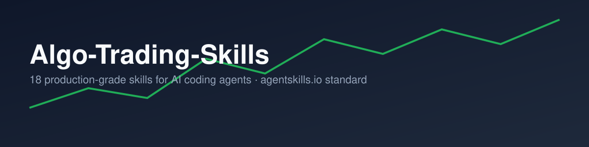

# Algo-Trading-Skills

### A structured algorithmic trading skills library for AI coding agents

[](LICENSE)
[](#whats-inside--16-categories)
[](docs/ROADMAP_500.md)
[](#whats-inside--16-categories)
[](#compatible-platforms)
[](https://agentskills.io)
[](CONTRIBUTING.md)

**28 production-grade algorithmic trading skills built · 502 skills tracked across a global research roadmap spanning 16 engineering domains · broker/exchange coverage spanning India (Fyers, Zerodha Kite, ICICI Breeze, Upstox), US (Alpaca, IBKR, Schwab, TradeStation), global crypto (Binance, Coinbase, Kraken, Deribit), forex (OANDA, MT5), and dozens more venues in the roadmap · agentskills.io standard**

> **Status note:** this repo is mid-expansion from an India-first initial pass to global coverage. 28 skills currently have the full `SKILL.md` + `references/` + `scripts/` + `assets/` structure and pass `tools/validate_skills.py`. A further 474 are tracked as titled, scoped entries in [`docs/ROADMAP_500.md`](docs/ROADMAP_500.md) — a prioritized research backlog covering global exchanges, regulatory regimes, execution algorithms, custody, and more, not finished work. Broker/regulatory specifics in planned entries should be verified against current sources before being built out into a real skill. See [Contributing](#contributing) if you want to help.

[Get Started](#quick-start) · [What's Inside](#whats-inside--16-categories) · [Skill Anatomy](#skill-anatomy) · [Platforms](#compatible-platforms) · [Contributing](#contributing)

---

> **Community Project.** This is an independent, community-created skills library. Not affiliated with Anthropic PBC or any broker named in this repo.
>
> **Engineering guidance, not financial advice.** These skills encode production engineering practices for trading infrastructure. They do not guarantee the profitability of any strategy and do not eliminate the risk of loss in live trading. See the [Disclaimer](#disclaimer).

## Give any AI agent the instincts of a senior trading-infrastructure engineer

An AI coding agent can write a WebSocket client, a backtest loop, or an order-placement function that looks completely correct — right library calls, clean structure, plausible logic — and still fail in production for reasons that have nothing to do with code quality: a broker invalidates a token overnight in a way its docs don't mention, a backtest silently uses a bar's own close to predict its own direction, a risk limit lives inside the same function it's supposed to constrain, a WebSocket callback blocks the read loop during exactly the volatility spike a strategy exists to catch.

**Your AI agent doesn't know these failure modes — unless you give it these skills.**

This repo contains **18 structured skills** spanning **6 engineering domains** of algorithmic trading infrastructure, each following the [agentskills.io](https://agentskills.io) open standard, drawn from a real, running Nifty 50 options trading platform: dual-broker authentication (Fyers REST + ICICI Breeze via Selenium), an ML signal classifier with walk-forward validation, a producer-consumer tick pipeline with explicit backpressure policy, correlation-aware position sizing, and systemd-supervised deployment.

## Why this exists

Cybersecurity has [Anthropic-Cybersecurity-Skills](https://github.com/mukul975/Anthropic-Cybersecurity-Skills), an 800+ skill library mapped to MITRE ATT&CK and NIST, giving AI agents the structured decision-making a senior security analyst follows. Algorithmic trading has had no comparable resource — existing repos give you broker SDKs, indicator libraries, or strategy templates, but none give an agent the practitioner playbook for *when* to use a technique, what to check first, how to execute it step by step, and how to verify it actually worked.

This is a first pass at that resource for trading: not hundreds of skills, but 18 that are each deep enough to prevent a specific, named class of production bug. Quality over volume — every skill here answers yes to: *would this have actually prevented a real production bug, and is it specific enough for an agent to follow step-by-step rather than nod along with generic advice?*

## What's inside — 16 categories

The first 6 categories are the original India-first pass; the next 10 extend the
same quality bar to global markets — crypto exchanges, forex brokers, multi-currency
and multi-timezone data handling, non-Indian regulatory regimes, multi-asset
derivatives, execution algorithms, custody/security, cross-strategy portfolio
management, market microstructure, alternative-data research, and tax/accounting.

| Domain | Built | Tracked (built+planned) | Key coverage |
|---|---|---|---|
| [`broker-integration`](skills/) | 4 | 36 | Headless auth (REST + Selenium), token lifecycle via live probing, order idempotency, per-broker rate limiting |
| [`real-time-architecture`](skills/) | 4 | 30 | Producer-consumer tick pipelines, burst-safe buffering, explicit backpressure policy, WebSocket reconnection without duplicate subscriptions |
| [`backtesting-methodology`](skills/) | 3 | 30 | Lookahead bias elimination, walk-forward validation, realistic slippage/fee/latency simulation |
| [`financial-ml`](skills/) | 3 | 38 | Leakage-free feature engineering, offline-train/online-infer deployment without train/serve skew, live model staleness detection |
| [`risk-management`](skills/) | 2 | 39 | Kill switches and drawdown circuit breakers, correlation-aware exposure limits |
| [`deployment-ops`](skills/) | 2 | 30 | systemd process supervision, the paper-to-live promotion gate |
| [`global-market-integration`](skills/) | 2 | 44 | Crypto exchange APIs (Binance/Coinbase/Kraken), forex brokers (OANDA/MT5), dozens of global venues in roadmap |
| [`regulatory-compliance-global`](skills/) | 2 | 38 | US Pattern Day Trader rule, EU MiFID II/RTS 6, and a global regulatory roadmap (CFTC, IIROC, SFC, FSA, SEBI, ASIC, MAS, FINMA...) |
| [`multi-asset-derivatives`](skills/) | 1 | 28 | Options/futures SPAN-style margin estimation |
| [`execution-algorithms`](skills/) | 1 | 33 | TWAP/VWAP order slicing |
| [`data-management-global`](skills/) | 3 | 37 | Global exchange holiday calendars, multi-timezone/DST-safe scheduling, multi-currency P&L |
| [`crypto-custody-security`](skills/) | 1 | 29 | Crypto wallet/API-key custody and permission scoping |
| `portfolio-multi-strategy` | 0 | 30 | *(planned — see roadmap)* |
| `market-microstructure-latency` | 0 | 24 | *(planned — see roadmap)* |
| `quant-research-alt-data` | 0 | 20 | *(planned — see roadmap)* |
| `tax-accounting-reporting-global` | 0 | 16 | *(planned — see roadmap)* |

Full indexed list with build status: [`index.json`](index.json). Full 502-entry
roadmap with one-line scope for every planned skill: [`docs/ROADMAP_500.md`](docs/ROADMAP_500.md).

### The 28 built skills

| Skill | Category |
|---|---|
| `headless-broker-auth-patterns` | broker-integration |
| `token-lifecycle-live-probing` | broker-integration |
| `order-placement-idempotency` | broker-integration |
| `multi-broker-rate-limit-handling` | broker-integration |
| `producer-consumer-tick-pipeline` | real-time-architecture |
| `tick-buffering-burst-handling` | real-time-architecture |
| `backpressure-drop-degrade-policy` | real-time-architecture |
| `websocket-reconnect-without-duplicate-subscriptions` | real-time-architecture |
| `lookahead-bias-elimination` | backtesting-methodology |
| `walk-forward-validation-setup` | backtesting-methodology |
| `execution-realistic-simulation` | backtesting-methodology |
| `feature-engineering-without-leakage` | financial-ml |
| `offline-train-online-infer-deployment` | financial-ml |
| `model-staleness-detection` | financial-ml |
| `kill-switch-and-drawdown-circuit-breakers` | risk-management |
| `correlation-aware-exposure-limits` | risk-management |
| `systemd-supervision-for-trading-bots` | deployment-ops |
| `paper-to-live-promotion-checklist` | deployment-ops |
| `crypto-exchange-api-integration` | global-market-integration |
| `forex-broker-integration-oanda-mt5` | global-market-integration |
| `pattern-day-trader-rule-compliance-us` | regulatory-compliance-global |
| `mifid-ii-algo-trading-compliance-eu` | regulatory-compliance-global |
| `options-margin-span-calculation-global` | multi-asset-derivatives |
| `execution-algo-twap-vwap-slicing` | execution-algorithms |
| `global-exchange-holiday-calendar-handling` | data-management-global |
| `multi-timezone-session-scheduling` | data-management-global |
| `multi-currency-pnl-and-fx-conversion` | data-management-global |
| `crypto-wallet-key-custody-security` | crypto-custody-security |

See `docs/architecture.md` for how these fit together as a system, and
`mappings/broker-api-coverage.md` / `mappings/regulatory-coverage.md` for
cross-cutting broker and regulatory touchpoints.

## Quick start

```bash
git clone https://github.com/<your-org>/algo-trading-skills.git
cd algo-trading-skills
python tools/validate_skills.py   # optional: confirms every skill's structure/frontmatter
```

Point your agent at the `skills/` directory (see [Compatible platforms](#compatible-platforms)
below for the exact wiring per tool), and it can discover and load skills by
scanning `SKILL.md` frontmatter.

## How AI agents use these skills

Each skill costs roughly 30–50 tokens to scan (frontmatter only) and 500–1,500
tokens to fully load (complete workflow in `SKILL.md`, more in `references/` if
needed). This progressive-disclosure structure — mirrored from the anatomy
below — lets an agent search all 28 built skills (and 502 tracked overall) without blowing its context window.

```
User prompt: "My Fyers bot's live orders keep getting placed twice after a timeout"

Agent's internal process:

  1. Scans 18 skill frontmatters (~30-50 tokens each)
     → identifies order-placement-idempotency and token-lifecycle-live-probing
       as the relevant matches

  2. Loads skills/order-placement-idempotency/SKILL.md in full
     → follows the Workflow section: classify timeout as ambiguous (not
       failed), reconcile against the broker order book before any retry

  3. Loads references/workflows.md for the full procedure and
     scripts/order_ledger.py for a working starting point

  4. Validates the fix using the Verification section
     → confirms a simulated timeout no longer produces a duplicate order
```

## Skill anatomy

Every skill follows a consistent directory structure:

```
skills/order-placement-idempotency/
├── SKILL.md              ← Skill definition (YAML frontmatter + Markdown body)
├── references/
│   ├── standards.md      ← Broker/framework coverage + regulatory touchpoints
│   └── workflows.md      ← Deep technical procedure reference
├── scripts/
│   └── order_ledger.py   ← Working helper script
└── assets/
    └── checklist.md      ← Sign-off checklist
```

Full anatomy and frontmatter field reference: [`docs/skill-anatomy.md`](docs/skill-anatomy.md).

### YAML frontmatter (real example)

```yaml
---
name: order-placement-idempotency
description: >-
  Use whenever a bot places, modifies, or cancels live orders and must
  guarantee it never double-executes an order due to retries, timeouts,
  or reconnects
domain: algorithmic-trading
subdomain: broker-integration
tags: ["broker-integration", "fyers-api-v3", "zerodha-kite-connect", "icici-breeze-api"]
brokers_frameworks: ["Fyers API v3", "Zerodha Kite Connect", "ICICI Breeze API", "Upstox API v2", "Alpaca Trading API", "IBKR API"]
version: "1.0"
author: algo-trading-skills-contributors
license: Apache-2.0
---
```

### Markdown body sections

```
## When to Use          Trigger conditions — when should an AI agent activate this skill?
## Prerequisites        Required tools, access, and environment setup.
## Workflow             Step-by-step execution guide with specific decision points.
## Common Pitfalls      Named, specific failure modes this skill prevents.
## Verification         How to confirm the skill was executed successfully.
## Related Skills       Cross-links to other skills in this repo.
```

`tools/validate_skills.py` enforces this structure in CI (see `.github/workflows/validate-skills.yml`).

## Compatible platforms

**AI coding agents** Claude Code · Cursor · GitHub Copilot · OpenAI Codex CLI · Gemini CLI · Windsurf · Cline · Continue

**Agent frameworks** Any framework that can read plain Markdown + YAML frontmatter from a filesystem path (LangChain, CrewAI, custom MCP-based agents, etc.)

Installation differs slightly by platform:

- **Claude Code** — copy or symlink `skills/*` into `.claude/skills/` (project-level) or `~/.claude/skills/` (global), or install via the `.claude-plugin/plugin.json` manifest if your setup supports plugin-style discovery.
- **Cursor** — point Cursor's rules/skills configuration at the cloned `skills/` directory.
- **GitHub Copilot** — reference skill files as context, or copy into `.github/copilot-instructions/` if supported.
- **Gemini CLI / other agentskills.io-compatible tools** — load directly from a cloned copy of this repo per your tool's skills-directory convention.

The format is deliberately plain (YAML frontmatter + Markdown, no platform-specific syntax) so manual copy-paste into any agent's context window always works as a fallback.

## Architecture context

The skills assume (and are easiest to apply within) a system shaped like a
producer-consumer tick pipeline feeding a strategy/ML engine, gated by an
independent risk module, behind idempotent order placement, supervised by
systemd — see [`docs/architecture.md`](docs/architecture.md) for the full
diagram and how each skill maps onto it.

## Contributing

This project grows through contributions that reflect genuine production
experience. See [`CONTRIBUTING.md`](CONTRIBUTING.md) for the process, and
`skills/` for domains that could use expansion — this first pass deliberately
covers 18 deep skills rather than attempting broad coverage; areas like
options-Greeks-specific risk modeling, multi-asset portfolio construction, and
crypto-exchange-specific integration are open for contribution.

Every PR is reviewed against the quality bar in `CONTRIBUTING.md` and the
structural checks in `tools/validate_skills.py`.

## Community

- [Issues](../../issues) — bug reports and skill proposals (templates provided)
- [Pull requests](../../pulls) — see `CONTRIBUTING.md` before opening
- [Security policy](SECURITY.md) — responsible disclosure for guidance or script vulnerabilities

## Citation

If you use this project in research or documentation, see [`CITATION.cff`](CITATION.cff).

## License

Licensed under the [Apache License 2.0](LICENSE) — free to use, modify, and
distribute in personal and commercial projects.

## Disclaimer

These skills encode engineering practices for building trading infrastructure.
They are **not financial advice**, do not guarantee the profitability of any
strategy, and following them does not eliminate the risk of loss in live
trading. Always validate thoroughly in paper trading (see
`skills/paper-to-live-promotion-checklist/SKILL.md`) before committing real
capital, and confirm the regulatory requirements applicable to algorithmic
trading in your jurisdiction independently (see
`mappings/regulatory-coverage.md`).

---

Community project. Not affiliated with Anthropic PBC or any broker referenced in this repository.
