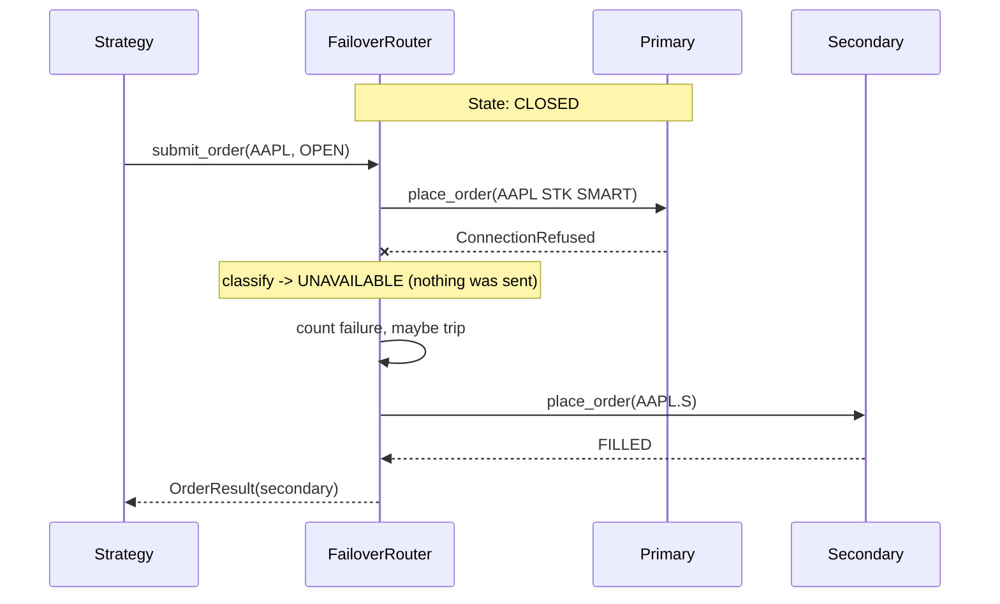
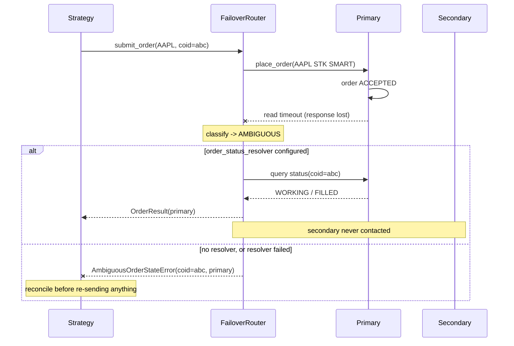
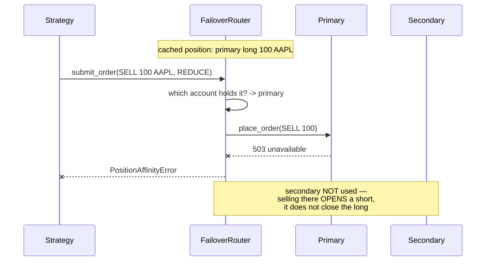
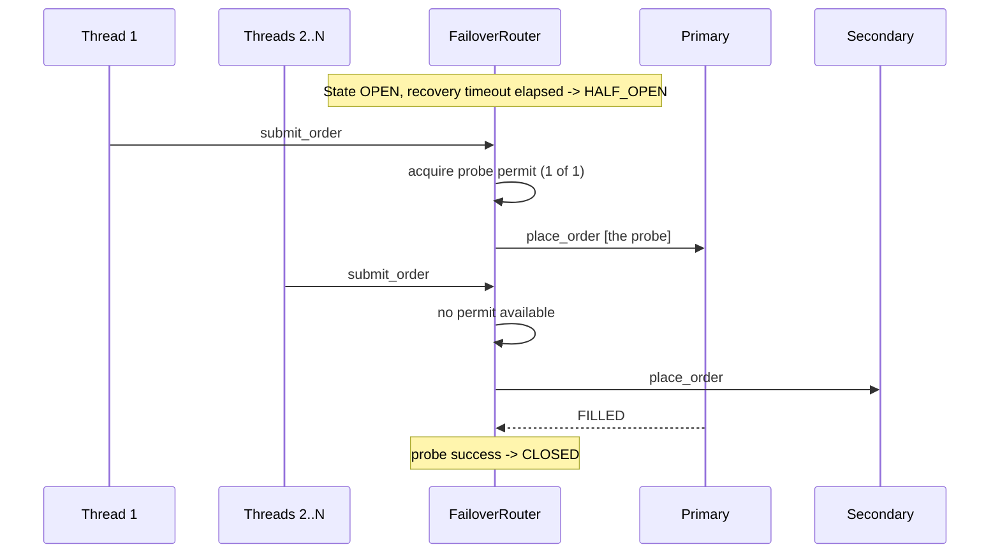

# Failover Workflow Sequences

The decisive step in every sequence below is **classification**. A failover router that
reacts to "the call raised" rather than "the call raised *this*" will duplicate orders,
launder rejections, or open positions it was asked to close.

---

## Sequence 1 — Safe failover (`UNAVAILABLE`)

The connection was refused or DNS failed, so nothing reached the broker. This is the
only shape of failure where re-sending is unambiguously correct.



---

## Sequence 2 — Ambiguous outcome (the one that duplicates)

The request was sent and the response was lost. The order may be working. **Nothing may
be re-sent anywhere.**



The wrong version of this diagram — primary errors, router immediately sends the same
order to the secondary — is what produces two live orders in two accounts that nothing
will net against.

---

## Sequence 3 — Terminal rejection (do not shop it)

```mermaid
sequenceDiagram
    participant Strategy
    participant Router as FailoverRouter
    participant Primary
    participant Secondary

    Strategy->>Router: submit_order(AAPL x 1,000,000)
    Router->>Primary: place_order(...)
    Primary-->>Router: 400 insufficient buying power
    Note over Router: classify -> REJECTED
    Router--xStrategy: BrokerError re-raised
    Note over Router,Secondary: secondary never contacted;<br/>circuit NOT counted against
```

The rejection is the primary's pre-trade risk control doing its job. Failing it over is
looking for a broker that will say yes. It also must not count toward broker health, or
a strategy emitting bad orders will trip the breaker on a healthy primary.

---

## Sequence 4 — Reducing order pinned to the holding account



The naive failover here ends the session long 100 in one account and short 100 in the
other: double gross exposure, and in US equities a sale in an account that owns nothing
(Reg SHO Rule 200(g); locate required under 203(b)(1)).

---

## Sequence 5 — Bounded half-open probing



Without the permit, every concurrent caller probes at once — N live orders to a broker
believed to be down.

---

## Phase procedure

### Phase 0 — Before enabling failover

- Place real orders through the secondary account and confirm fills, symbols, order
  types, and margin treatment. A backup never exercised is an assumption.
- Register symbol mappings for every tradable instrument; enable
  `strict_symbol_mapping=True`.
- Wire the pre-trade risk layer **above** the router so both accounts are covered, and
  confirm limits are enforced in aggregate rather than per-account.
- Implement the `order_status_resolver`. Without it, every ambiguous failure halts that
  order — safe, but operationally expensive.
- Decide and document the escalation path for `PositionAffinityError` and
  `AllBrokersUnavailableError`. Both mean a human decides.

### Phase 1 — Session start

- Seed the position cache from each broker's own position report. The router only sees
  fills it routed; anything else is invisible to it.
- Confirm both legs are reachable, and that the circuit is `CLOSED` and not manually
  held open from a previous session.

### Phase 2 — Steady state

- Monitor `stats()`: `ambiguous_outcomes` is the number that matters. A non-zero and
  rising count means orders are being halted for reconciliation, which is correct
  behaviour and an operational problem at the same time.
- `terminal_rejections` rising means the strategy is emitting bad orders — a strategy
  problem, not a broker problem, and deliberately invisible to the breaker.
- `failovers` rising means the primary is degrading; `routed_secondary` tells you how
  much exposure has moved accounts.

### Phase 3 — After a failover

- **Reconcile positions across both accounts before the next reducing order.** The
  strategy's notion of "flat" is now split across two accounts that do not net.
- Decide explicitly whether to flatten the secondary and return, or to leave the
  position where it sits and manage it there. Both are defensible; drifting into one by
  accident is not.
- Re-seed the position cache after any manual intervention.

### Phase 4 — Recovery

- The circuit probes on its own timer. Where the desk knows the primary is still
  unhealthy, hold it with `manual_open` — that survives the recovery timeout, and the
  automatic probe does not.
- Return to the primary only with the position picture reconciled. Resuming flow to the
  primary while a position sits in the secondary is how the two accounts drift apart
  permanently.

---

## Failure-mode quick reference

| Symptom | Likely classification | Correct response |
|---|---|---|
| Read timeout on submit | `AMBIGUOUS` | Query order status; never re-send blindly |
| Connection refused | `UNAVAILABLE` | Fail over |
| HTTP 503 | `AMBIGUOUS` if sent | Query status; honour `Retry-After` |
| HTTP 429 / 418 | `RATE_LIMITED` | Fail over and back off this leg |
| HTTP 400 "buying power" | `REJECTED` | Re-raise; do not fail over, do not count |
| Unknown / unmapped symbol | Config fault | `SymbolMappingError`; fix the mapping |
| Both legs failing | — | `AllBrokersUnavailableError`; escalate |
| Reducing order, holder down | — | `PositionAffinityError`; escalate, never reroute |
