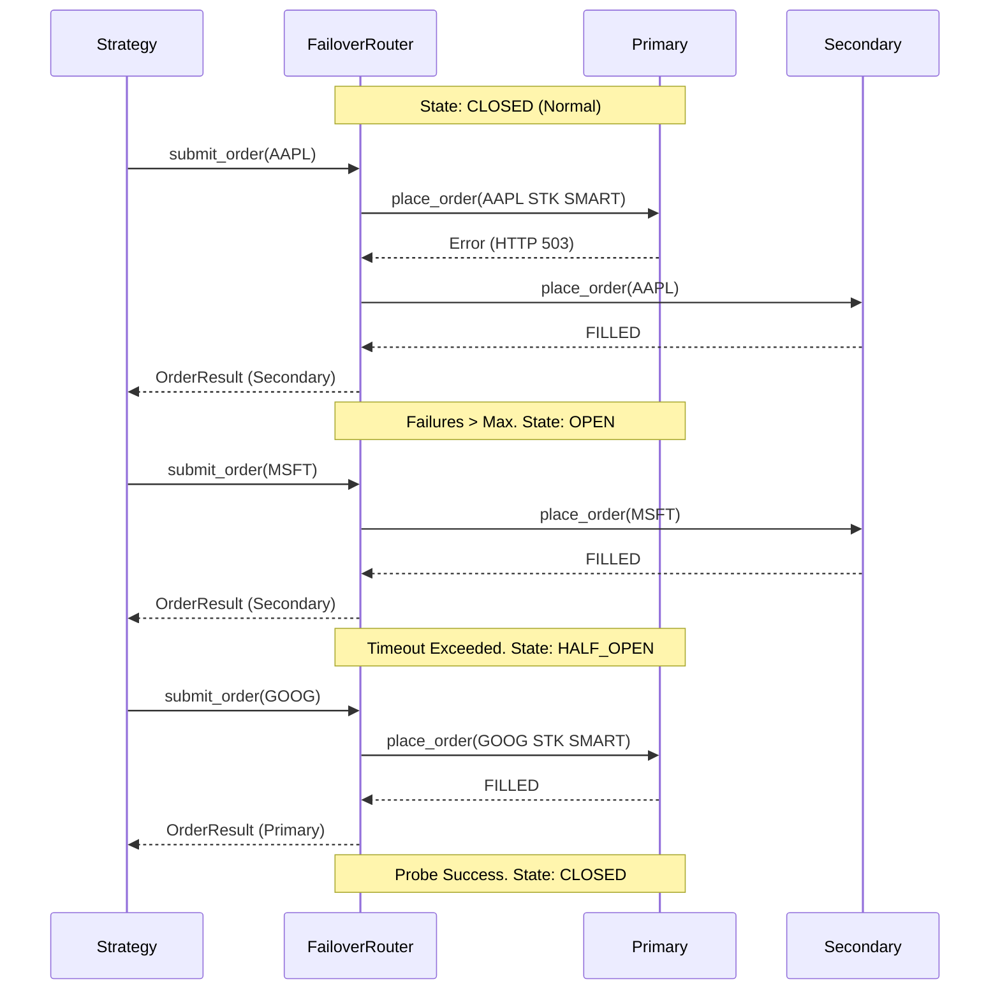

# Failover Workflow Sequence

## Explanation
1. **Normal Flow**: Orders go to the Primary Broker.
2. **Tripping the Breaker**: If consecutive errors occur, the internal state shifts to OPEN.
3. **Failover Execution**: While OPEN, all subsequent orders bypass the Primary and are mapped/sent to the Secondary.
4. **Recovery**: After a timeout, the state becomes HALF_OPEN. The next order acts as a probe. If successful, state goes back to CLOSED.
