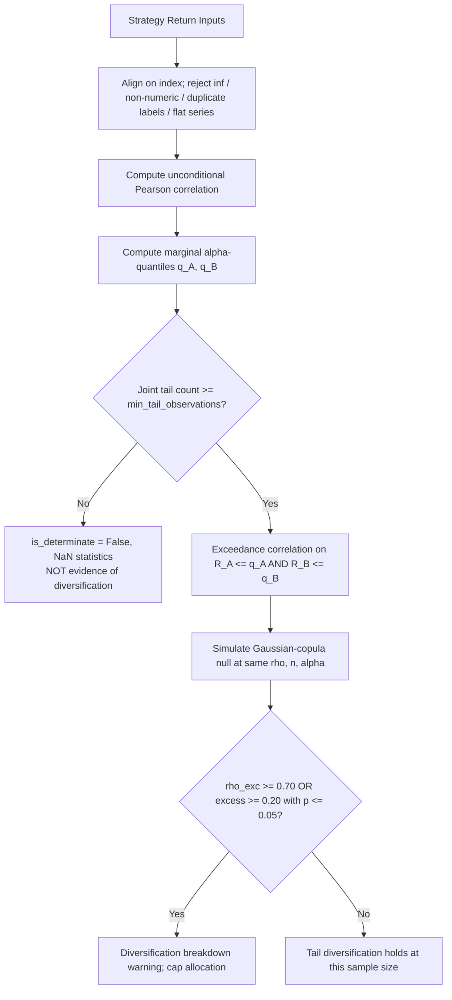

# Workflows for Tail Correlation Analysis

## Step-by-Step Procedure

1. **Ingest and align return series.** Join each pair on its timestamp index. Equal lengths
   do not imply a shared index, so align first and count the overlap; the engine logs how
   many rows alignment dropped. Reject `±inf`, non-numeric values, duplicate index labels
   and zero-variance series rather than imputing them.
2. **Set the tail quantile.** $\alpha = 0.10$ for standard stress analysis, $\alpha = 0.05$
   for extreme tails — but check the arithmetic first: an independent pair leaves about
   $\alpha^2 n$ observations in the joint tail, so $\alpha = 0.05$ needs roughly four times
   the history that $\alpha = 0.10$ does.
3. **Run `TailCorrelationAnalyzerEngine.analyze_pair` or `.analyze_portfolio_matrix`.**
4. **Triage the output in three buckets, not two.**
   - `diversification_breakdown=True` — act on it.
   - `is_determinate=False` — **unmeasured**. Extend the history, raise $\alpha$, or add
     stress-scenario data. Never treat this as a pass.
   - Otherwise — tail diversification holds *at this sample size*; note
     `joint_tail_observations` alongside the conclusion.
5. **Read the excess, not the delta.** `tail_correlation_excess` and `benchmark_pvalue`
   carry the signal. `tail_correlation_delta` ($\rho_{\text{tail}} - \rho_{\text{uncond}}$)
   is retained for continuity and is negative even for well-behaved Gaussian pairs.
6. **Adjust weights.** Feed `breakdown_pairs` into the allocation review; enforcement belongs
   to `correlation-aware-exposure-limits`, not to this module.

## Performance note

Each pair simulates `benchmark_simulations` (default 1000) null samples of the pair's own
length, so a call costs roughly 0.2 s at $n = 1500$ and a 20-strategy matrix (190 pairs)
runs in well under a minute. Lower `benchmark_simulations` for interactive exploration;
keep it at or above the default for numbers that go into an allocation decision. Results are
deterministic for a given `benchmark_seed`.
