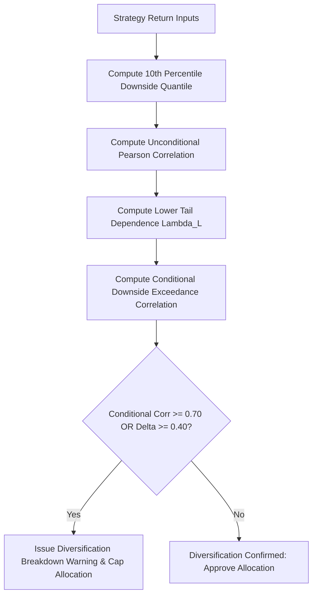

# Workflows for Tail Correlation Analysis

## Step-by-Step Procedure

1. **Ingest Return Series**: Align strategy return series by timestamp, dropping non-overlapping missing values.
2. **Set Tail Quantile**: Use $\alpha = 0.10$ for standard stress analysis or $\alpha = 0.05$ for extreme tail events.
3. **Execute `TailCorrelationAnalyzerEngine`**: Run pair or portfolio matrix analysis.
4. **Evaluate Output**: Filter breakdown pairs and adjust portfolio weights to mitigate joint crash exposure.