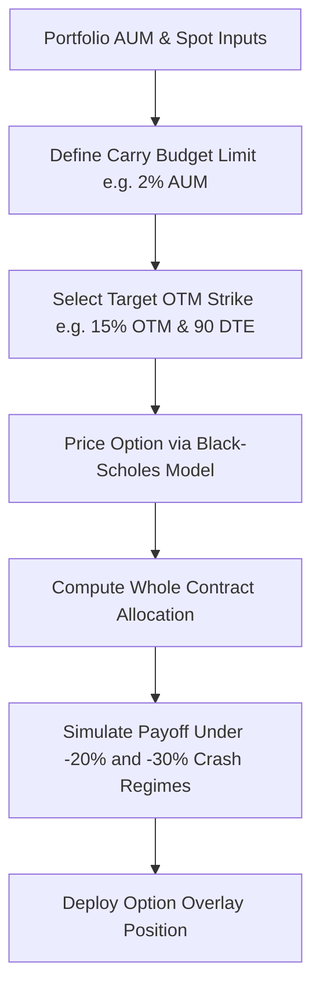

# Workflows for Option Tail Risk Hedging

## Step-by-Step Execution

1. **Initialize `TailRiskHedger`**: Define annual carry budget percentage and contract sizing parameters.
2. **Run `plan_systematic_otm_put_hedge()`**: Input spot price, volatility, and portfolio valuation.
3. **Audit Payoff Coverage**: Ensure convex payout at -30% market drop offsets majority of portfolio losses.
4. **Monitor Carry Drag**: Track cumulative premium spend against annual performance benchmarks.
