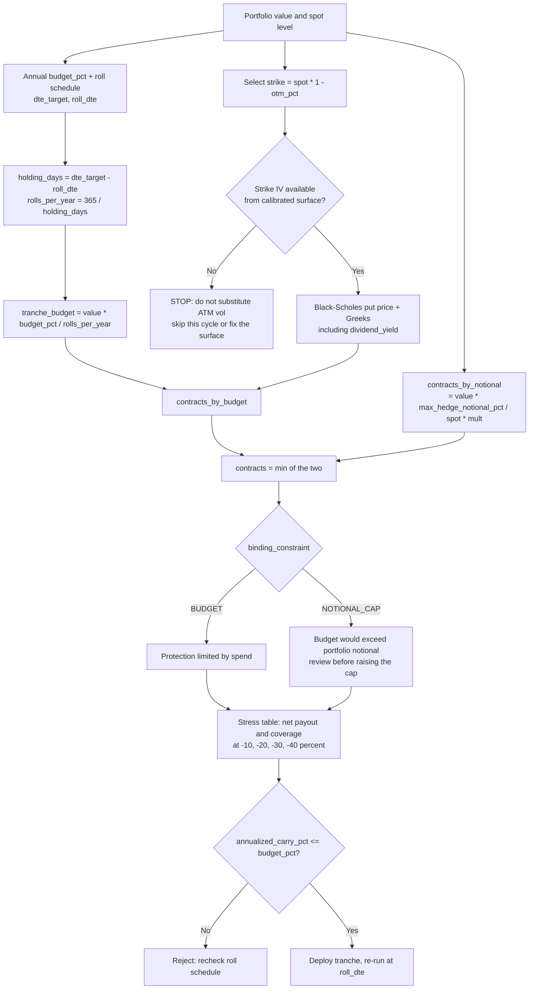

# Workflows for Option Tail Risk Hedging



## Step-by-Step Execution

1. **Configure the policy, including the roll.**

   ```python
   from tail_risk_hedger import Config, TailRiskHedger

   cfg = Config(
       budget_pct=0.02,            # per YEAR, not per tranche
       otm_pct=0.15,               # strike at 0.85 * spot
       dte_target=90,              # bought at 90 DTE
       roll_dte=30,                # rolled at 30 DTE -> 60-day hold
       max_hedge_notional_pct=1.0, # never hedge more shares than owned
   )
   hedger = TailRiskHedger(config=cfg)
   ```

   `roll_dte` is not cosmetic. It is what turns an annual budget into a per-tranche
   spend: `holding_days = dte_target - roll_dte`, `rolls_per_year = 365 / holding_days`.
   Getting it wrong scales the program's real cost by the same factor.

2. **Fetch the implied volatility of the strike you are about to buy.** Not ATM vol,
   not a historical estimate, not yesterday's surface. If it is unavailable, stop —
   `plan_systematic_otm_put_hedge` has no default and will not invent one.

3. **Size the tranche.**

   ```python
   plan = hedger.plan_systematic_otm_put_hedge(
       portfolio_value=1_000_000.0,
       spot_price=400.0,
       volatility=0.30,        # the 340-strike's own IV
       risk_free_rate=0.04,
       contract_multiplier=100,
       dividend_yield=0.013,   # omit only if the underlying truly pays nothing
   )
   ```

4. **Audit the plan before acting.**

   | Field | What it tells you |
   |---|---|
   | `binding_constraint` | `BUDGET` = protection limited by spend. `NOTIONAL_CAP` = the budget would have bought more coverage than the portfolio holds; investigate before raising the cap. |
   | `annualized_carry_pct` | The number to compare against `budget_pct`. Must not exceed it. |
   | `carry_cost_pct` | One tranche only. Always looks small. Not the policy number. |
   | `notional_coverage_ratio` | Hedged notional ÷ portfolio value. Above 1.0 the overlay is a leveraged short. |
   | `greeks["delta"]` | A 15% OTM put should be small and negative (order -0.05 to -0.15). A near -1.0 delta means the pricer is wrong, not that the hedge is strong. |
   | `greeks["theta"]` | Per calendar day, per share. Multiply by contracts × multiplier for daily carry. |

5. **Read the stress table net of premium.**

   ```python
   for key, sc in plan.stress_scenarios.items():
       print(key, sc.gross_payout, sc.net_payout, sc.net_coverage_ratio)
   ```

   A negative `net_coverage_ratio` at -10% is correct: a 15% OTM put never reaches
   its strike on a 10% move, so the premium is a pure loss. Tail hedges are supposed
   to lose money in ordinary drawdowns. The figures are terminal intrinsic values,
   so treat them as a floor — a crash well before expiry leaves the put worth more.

6. **Re-run at every roll.** Spot, IV and portfolio value have all moved. Under a
   constant budget the contract count falls as volatility rises, so the program buys
   the least protection immediately after a volatility spike. If a minimum
   protection floor matters more than a fixed cost, invert the problem: size to the
   floor and treat the premium as the output, then check it against policy.

## Failure modes to watch in production

- **Stale IV.** A surface that lags a volatility spike prices the put too cheaply
  and over-allocates contracts precisely on the day the market repriced risk.
- **Silent NaN.** Any non-finite input raises `ValueError` at the boundary. Do not
  catch and default it — a defaulted volatility is exactly the failure this design
  refuses.
- **Budget looks fine per tranche.** Every individual tranche can sit inside
  `budget_pct` while the annualised program runs six times over it. Only
  `annualized_carry_pct` catches that.
- **Cap silently binding every cycle.** If `binding_constraint` is persistently
  `NOTIONAL_CAP`, the budget is larger than the strategy can sensibly deploy at that
  strike; move the strike closer to the money or cut the budget rather than raising
  the cap.
