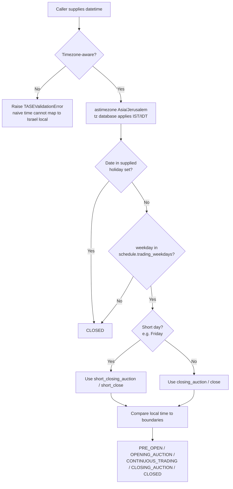
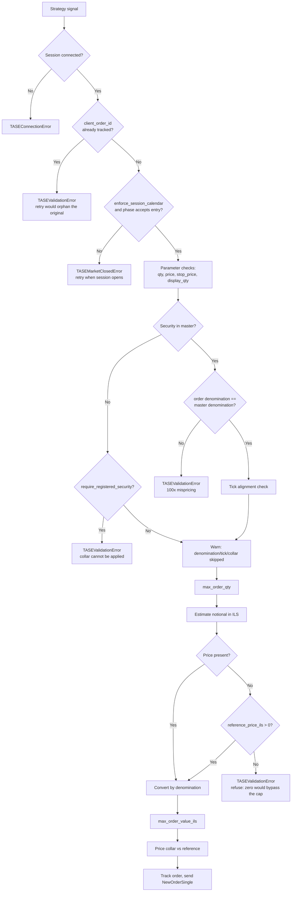

# TASE Integration Workflows

## Workflow 1: Resolving the session phase

The phase resolution is where the two calendar defects this skill exists to prevent are
caught. Note that the trading-week regime is selected by *date*, not assumed.



Two failure modes are worth restating because they are silent:

- Resolving local time with a **fixed UTC+2 offset** is correct only in winter. From the
  Friday before the last Sunday in March to the last Sunday in October, Israel is UTC+3,
  and the closing auction reads as continuous trading.
- An **empty holiday set** means every non-weekend weekday is treated as a trading day.
  The engine cannot derive TASE's Hebrew-calendar holidays; supplying them is the
  caller's job, and forgetting is indistinguishable from a market that never closes.

## Workflow 2: Order submission and the fail-closed controls



### Handling the three failure classes distinctly

They are not interchangeable, and collapsing them into one retry path is how a rejected
order becomes a duplicated one:

| Exception | Meaning | Correct response |
| :--- | :--- | :--- |
| `TASEMarketClosedError` | Venue is not accepting entry | Queue and retry at session open |
| `TASEValidationError` | Order is malformed or unverifiable | Fix the order or the master; retrying unchanged fails identically |
| `TASERiskLimitError` | A risk control fired | Escalate to a risk decision — never auto-retry |
| `TASEConnectionError` | Session is down | Reconnect, then **reconcile before resubmitting** |

## Workflow 3: Notional estimation by denomination

The step most often got wrong. Each row is a different formula, and picking the wrong one
is a 100x error in a number that then feeds both the value cap and the collar check.

| Denomination | Cash value per unit | Failure if mishandled |
| :--- | :--- | :--- |
| `AGOROT` | `price / 100` | Treating Agorot as ILS overstates notional 100x |
| `ILS` | `price` | Treating ILS as Agorot understates notional 100x |
| `PERCENTAGE` | `price / 100 x par_value_ils` | Treating percent as ILS misstates notional by `100 / par` |

A **market order carries no price**. The estimate falls back to
`reference_price_ils x quantity`; when no positive reference price is registered the
notional is genuinely unknown and the order is refused. Returning zero instead — the
obvious-looking shortcut — makes the notional cap unreachable for exactly the order type
with the least price certainty.

## Workflow 4: Daily reference data ingestion

1. **Before the session**, pull the security master from TASE Data Hub / MAYA.
2. **Extract per instrument**: TASE security number, ISIN, instrument class, price
   denomination, tick size, previous close as the reference price, and **par value for
   every percentage-quoted instrument**.
3. **Register**. `register_security()` rejects a percentage-quoted instrument with no par
   value and a non-positive tick size, so a malformed master fails at load rather than at
   order time.
4. **Refresh the holiday set** from TASE's published schedule and rebuild the
   `TASESessionSchedule`; the schedule is frozen, so this is a replacement, not a mutation.
5. **Re-check the trading-week regime** if you are replaying history — use
   `TASESessionSchedule.for_date(d)` rather than the live schedule.

## Workflow 5: Backtesting across the 2026 trading-week change

A backtest spanning 2025-2026 crosses a calendar regime boundary. Using one schedule for
the whole span is wrong on one side of 5 January 2026 no matter which one you pick.

```python
schedule = TASESessionSchedule.for_date(bar_date, holidays=tase_holidays)
engine.config.session_schedule = schedule
```

Symptoms of getting this wrong, both of which look like data problems rather than
calendar problems:

- **Sunday bars in 2026 history** that the strategy trades but the venue never priced.
- **Friday bars in 2025 history** treated as tradable, or 2026 Friday bars silently
  dropped, shrinking the sample and flattering turnover statistics.
