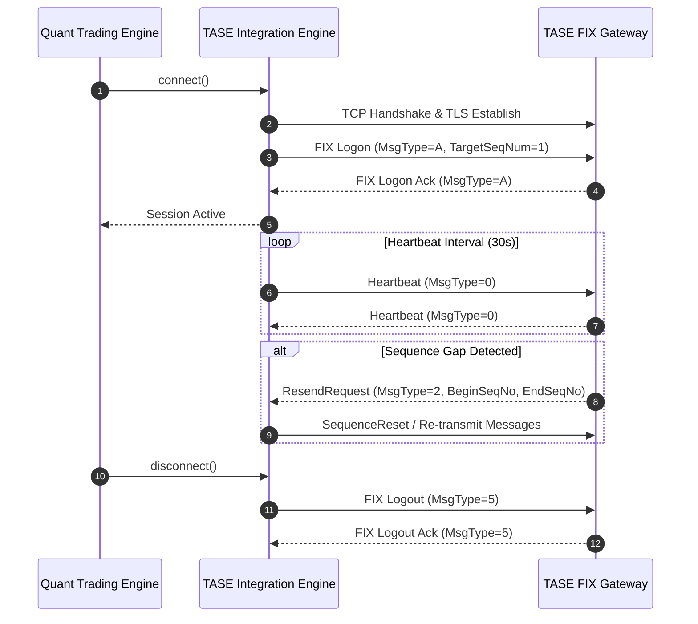
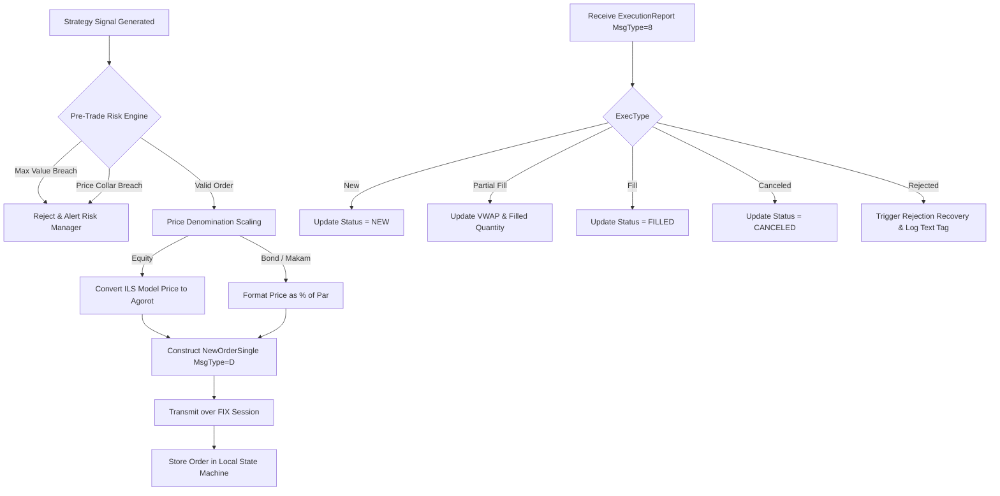

# Tel Aviv Stock Exchange (TASE) Institutional Integration Workflows

## Workflow 1: FIX Session Lifecycle & Sequence Recovery

---

## Workflow 2: Order Placement & Execution Processing Pipeline

---

## Workflow 3: Daily Reference Data & Security Master Ingestion
1. **Cron Ingestion (07:00 IST)**: Trigger REST request to TASE Data Hub API (`GET /api/v1/securities`).
2. **Security ID & ISIN Cross-Reference**: Extract TASE Security Number (e.g. `1082511`), ISIN (`IL0001082511`), Instrument Class (`EQUITY`/`BOND`/`MAKAM`), and Base Price Denomination (`AGOROT` vs `ILS`).
3. **Reference Price Calibration**: Extract previous EOD settlement price and calculate dynamic upper/lower price collars (±10%).
4. **Register Security Master**: Hydrate local `TASESecurity` dictionary inside the `TASEIntegrationEngine`.

---

## Workflow 4: Sunday Trading Session Handling & Sunday-Mon Transition
1. **Calendar Validation**: Verify target execution date against Israeli calendar (Sunday = Day 6, Trading Active; Friday = Day 4, Weekend Closed).
2. **Timezone Alignment**: Convert strategy timestamps from UTC to IST (Israel Standard Time: UTC+2 Standard / UTC+3 DST).
3. **Session Phase Tracking**:
   - `08:30 IST`: Transition engine to `PRE_OPEN` phase. Allow order entry, modification, and cancellation without execution.
   - `09:50 IST`: Transition engine to `OPENING_AUCTION`. Hold new orders; await opening uncrossing Execution Reports.
   - `10:00 IST`: Transition engine to `CONTINUOUS_TRADING`. Enable active algo order slicing (TWAP/VWAP).
   - `15:50 IST (Sunday) / 17:15 IST (Mon-Thu)`: Transition engine to `CLOSING_AUCTION`.
   - `16:00 IST (Sunday) / 17:25 IST (Mon-Thu)`: Transition engine to `CLOSED`. Reconcile fills, generate daily PnL, and disconnect session.
