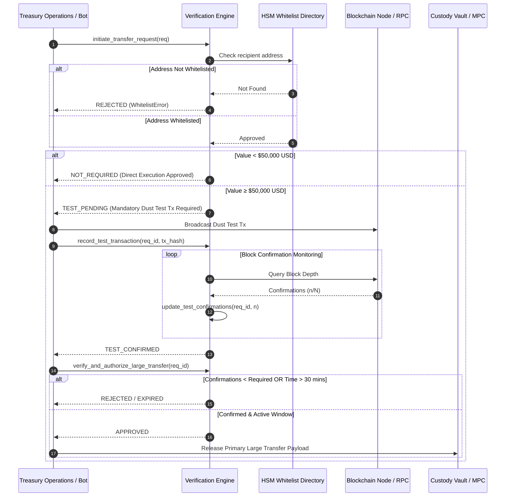

# Institutional Crypto Transfer Verification Workflows

## Workflow 1: Large Transfer Pre-Flight & Test Transaction Pipeline


---

## Workflow 2: Destination Memo / Tag Enforcement Workflow
```mermaid
flowchart TD
    A[Transfer Request Initiated] --> B{Asset Class}
    B -->|ETH / BTC / SOL| C[Check Whitelist Status]
    B -->|XRP / TON / XLM / EOS| D{Destination Tag Specified?}
    
    D -- No Tag --> E[REJECT: Missing Destination Memo/Tag]
    D -- Tag Present --> C
    
    C -- Unwhitelisted --> F[REJECT: Recipient Address Not Whitelisted]
    C -- Whitelisted --> G{USD Transfer Value}
    
    G -- Below Threshold --> H[Authorize Primary Transfer]
    G -- Exceeds Threshold --> I[Mandate Dust Test Transaction]
```
