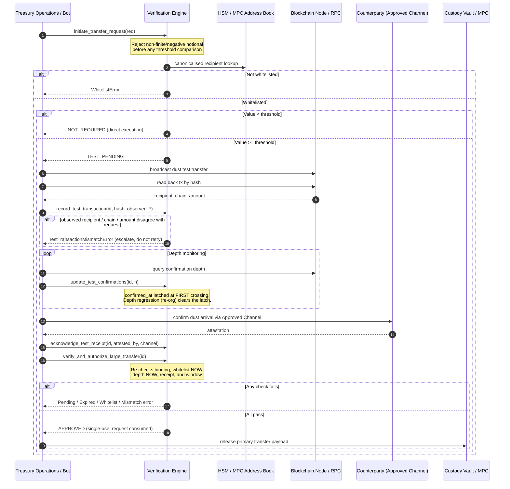
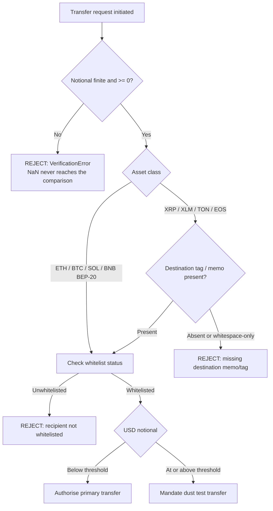
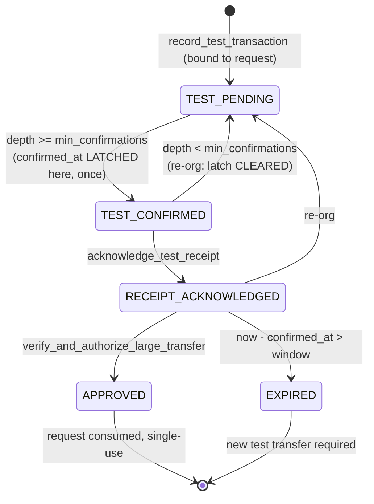

# Large Transfer Verification Workflows

## Workflow 1: Pre-flight, test transfer, and authorisation

Note the two facts the sequence turns on. The dust transaction is **read back
from the chain** and bound to the request before it counts, and the counterparty
must **attest arrival out of band** — on-chain depth alone confirms a wrong
address just as reliably as a right one.

## Workflow 2: Destination memo / tag enforcement

BNB sits on the left branch: the memo-bearing BEP-2 Beacon Chain was shut down on
2024-11-19, and BEP-20 on BNB Smart Chain uses no memo.

## Workflow 3: Re-org and expiry state machine

The expiry window exists because a verified destination decays — the counterparty
may rotate keys, or an attacker may swap the address after a successful test.
Two rules keep it meaningful.

1. **The latch is set once.** Subsequent `update_test_confirmations` calls do not
   refresh `confirmed_at`. If they did, the confirmation poller would hold the
   window open indefinitely and the time-decay control would never fire.
2. **A depth regression clears the latch.** The window then restarts from the
   re-confirmation, not from a depth that no longer exists on the canonical chain.

## Operational notes

- **Do not catch `TestTransactionMismatchError` and retry.** It means the dust
  landed somewhere other than where the primary transfer is going. Retrying sends
  more money to the same wrong place. Escalate to a human.
- **`observed_*` must come from the chain, not from your own request object.**
  Echoing back the intended address makes the binding check a tautology and
  restores exactly the hole this control exists to close.
- **Authorisation is single-use.** A caller that retries
  `verify_and_authorize_large_transfer` after a network error gets an exception,
  not a second approval. Persist the first result rather than re-requesting it.
- **The engine is not thread-safe.** Its state is plain dicts and sets with no
  locking. Confine one engine instance to one thread, or serialise access
  externally — two threads racing the same `request_id` through the
  consume-on-approve path is precisely the duplicate-release scenario the
  single-use rule is meant to prevent.
