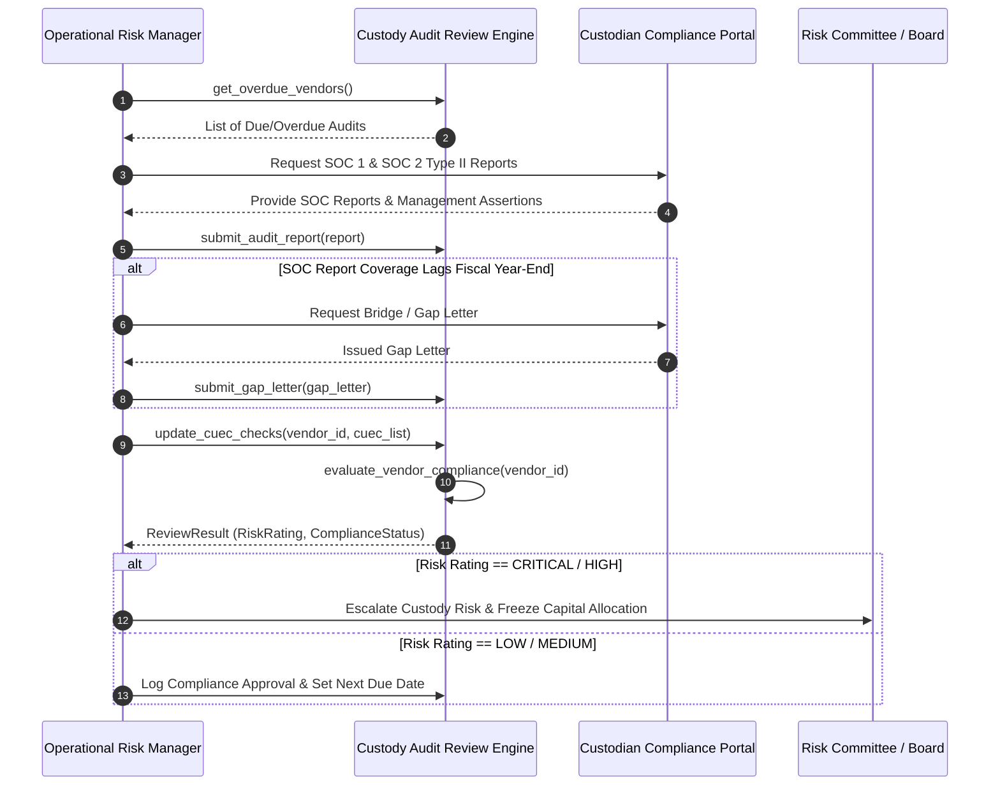

# Institutional Third-Party Custody Audit Workflows

## Workflow 1: Annual Custody Audit Review Lifecycle


---

## Workflow 2: Auditor Opinion & Deficiency Risk Pipeline
```mermaid
flowchart TD
    A[Audit Report Ingested] --> B{Report Type}
    B -->|SOC 1 / SOC 2 Type II| C{Auditor Opinion}
    
    C -->|Qualified / Adverse / Disclaimer| D[Status: ESCALATED, Risk: CRITICAL]
    C -->|Unqualified - Clean| E{Control Deficiencies Reported?}
    
    E -- > 0 Deficiencies --> F[Status: COMPLIANT, Risk: HIGH]
    E -- 0 Deficiencies --> G{Coverage End Age > 365 Days?}
    
    G -- Yes --> H{Valid Gap Letter on File?}
    H -- No --> I[Status: OVERDUE, Risk: HIGH]
    H -- Yes --> J{CUECs 100% Implemented?}
    
    G -- No --> J
    
    J -- No --> K[Status: COMPLIANT, Risk: MEDIUM]
    J -- Yes --> L[Status: COMPLIANT, Risk: LOW]
```
