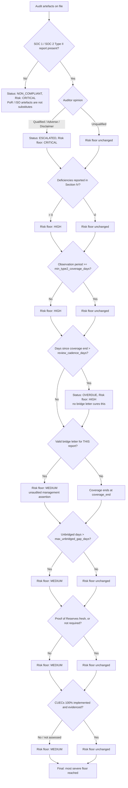
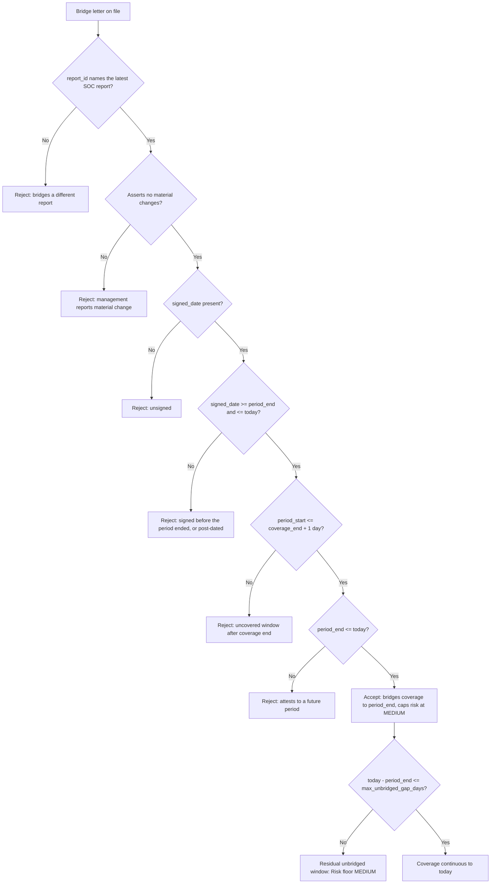

# Institutional Third-Party Custody Audit Workflows

## Workflow 1: Annual Custody Audit Review Lifecycle
```mermaid
sequenceDiagram
    autonumber
    participant Risk as Operational Risk Manager
    participant Engine as Custody Audit Review Engine
    participant Portal as Custodian Compliance Portal
    participant Board as Risk Committee / Board

    Risk->>Engine: get_overdue_vendors(as_of)
    Engine-->>Risk: Vendors OVERDUE / NON_COMPLIANT
    Risk->>Engine: get_vendors_requiring_escalation(as_of)
    Engine-->>Risk: Vendors ESCALATED / CRITICAL

    Risk->>Portal: Request SOC 1 & SOC 2 Type II reports
    Portal-->>Risk: SOC reports + management assertions

    Note over Risk: Transcribe the CUEC section into cuecs_required,<br/>and check whether subservice organisations are<br/>carved out (their controls are untested).

    Risk->>Engine: submit_audit_report(report)

    alt Coverage ended more than max_unbridged_gap_days ago
        Risk->>Portal: Request bridge / gap letter
        Portal-->>Risk: Signed management bridge letter
        Risk->>Engine: submit_gap_letter(gap_letter)
    end

    alt Custodian carves out a subservice organisation
        Risk->>Portal: Request the subservice organisation's own SOC report
    end

    Risk->>Engine: update_cuec_checks(vendor_id, cuec_list)
    Risk->>Engine: evaluate_vendor_compliance(vendor_id, as_of)
    Engine-->>Risk: ReviewResult (status, risk_rating, findings, audit_trail)

    alt ESCALATED or CRITICAL
        Risk->>Board: Freeze new allocation; Risk Committee within 24h
    else OVERDUE or HIGH
        Risk->>Portal: Formal compliance query; 30-day remediation clock
    else COMPLIANT
        Risk->>Engine: record_review(vendor_id, as_of)
    end
```

---

## Workflow 2: Auditor Opinion & Deficiency Risk Pipeline

Every gate below raises the risk floor; none lowers it. A vendor exits at the most
severe floor any gate set, so the branches are read as accumulating, not as
alternatives.



---

## Workflow 3: Bridge Letter Acceptance Test

A bridge letter is recorded whatever its condition — the rejection reason belongs in
the audit trail, not in a silent drop at ingestion. It is *accepted* only if every
test below passes.



---

## Workflow 4: Reading the report before it reaches the engine

The engine records a reviewer's conclusions; it does not read SOC reports. Four
things must be established by a human first, because getting any of them wrong makes
every downstream verdict confidently wrong:

1. **Scope.** Does the report's system description actually cover the custody
   service and the entity holding the assets? A group-level SOC 2 covering a trading
   platform does not cover the trust company holding the keys.
2. **Subservice organisations.** Carve-out or inclusive? Carved-out controls are
   disclosed as CSOCs and never tested — chase the subservice organisation's own
   report for an overlapping period.
3. **Section IV exceptions.** An unqualified opinion routinely coexists with test
   exceptions. Count them into `deficiencies_found` and read management's response.
4. **The CUEC section.** Transcribe every control into `cuecs_required`. An empty
   list is treated as "not assessed", never as "none required".
