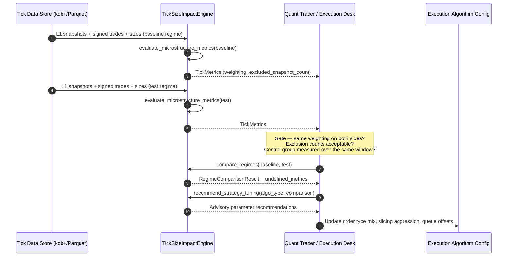
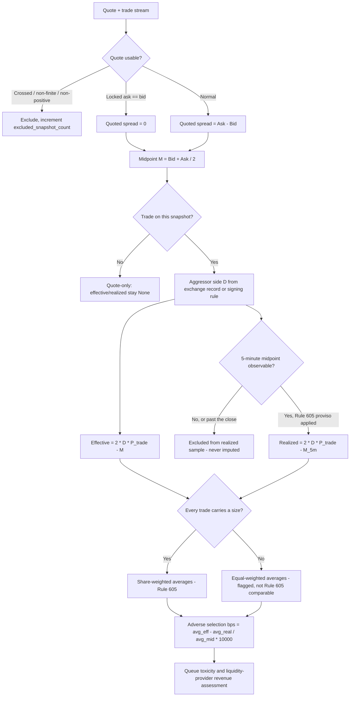

# Tick Size Regime Impact — Technical Workflows

## Workflow 1: Regime evaluation lifecycle



The two gates in the middle are the point of the workflow. A comparison that pairs a
share-weighted baseline against an equal-weighted test, or that silently dropped 30% of its
snapshots, produces a number with no meaning — and the engine will hand it to you anyway
unless you read `weighting` and `excluded_snapshot_count`.

## Workflow 2: Spread decomposition pipeline



Note the shape of step N: adverse selection is computed from the **weighted averages**, not
as the mean of per-trade ratios. This follows the Rule 605 "average percentage spread"
construction at 17 CFR 242.600(b)(10)–(11), where the percentage statistic is the average
spread divided by the average midpoint. The two estimators differ whenever trade size and
spread are correlated, which under a tick change they are.

## Workflow 3: Attribution discipline

A raw pre/post comparison attributes every concurrent market-wide change to the tick. To
isolate the tick effect:

1. Measure the **control group** — comparable securities whose tick did not change — over
   the identical window, with the identical pipeline.
2. Take the difference-in-differences: `(test_post - test_pre) - (control_post - control_pre)`.
3. Stratify. The Pilot's effect on quoted spreads ranged from `-17%` to `+203%` purely by
   pre-change spread class; a single pooled number hides the entire finding.
4. Test significance before acting. Several of the Pilot's headline raw changes — including
   share-weighted effective spread and 5-minute realized spread — were **not** statistically
   significant in difference-in-differences.

`compare_regimes` computes step 2's inner differences. Steps 1, 3 and 4 are the analyst's,
and skipping them is the most common way a tick-impact study reaches a confident wrong
answer.

## Workflow 4: Handling the end-of-session horizon

```
execution_time = 15:58:12 ET
horizon        = 5 minutes  -> 16:03:12 ET, past the 16:00 close
```

Per 17 CFR 242.600(b)(13), the correct input is the midpoint of the **final** NBBO
disseminated for regular trading hours — not the next session's opening quote, and not a
`None` where the final NBBO is in fact available. Carrying the next open instead prices an
overnight gap into the realized spread and reports it as intraday adverse selection.

The engine cannot see the session calendar, so this resolution happens in the caller's data
preparation. Where the final NBBO genuinely cannot be resolved, pass `None`: the trade then
contributes to the effective-spread sample and is excluded from the realized-spread sample,
and `realized_sample_count` will be lower than `trade_sample_count`.
