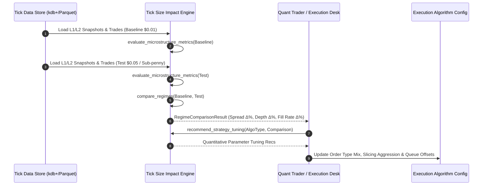
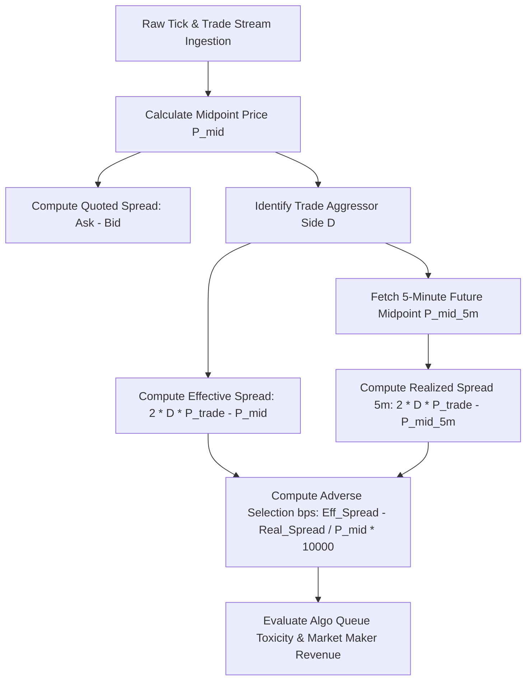

# Institutional Market Microstructure & Tick Size Impact Workflows

## Workflow 1: Tick Size Pilot Microstructure Evaluation Lifecycle

---

## Workflow 2: Spread Decomposition & Adverse Selection Analysis Pipeline
