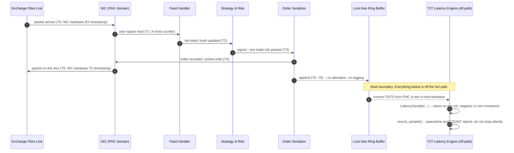
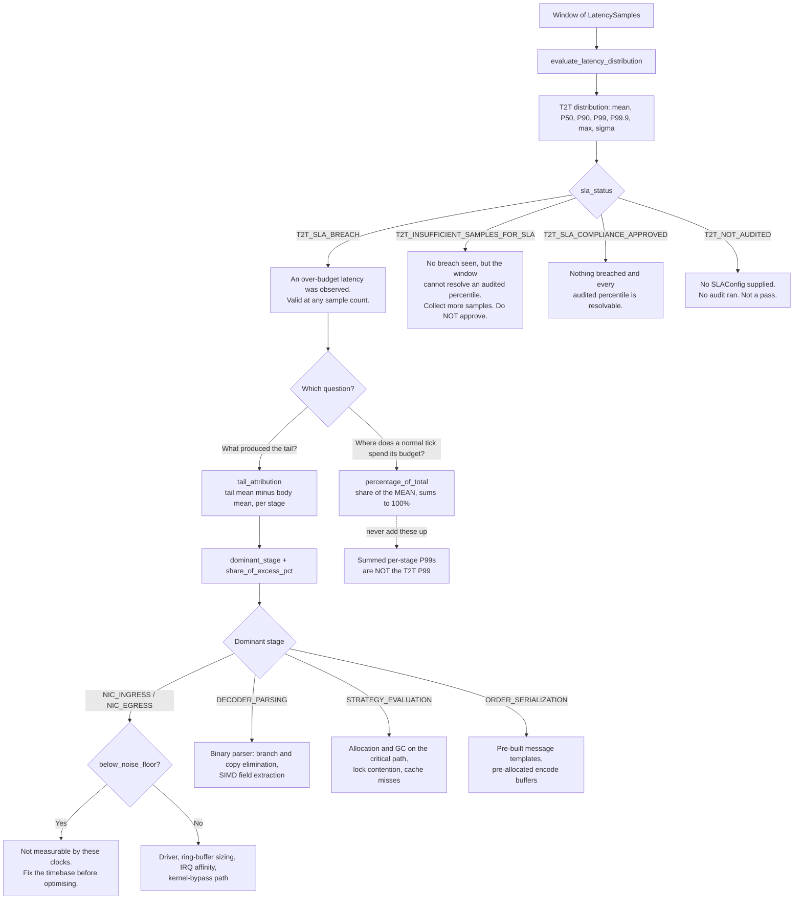

# Tick-to-Trade Latency Measurement Workflows

## Capture points

Five stages require **six** capture points. The engine derives each stage from two
adjacent ones; there is no way to recover five stages from five timestamps, which is the
defect revision 1.1.0 shipped.

| Marker | Field | Taken by | Clock domain |
| :--- | :--- | :--- | :--- |
| $T_0$ | `ingress_ns` | NIC hardware RX timestamp | NIC PTP hardware clock (PHC) |
| $T_1$ | `socket_read_ns` | packet visible to user space | in-host counter |
| $T_2$ | `decoded_ns` | decode complete, book updated | in-host counter |
| $T_3$ | `strategy_ns` | signal computed, pre-trade risk passed | in-host counter |
| $T_4$ | `serialized_ns` | order encoded, handed to the socket | in-host counter |
| $T_5$ | `egress_ns` | NIC hardware TX timestamp | NIC PTP hardware clock (PHC) |

| Stage | Interval | Spans a clock-domain boundary? |
| :--- | :--- | :--- |
| `NIC_INGRESS` | $T_0 \to T_1$ | **Yes** — PHC to in-host |
| `DECODER_PARSING` | $T_1 \to T_2$ | No |
| `STRATEGY_EVALUATION` | $T_2 \to T_3$ | No |
| `ORDER_SERIALIZATION` | $T_3 \to T_4$ | No |
| `NIC_EGRESS` | $T_4 \to T_5$ | **Yes** — in-host to PHC |
| **Total T2T** | $T_0 \to T_5$ | Within one domain, but only after conversion |

The two boundary-spanning stages are the ones a clock-domain error corrupts, and the two
most likely to fall below the measurement noise floor. Set
`SLAConfig.timestamp_uncertainty_us` and read `below_noise_floor` on those two first.

---

## Workflow 1: Capture and normalise

**Conversion is mandatory and is not done for you.** The Linux kernel does not convert
NIC hardware timestamps to system time. Subtracting an unconverted $T_0$ from $T_1$ gives
an offset, not a duration. If the offset is large the sample goes non-monotonic and the
engine raises; if it is small the result is positive, plausible and wrong, and nothing
detects it.

---

## Workflow 2: Evaluate, attribute, and decide

**Why the tail branch is not the mean branch.** `percentage_of_total` decomposes the
*average*. A stage can be 40% of the mean and 99% of the tail — that is precisely the
signature of a stall (GC pause, scheduler preemption, IRQ storm) rather than a uniformly
slow stage. Optimising the largest mean share when the problem is a tail spends effort on
the wrong code.

**Why summing per-stage percentiles is wrong.** Each stage's P99 ranks that stage alone.
Two stalls in different stages of different samples are each 1-in-100 within their own
stage — so neither stage's P99 resolves them — while both land in the top 2 of the totals.
Worked fixture: 98 samples at 2.5 µs, one with a 20 µs strategy stall, one with a 20 µs
decode stall. Summed stage P99s = **2.5 µs**. Measured total P99 = **21.5 µs**. Stage-wise
budgeting would approve a pipeline already an order of magnitude over.

**Why the tail split is by rank.** The tail set is the samples ranked at or above the
nearest rank for `tail_percentile`. Splitting on `total >= threshold` instead would put
*every* sample in the tail whenever the threshold value repeats — routine on a pipeline
with a flat body — and silently produce no attribution at all.

---

## Workflow 3: Interpreting the verdict

| Observation | Reading | Action |
| :--- | :--- | :--- |
| `sla_status == T2T_SLA_BREACH` | An over-budget latency was genuinely observed. One sample is enough. | Attribute the tail, fix the dominant stage, re-measure under load. |
| `sla_status == T2T_INSUFFICIENT_SAMPLES_FOR_SLA` | Nothing breached, but P99 and/or P99.9 is not resolvable from this window. | Lengthen the measurement window. 100 samples for P99, 1,000 for P99.9. Never widen the budget instead. |
| `resolution_warnings` non-empty with no breach | Same as above; the warnings name the percentile and the sample count required. | As above. |
| `sla_status == T2T_NOT_AUDITED` | No `SLAConfig` was supplied, so no audit ran. | Supply calibrated budgets. Do not record this as a pass. |
| `tail_attribution is None` | The rank split left no body set — too few samples to have a tail. | Collect more samples. |
| `dominant_stage is None` with a valid attribution | The tail is no slower than the body. There is no tail to attribute. | Nothing to optimise from this window. |
| `below_noise_floor` on a stage | That stage's P50 is under the configured combined clock uncertainty. | Improve the timebase (`clock-synchronization-ptp-for-trading-hosts`) before trusting or optimising the figure. |
| A stage reports exactly 0.0 µs | The timer could not resolve the stage. | Not a free stage. Use a finer counter or accept the stage as unmeasured. |
| Quarantine rate rising | Non-monotonic samples are an instrumentation or clock-domain defect. | Alert on the rate. Silently dropping them biases the tail *downwards*. |

## Measure under load, not on a quiet afternoon

RTS 6 Art. 10 requires an investment firm's annual self-assessment to include "running
high messaging volume tests using the highest number of messages received and sent by the
investment firm during the previous six months, multiplied by two". That is the right
shape for a T2T profiling run regardless of jurisdiction: a window sampled from a quiet
market contains none of the queueing, cache pressure or GC behaviour the tail is made of,
and cannot approve an SLA. See `load-testing-before-scaling-to-new-instrument-universe`.

Note also the limit of this measurement: it only sees ticks that produced an order. A
pipeline that *drops* ticks under load omits its own worst observations and this module
cannot detect that. Count drops in the feed handler —
`tick-buffering-burst-handling`, `sequence-number-gap-detection-for-feeds`.
