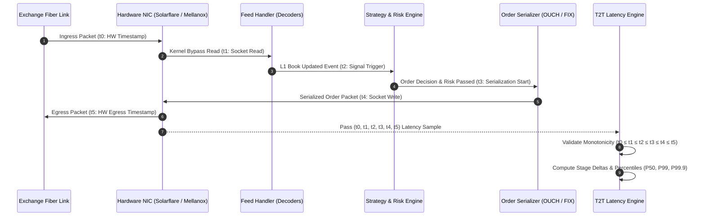
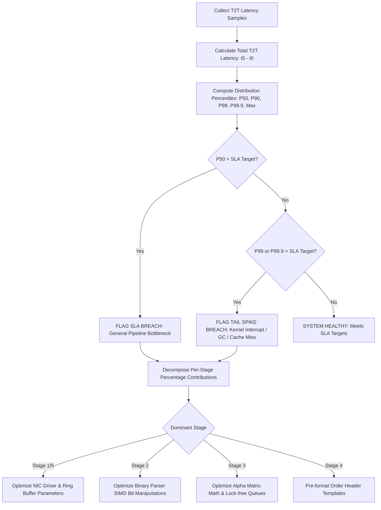

# Institutional Tick-to-Trade Latency Workflows

## Workflow 1: Microsecond Hardware & Software Timestamp Pipeline

```mermaid
sequenceDiagram
    autonumber
    participant Wire as Exchange Fiber Link
    participant NIC as Hardware NIC (Solarflare / Mellanox)
    participant Feed as Feed Handler (Decoders)
    participant Strategy as Strategy & Risk Engine
    participant Order as Order Serializer (OUCH / FIX)
    participant Profiler as T2T Latency Engine

    Wire->>NIC: Ingress Packet (t0: HW Timestamp)
    NIC->>Feed: Kernel Bypass Read (t1: Socket Read)
    Feed->>Strategy: L1 Book Updated Event (t2: Signal Trigger)
    Strategy->>Order: Order Decision & Risk Passed (t3: Serialization Start)
    Order->>NIC: Serialized Order Packet (t4: Socket Write)
    NIC->>Wire: Egress Packet (t5: HW Egress Timestamp)

    NIC-->>Profiler: Pass (t0, t1, t2, t3, t4, t5) Latency Sample
    Profiler->>Profiler: Validate Monotonicity (t0 ≤ t1 ≤ t2 ≤ t3 ≤ t4 ≤ t5)
    Profiler->>Profiler: Compute Stage Deltas & Percentiles (P50, P99, P99.9)
```

---

## Workflow 2: Percentile SLA Monitoring & Bottleneck Identification

```mermaid
flowchart TD
    A[Collect T2T Latency Samples] --> B[Calculate Total T2T Latency: t5 - t0]
    B --> C[Compute Distribution Percentiles: P50, P90, P99, P99.9, Max]
    
    C --> D{P50 > SLA Target?}
    D -- Yes --> E[FLAG SLA BREACH: General Pipeline Bottleneck]
    D -- No --> F{P99 or P99.9 > SLA Target?}
    
    F -- Yes --> G[FLAG TAIL SPIKE BREACH: Kernel Interrupt / GC / Cache Miss]
    F -- No --> H[SYSTEM HEALTHY: Meets SLA Targets]
    
    E & G --> I[Decompose Per-Stage Percentage Contributions]
    I --> J{Dominant Stage}
    J -- Stage 1/5 --> K[Optimize NIC Driver & Ring Buffer Parameters]
    J -- Stage 2 --> L[Optimize Binary Parser SIMD Bit Manipulations]
    J -- Stage 3 --> M[Optimize Alpha Matrix Math & Lock-free Queues]
    J -- Stage 4 --> N[Pre-format Order Header Templates]
```
