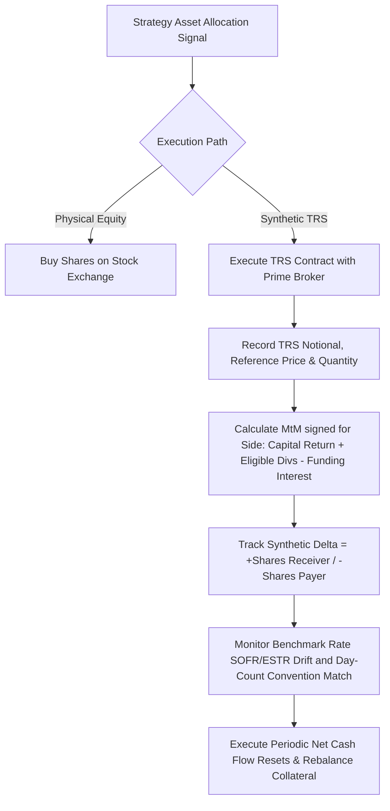

# Institutional Total Return Swap (TRS) Workflows

## Workflow 1: Periodic Swap Cash Flow Reset Lifecycle
```mermaid
sequenceDiagram
    autonumber
    participant Engine as TRS Engine
    participant Data as Reference Asset & Benchmark Feed
    participant Custody as Prime Broker / Custodian
    participant Margin as Collateral / CSA Manager

    Engine->>Data: Fetch Reset Period Start/End Prices & benchmark fixings
    Data-->>Engine: Prices (P_start, P_end), fixings, dividend events (ex/record/pay dates)
    
    Engine->>Engine: config.validate() + consistency_warnings()
    Engine->>Engine: filter dividends to the Dividend Period (start, end]
    Engine->>Engine: calculate_total_return_leg(Config, Reset)
    Engine->>Engine: calculate_funding_leg(Config, Reset) on N_shares * P_start
    Engine->>Engine: process_reset_period(Config, Reset, Side)
    
    Engine-->>Custody: Generate TRSSettlement (net cashflow, signed for Side)
    
    alt Net Cashflow > 0 (Inflow to Receiver)
        Custody-->>Engine: Wire Settlement Cash Payment
    else Net Cashflow < 0 (Outflow from Receiver)
        Engine->>Custody: Transfer Settlement Cash Payment
    end

    Engine->>Margin: VM requirement = max(0, -MtM - threshold), then MTA test
    Note over Engine,Margin: IM is segregated and never offsets the VM call
    Margin-->>Custody: Post/return VM; hold IM separately
```

---

## Workflow 2: Synthetic Exposure & Delta Risk Pipeline
