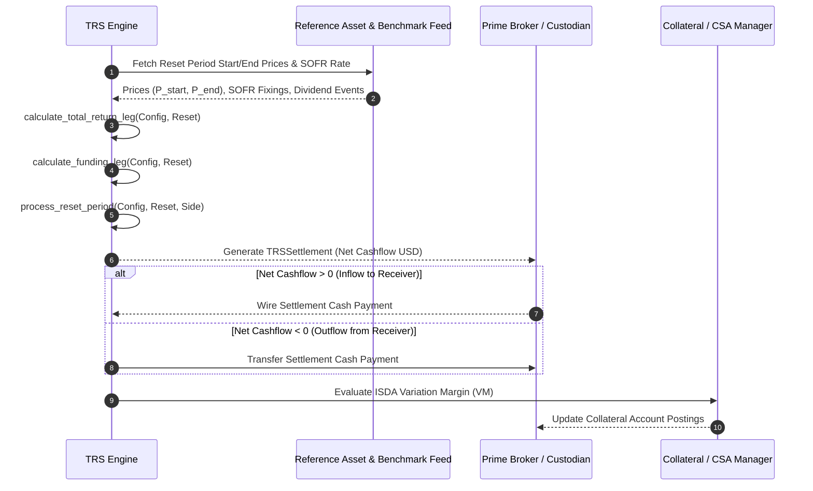

# Institutional Total Return Swap (TRS) Workflows

## Workflow 1: Periodic Swap Cash Flow Reset Lifecycle


---

## Workflow 2: Synthetic Exposure & Delta Risk Pipeline
```mermaid
flowchart TD
    A[Strategy Asset Allocation Signal] --> B{Execution Path}
    B -->|Physical Equity| C[Buy Shares on Stock Exchange]
    B -->|Synthetic TRS| D[Execute TRS Contract with Prime Broker]
    
    D --> E[Record TRS Notional, Reference Price & Quantity]
    E --> F[Calculate Daily MtM: Capital Return + Divs - Funding Interest]
    
    F --> G[Track Synthetic Delta = +Shares / -Shares]
    G --> H[Monitor Daily Benchmark Rate (SOFR/ESTR) Drift]
    H --> I[Execute Periodic Net Cash Flow Resets & Rebalance Collateral]
```