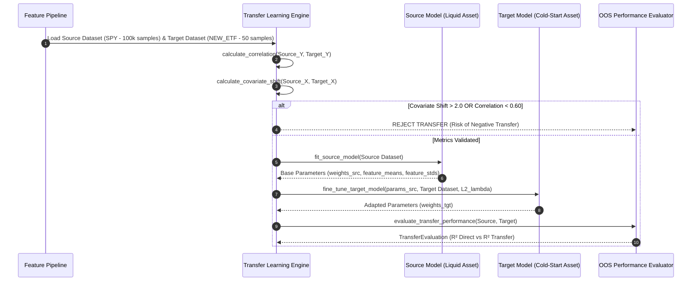

# Institutional Financial ML Transfer Learning Workflows

## Workflow 1: Source Pre-Training & Target Fine-Tuning Pipeline


---

## Workflow 2: Negative Transfer Prevention & Model Deployment Decision Tree
```mermaid
flowchart TD
    A[Cold-Start Target Asset Identified] --> B[Identify Liquid Correlated Source Asset]
    B --> C[Compute Pairwise Return Correlation r]
    
    C -- r < 0.60 --> D[REJECT: Insufficient Source Correlation]
    C -- r ≥ 0.60 --> E[Compute Covariate Shift Domain Distance]
    
    E -- Shift > 2.0 --> F[REJECT: Extreme Domain Shift]
    E -- Shift ≤ 2.0 --> G[Pre-train Source Model on Liquid Data]
    
    G --> H[Fine-tune Target Model using L2 Regularization λ]
    H --> I[Evaluate Out-of-Sample R² Gain]
    
    I -- Transfer R² ≤ Direct Target R² --> J[REJECT: Negative Transfer Detected]
    I -- Transfer R² > Direct Target R² --> K[APPROVE: Deploy Transferred Model to Live Trading]
```
