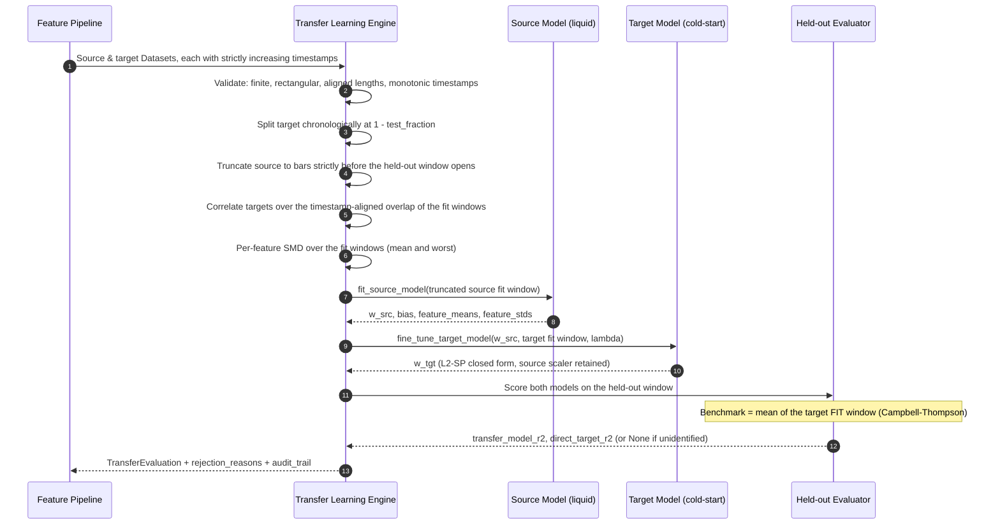
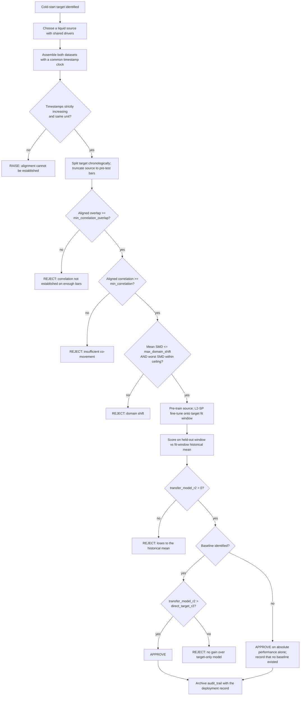

# Transfer Learning Across Correlated Instruments — Procedure Reference

## Workflow 1: Pre-training, fine-tuning and the out-of-sample gate

Note the ordering: the target is split **before** anything is fitted, and the source is
truncated to the target's fit era **before** it is pre-trained. Both steps exist because
source and target co-move by premise, so any source bar from the evaluation period
carries the evaluation period into the pre-trained weights.

## Workflow 2: The deployment decision

Every gate is evaluated; the engine does not short-circuit. A rejected evaluation still
reports every measured statistic, so you learn which gate to act on rather than only the
first one that tripped.

## Workflow 3: Reading a rejection

`rejection_reasons` is a list, not a single cause. Read all of it.

| Reason contains | What it means | First thing to try |
| :--- | :--- | :--- |
| `min_correlation_overlap` | The two series barely share bars in the fit window | Check the timestamp unit and trading calendar on both sides — an off-by-one-unit clock produces a near-empty join, not a wrong number |
| `< min_correlation` | The instruments do not co-move enough over the aligned window | Pick a different source; do not lower the floor to get a pass |
| `max_domain_shift` | Feature distributions differ too much on average | Inspect per-feature shifts; a single unit-mismatched column often accounts for all of it |
| `max_feature_domain_shift` | One feature is badly shifted even though the mean looks fine | Fix or drop that feature; `worst_shift_feature` names it |
| `loses to the fit-window historical mean` | The transferred model is worse than predicting the mean | The source relationship does not hold on the target. This is negative transfer; a different `lambda` will not rescue it |
| `No gain over target-only baseline` | Transfer adds nothing | Ship the target-only model |

## Workflow 4: Calibrating `lambda`

`l2_penalty` is the one parameter worth tuning, and it must be tuned without touching the
held-out window.

1. Carve a **validation** slice out of the *end of the fit window*, chronologically —
   never at random, and never from the held-out window.
2. For each candidate `lambda`, fit the source model on data preceding that validation
   slice, fine-tune on the fit window that precedes it, and score on the slice using
   `calculate_oos_r2` with the sub-fit window's mean as the benchmark.
3. Take the best `lambda`, then run `evaluate_transfer_performance` once on the full
   split. Tuning against the held-out window and then reporting that window's R-squared
   is selection bias, not validation; see `hyperparameter-tuning-without-target-leakage`.
4. Sanity-check the endpoints: as `lambda -> 0` the fit approaches target-only OLS (and
   becomes unidentified when the target has fewer than `D + 2` rows); as `lambda` grows
   large the weights approach `w_src` exactly.

## Workflow 5: Operating limits

- **Timestamps are joined on exact equality.** Source and target must share a clock and a
  calendar. A half-day session, a different close convention, or a nanosecond-versus-
  second unit mismatch shows up as a tiny or empty overlap.
- **The estimator is linear.** Non-linear structure is out of scope for the fit even
  though the gating logic around it is not.
- **The shift metric sees means only.** Equal means with different dispersion score zero.
- **Nothing here tests `P(Y|X)` stability.** The held-out comparison is the only check on
  it, and it checks the past.
- **Degenerate columns raise rather than being floored.** A constant feature has no
  defined standardization and no defined SMD; dividing by a small epsilon would turn
  rounding noise into a multi-sigma signal.
- **Re-run the evaluation on a schedule.** A correlation that justified the transfer is a
  measured quantity that decays; see `concept-drift-vs-staleness-differentiation` and
  `model-staleness-detection`.
