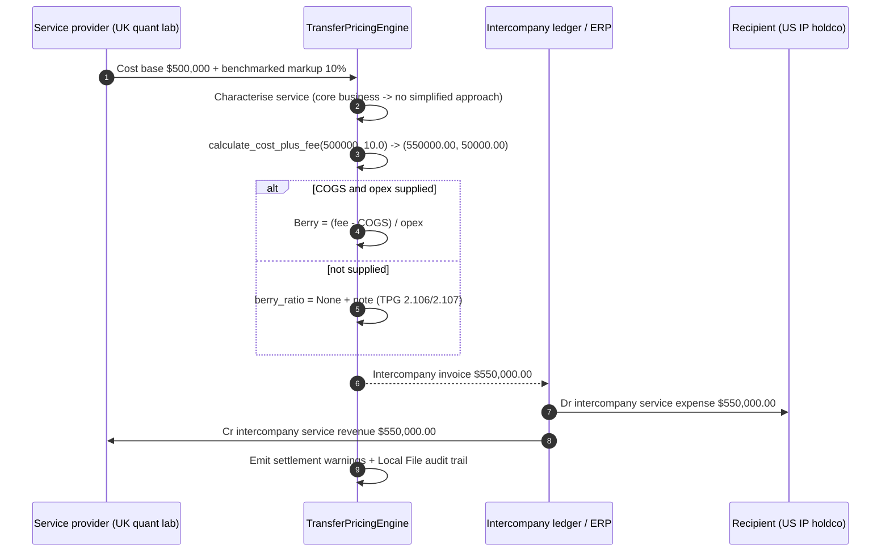
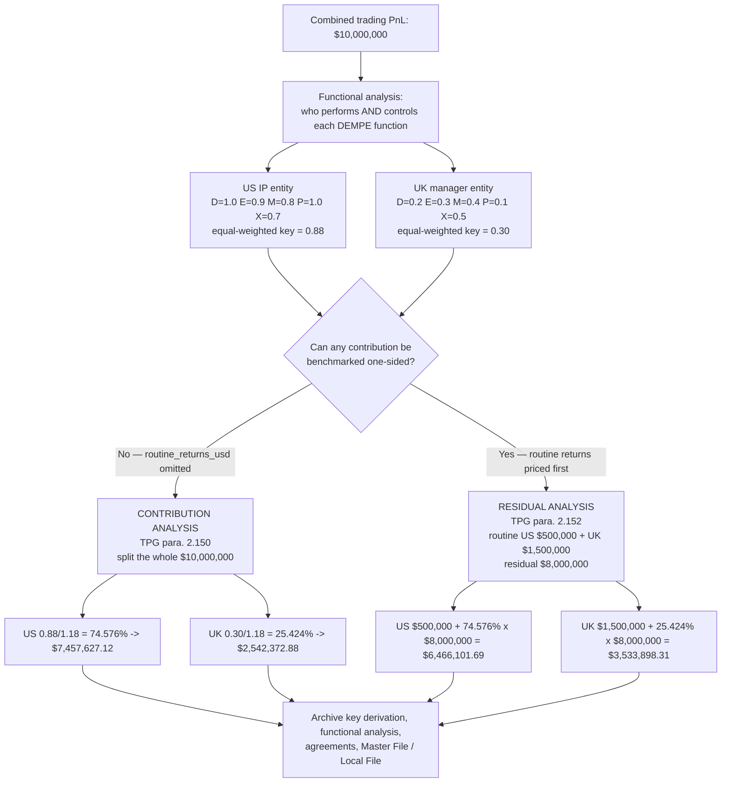
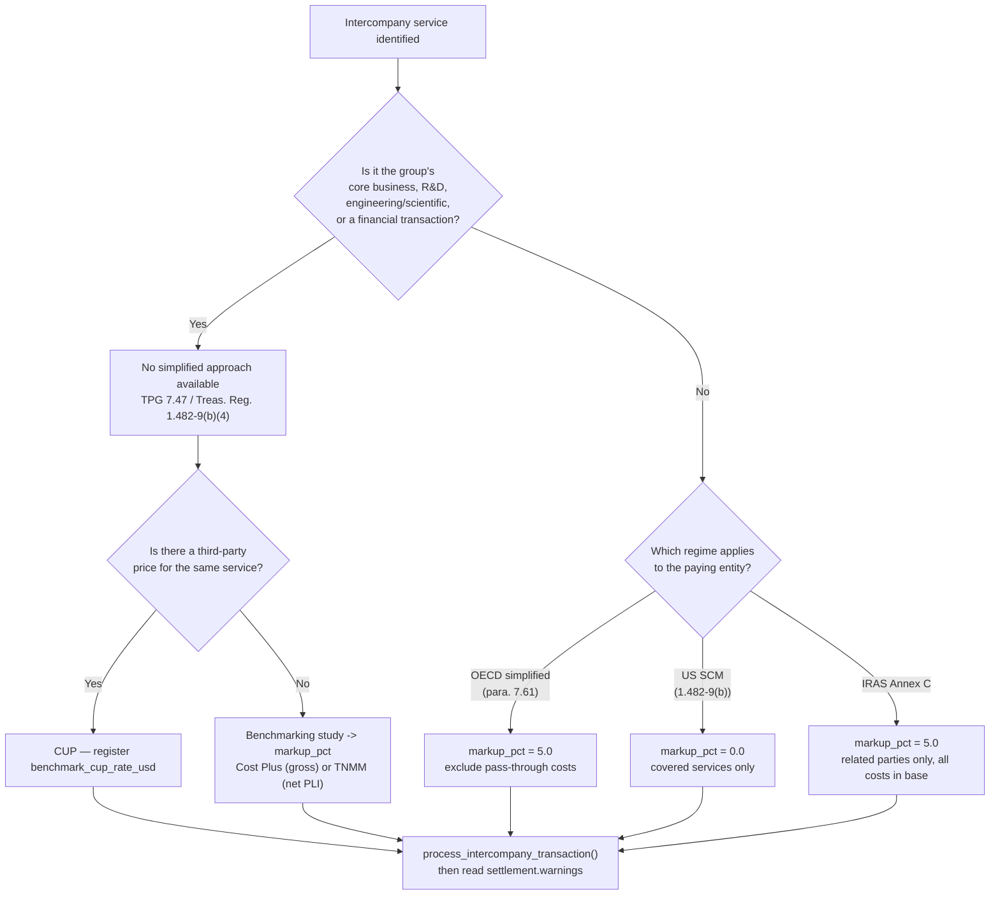

# Transfer Pricing Workflows

## Workflow 1: Intercompany service fee settlement

The Berry ratio step is conditional. It runs only when the provider's COGS and operating
expenses are supplied; otherwise the settlement carries `berry_ratio=None` and a note saying
why, because a ratio inferred from the cost base is the cost-plus markup factor relabelled.



**Berry ratio worked example.** A Singapore execution entity bills $1,200,000, buys
$700,000 of exchange capacity (COGS) and runs $400,000 of its own operating expenses.

```
Gross profit = 1,200,000 - 700,000 = 500,000
Berry ratio  = 500,000 / 400,000    = 1.25
```

Dividing the whole fee by the whole cost base gives 1,200,000 / 1,100,000 = 1.09, which is a
different and wrong number. The two coincide only when COGS is genuinely zero.

---

## Workflow 2: DEMPE-keyed profit split — contribution vs residual

Both branches use the same allocation key. They are different analyses under OECD TPG 2022
and produce different allocations, so the Local File must say which one was run.



**The equal weighting is an assumption, not a rule.** The OECD publishes no numeric DEMPE
score. Pass `dimension_weights` to weight the five functions differently and record the
evidence for whichever weighting you use (TPG paras. 2.166, 2.170, 2.171).

```python
split = engine.calculate_profit_split(
    10_000_000.0,
    [dempe_us, dempe_uk],
    routine_returns_usd={"ENT-US": 500_000.0, "ENT-UK": 1_500_000.0},
    dimension_weights={
        "development": 0.35, "enhancement": 0.25, "maintenance": 0.10,
        "protection": 0.10, "exploitation": 0.20,
    },
)
assert split.split_basis == "RESIDUAL_ANALYSIS"
```

---

## Workflow 3: Choosing a markup before choosing a number



A `markup_pct` of `0.0` is a deliberate, defensible value under the US Services Cost Method
and IRAS strict pass-through cost pooling. It is not a missing input, and the engine accepts
it. A markup below -100% is rejected: it would invert the fee.
