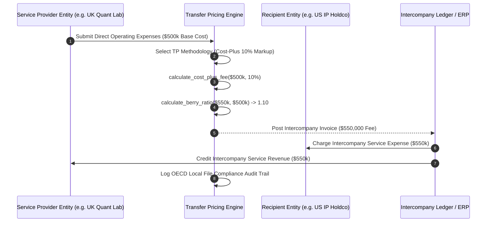

# Institutional Transfer Pricing Workflows

## Workflow 1: Intercompany Service Fee Settlement Pipeline


---

## Workflow 2: OECD DEMPE Residual Profit Split Pipeline
```mermaid
flowchart TD
    A[Consolidate Global Trading PnL: $10,000,000] --> B[Assess DEMPE Contributions Across Group Entities]
    
    B --> C[US Entity: Algo IP Development = 1.0, Protection = 1.0 -> Score 0.88]
    B --> D[UK Entity: Regional Execution & Risk Management -> Score 0.30]
    
    C & D --> E[Compute Composite Relative DEMPE Weights: US=74.6%, UK=25.4%]
    
    E --> F[Execute Residual Profit Split]
    F --> G[Allocate $7,457,627 to US IP Entity]
    F --> H[Allocate $2,542,373 to UK Manager Entity]
    
    G & H --> I[Generate OECD Master File & CbC Reporting Audit Logs]
```
