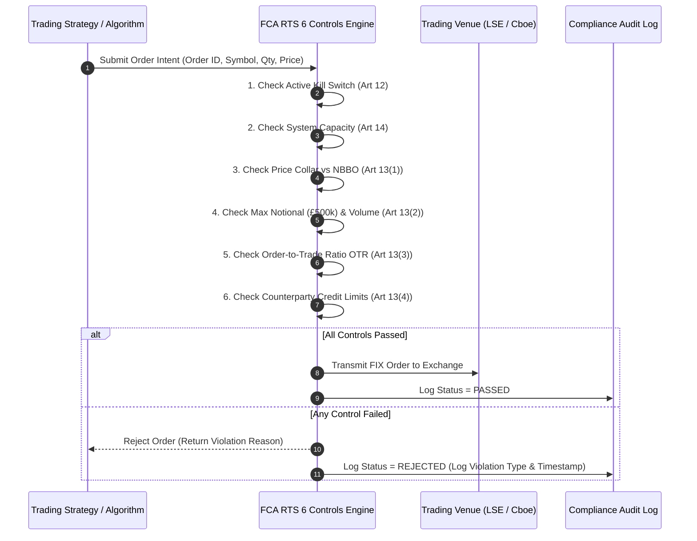

# Institutional UK FCA RTS 6 & FG18/9 Control Workflows

## Workflow 1: Pre-Trade Control Execution Pipeline (RTS 6 Article 13)


---

## Workflow 2: Automated Emergency Kill Switch Lifecycle (RTS 6 Article 12)
```mermaid
flowchart TD
    A[Monitor Market Risk & Algorithm Health] --> B{Emergency Event Triggered?}
    
    B -- Runaway Algo / Market Volatility --> C[Invoke trigger_kill_switch(algo_id, reason)]
    B -- System Capacity > 95% --> C
    
    C --> D[Set Active Kill Switch Flag in Memory]
    D --> E[Block All Subsequent Pre-Trade Orders for Target Algo]
    
    E --> F[Send FIX Mass Cancel Order to Exchange Gateways]
    F --> G[Cancel All Open Orders Across All Venues]
    
    G --> H[Notify SMF24 / SMF16 Compliance Officer]
    H --> I[Conduct Compliance Investigation]
    I --> J[Execute reset_kill_switch() Following Sign-Off]
```
