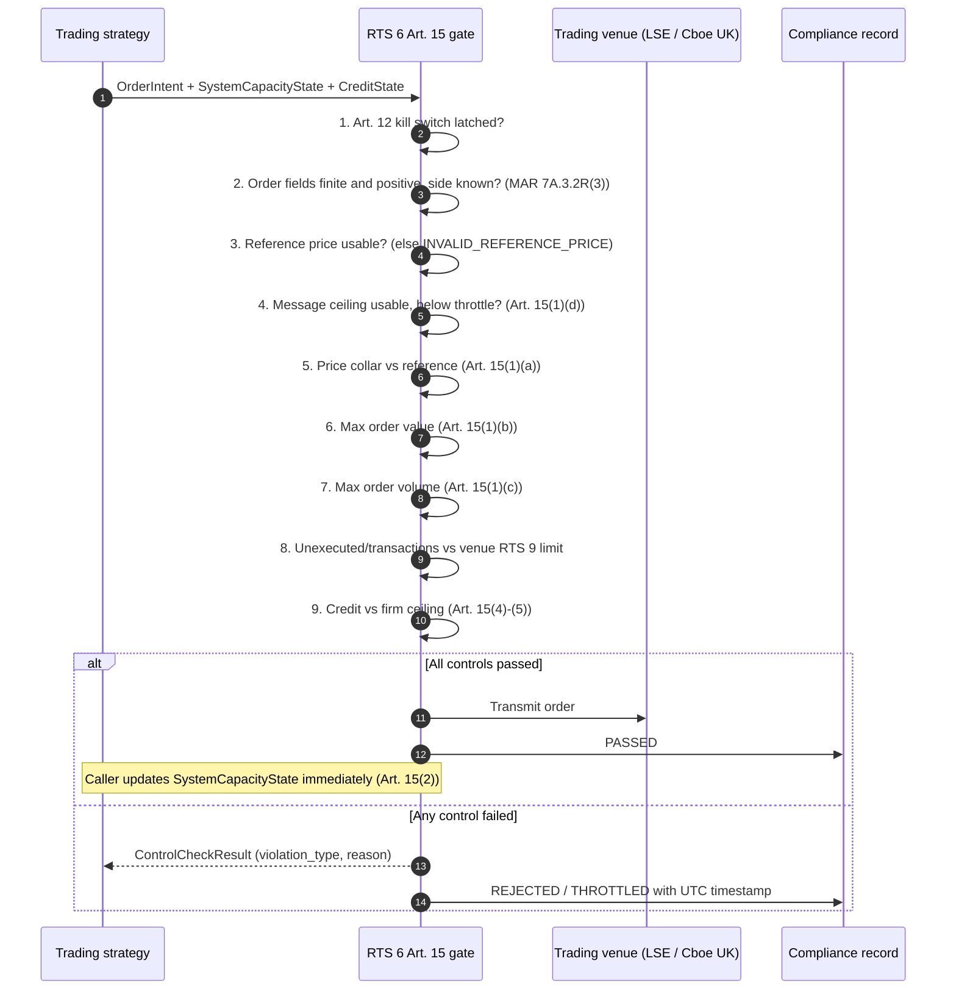

# UK FCA RTS 6 Article 15 / Article 12 Control Workflows

## Workflow 1: Pre-trade order-entry gate (RTS 6 Art. 15)

The gate is fail-closed: the three validation stages reject on unusable input
rather than skipping the control that depends on it.

### Reading a rejection

| `violation_type` | What is broken | Correct response |
|---|---|---|
| `KILL_SWITCH_ACTIVE` | The firm or the algorithm is halted | Stop. Do not resubmit until an authorised reset |
| `INVALID_ORDER` | Order field is NaN/Inf/non-positive, or the side is unknown | Fix the order construction. Never resubmit unchanged |
| `INVALID_REFERENCE_PRICE` | No usable reference — feed gap or stale mark | Restore the reference feed. The collar could not be evaluated, so nothing about this order has been validated on price |
| `INVALID_CAPACITY_STATE` | Message ceiling missing or rate unreadable | Fix gateway telemetry. The ceiling is unconfigured, not satisfied |
| `CAPACITY_EXCEEDED` | Message ceiling reached | Back off; retry when utilisation falls |
| `PRICE_COLLAR` | Order is outside the firm's price parameters | Reprice. Do not widen the collar to fit the order |
| `MAX_ORDER_VALUE` / `MAX_ORDER_VOLUME` | Order too large for the calibrated cap | Slice it. Raising the cap is a risk-committee decision |
| `ORDER_TO_TRADE_RATIO` | Self-monitor breach against the venue's RTS 9 limit | Reduce quoting or improve fill rate before the venue penalises it |
| `CREDIT_LIMIT_EXCEEDED` | Projected utilisation exceeds the firm ceiling | Reduce size or free credit. The strategy cannot raise the limit |

An Art. 15(6) override of any of the last four is a documented exception outside
this gate — specific trade, temporary, exceptional, verified by the risk management
function, authorised by a named individual.

## Workflow 2: Kill functionality lifecycle (RTS 6 Art. 12)

The latch happens before the venue call, so a failed mass cancel leaves the firm
halted rather than trading on.

```mermaid
flowchart TD
    A[Runaway algo / venue disruption / Art. 15&#40;3&#41; throttle trip] --> B[trigger_kill_switch&#40;algo_id, reason&#41;]
    B --> C[Latch scope: algo_id, or GLOBAL_SCOPE when algo_id is None]
    C --> D[Append KillSwitchEvent TRIGGER to the audit trail]
    D --> E[Call mass_cancel_handler]

    E -- returns count --> F[mass_cancel_invoked=True, cancelled_orders_count=n]
    E -- raises --> G[mass_cancel_error set, log CRITICAL, latch stays on]
    E -- no handler --> H[mass_cancel_error: no handler, nothing cancelled at venue]

    F --> I[All subsequent orders for the scope rejected]
    G --> I
    H --> I

    I --> J[Notify compliance and the risk management function]
    J --> K[Investigate; identify the algorithm, trader, desk or client per Art. 12&#40;3&#41;]
    K --> L[reset_kill_switch&#40;algo_id, authorised_by, reason&#41;]
    L --> M[Scope unlatched, execution counter cleared, RESET event recorded]
```

**Scope semantics.** `algo_id=None` means firm-wide and is stored under
`GLOBAL_SCOPE`. A blank or whitespace `algo_id` raises `ValueError` in both trigger
and reset — an empty configuration field must never halt the firm, and must never
lift a firm-wide halt. Resetting one algorithm leaves a firm-wide halt in force;
that has to be reset explicitly with `algo_id=None`.

**Verifying the handler.** An untested cancel path is an untested Art. 12 control.
Exercise `mass_cancel_handler` against the venue's test environment, and separately
against a forced failure, confirming that `is_kill_switch_active` stays `True` and
`mass_cancel_error` is populated.

## Workflow 3: Repeated automated execution throttle (RTS 6 Art. 15(3))

```mermaid
flowchart LR
    A[Execution reported] --> B[record_execution&#40;algo_id, config&#41;]
    B --> C{max_repeated_executions set?}
    C -- No --> D[No-op: Art. 15&#40;3&#41; control absent, known gap]
    C -- Yes --> E[Append timestamp, evict entries older than the window]
    E --> F{count >= limit?}
    F -- No --> G[Continue trading]
    F -- Yes --> H[Auto-latch kill switch for algo_id]
    H --> I[Re-enable only via reset_kill_switch with a named authoriser]
```

The count is windowed rather than cumulative: a lifetime counter trips a healthy
algorithm on an ordinary day. Both the count and
`repeated_execution_window_seconds` are firm parameters — RTS 6 prescribes neither,
requiring only that the number be "pre-determined".

## Workflow 4: Calibrating the limits

RTS 6 Art. 15(4) ties every limit to the firm, not to the regulation. A defensible
calibration record answers, per instrument tier:

1. **Price collar** — derived from what? Typical intraday volatility, tick size and
   the venue's own price-monitoring bands are the usual inputs. A collar wider than
   the venue's auction trigger adds nothing.
2. **Max order value and volume** — what is "uncommonly large" for this instrument?
   Anchor to a percentile of the firm's own historical order distribution and to
   average daily volume, not to a round number.
3. **Message ceiling** — the lower of the Art. 15(1)(d) limit applied to the venue
   and the throughput proven under Art. 10 stress testing (the previous six months'
   peak messaging, doubled).
4. **Credit ceiling** — from the clearing arrangement and capital base, per
   Art. 15(4), reviewed when either changes.
5. **Repeated-execution count and window** — from the strategy's expected execution
   cadence, set so that normal operation never trips it and a loop always does.

Re-calibrate on a documented cadence and on material change (Art. 11), and keep the
before/after values: the calibration basis is what an FCA reviewer asks for, not the
number itself.
