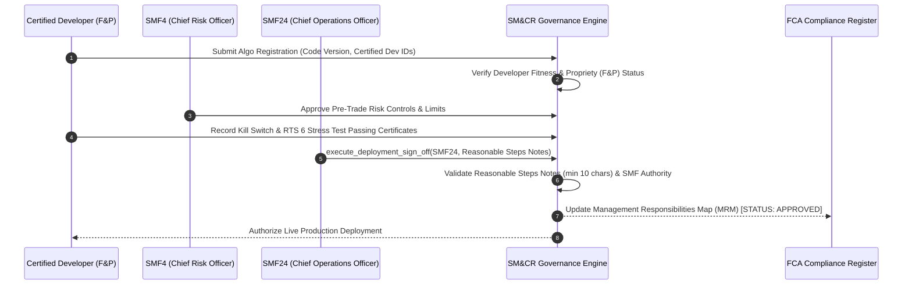

# Institutional UK FCA SM&CR Governance Workflows

## Workflow 1: Pre-Production Algo Deployment Sign-Off & Reasonable Steps Pipeline


---

## Workflow 2: Annual Certification & Management Responsibilities Map (MRM) Audit
```mermaid
flowchart TD
    A[Initiate Annual SM&CR Governance Review] --> B[Audit Senior Management Function Allocations]
    
    B --> C{Unassigned Trading Algorithms?}
    C -- Yes --> D[FLAG NON-COMPLIANCE: Assign SMF Holder Immediately]
    C -- No --> E[Audit Certification Register (Quant Devs & Traders)]
    
    E --> F{Any Dev Expired / Uncertified?}
    F -- Yes --> G[FLAG NON-COMPLIANCE: Revoke Production Commit Access]
    F -- No --> H[Verify Pre-Trade Risk & Kill Switch Testing Logs]
    
    H --> I[Execute generate_mrm_report()]
    I --> J[Submit Signed MRM Audit Report to FCA / PRA Regulators]
```

