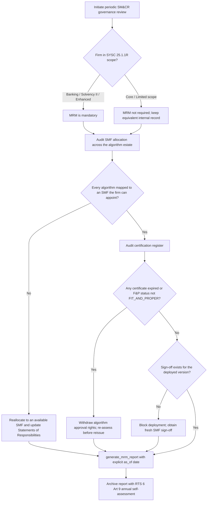

# UK FCA SM&CR Governance Workflows

## Workflow 1: Pre-production deployment sign-off and reasonable steps

```mermaid
sequenceDiagram
    autonumber
    participant Dev as Certification Function Approver (SYSC 27.8.23R)
    participant Risk as Risk Function
    participant SMF as Responsible SMF Holder
    participant Engine as SM&CR Governance Engine

    Note over Engine: Engine constructed with the firm's SM&CR tier;<br/>enhanced-only SMFs rejected for core firms

    Dev->>Engine: register_algo_strategy(algo_id, version, SMF, approvers)
    Engine->>Engine: Verify approvers hold current F&P certificates (12-month max)
    Engine-->>Dev: Warn if this is an amendment - prior sign-off does not carry over

    Risk->>Engine: Record pre-trade control approval (RTS 6 Art 15)
    Dev->>Engine: Record kill functionality drill (Art 12) and stress tests (Art 10)

    SMF->>Engine: execute_deployment_sign_off(version, reasonable-steps notes)
    Engine->>Engine: Reject content-free notes; reject a version mismatch
    Engine->>Engine: Store keyed by (algo_id, version); log the actual decision

    SMF->>Engine: verify_algo_deployment_readiness(algo_id, as_of=date)
    alt All governance evidence present
        Engine-->>SMF: Ready - evidence complete
    else Any gap
        Engine-->>SMF: Not ready + itemised issues, deployment blocked
    end
```

Readiness means the recorded evidence is complete. It is not a determination that the Duty of Responsibility has been discharged; that is assessed against DEPP 6.2.9-A to 6.2.9-E.

---

## Workflow 2: Periodic certification and governance audit



---

## Workflow 3: Handling an algorithm amendment

An amendment is the case most often mishandled, because nothing visibly fails.

1. Register the amended algorithm at its **new version**. The engine logs a warning that the prior sign-off does not carry over.
2. `verify_algo_deployment_readiness()` now reports no sign-off for the new version — the previous approval remains retrievable via `get_sign_off(algo_id, old_version)` for audit, but does not authorise release.
3. The certification function approver assesses the change; the responsible SMF signs off against the new version with notes covering what the amendment changed and what was re-tested.
4. Where the change is material, confirm the RTS 6 Article 9 self-assessment and Article 10 stress scenarios still cover the amended behaviour before release.
