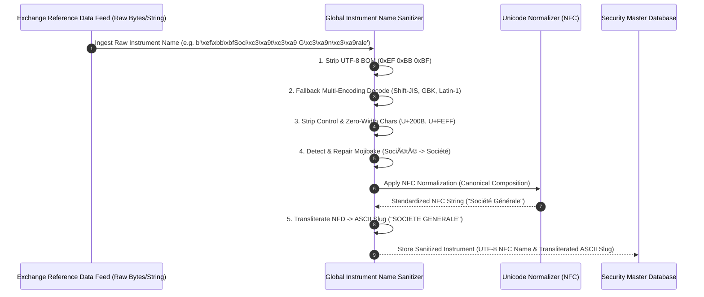

# Institutional Global Instrument Name Sanitization Workflows

## Workflow 1: Multi-Exchange Reference Data Sanitization Pipeline


---

## Workflow 2: Mojibake Detection & Security Master Match Decision Tree
```mermaid
flowchart TD
    A[Ingest Instrument Name String] --> B{Contains UTF-8 BOM or Zero-Width Chars?}
    
    B -- Yes --> C[Strip BOM & Zero-Width Chars: U+FEFF, U+200B]
    B -- No --> D{Contains Mojibake Patterns? e.g. é, ü}
    C --> D
    
    D -- Yes --> E[Execute repair_mojibake(): Re-encode Latin-1 -> Decode UTF-8]
    D -- No --> F[Apply Unicode NFC Normalization]
    E --> F
    
    F --> G[Generate Transliterated ASCII Slug: NFD Decomposition]
    G --> H[Query Security Master Index by NFC Name & ASCII Slug]
    
    H --> I{Match Found?}
    I -- Yes --> J[Link Existing Security Master ID (Prevent Duplicate Entry)]
    I -- No --> K[Create New Security Master Instrument Record]
```

