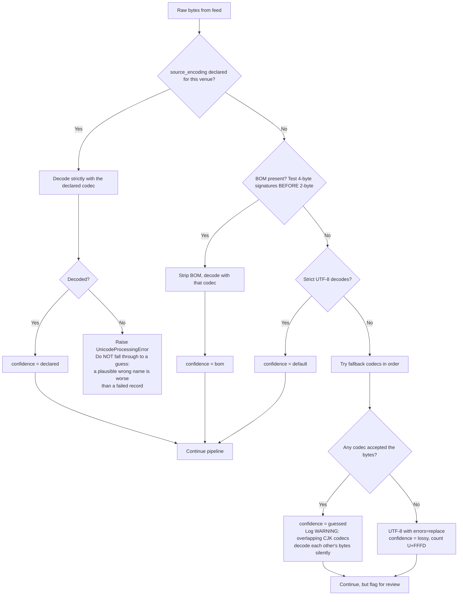
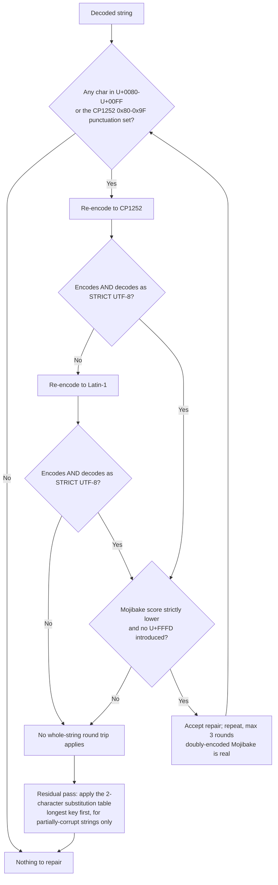
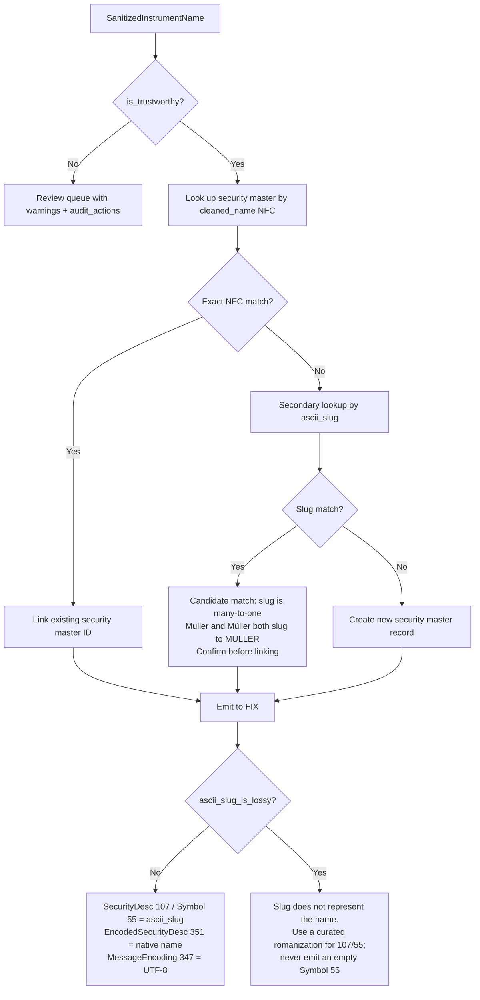

# Institutional Global Instrument Name Sanitization Workflows

## Workflow 1: Multi-Exchange Reference Data Sanitization Pipeline

The step order below is load-bearing. Mojibake repair runs **before** control stripping,
because the Latin-1 Mojibake of typographic punctuation is itself C1 control characters.

```mermaid
sequenceDiagram
    autonumber
    participant Feed as Exchange Reference Data Feed (raw bytes)
    participant Engine as Global Instrument Name Sanitizer
    participant Normalizer as Unicode Normalizer (NFC)
    participant Review as Review Queue
    participant DB as Security Master Database

    Feed->>Engine: Ingest raw name (e.g. b'\xef\xbb\xbfSoci\xc3\xa9t\xc3\xa9 G\xc3\xa9n\xc3\xa9rale')

    Engine->>Engine: 1. Decode: declared source_encoding, else BOM (UTF-8/16/32), else default, else guess
    Note over Engine: Result carries decode_confidence:<br/>declared / bom / default / guessed / lossy

    Engine->>Engine: 2. Repair Mojibake by strict CP1252 then Latin-1 round trip (max 3 rounds)
    Engine->>Engine: 3. Strip BOM / zero-width / control chars (joiners optional)
    Engine->>Normalizer: 4. Apply NFC (UAX #15)
    Normalizer-->>Engine: "Société Générale"
    Engine->>Engine: 5. Transliterate to ASCII slug, recording dropped characters

    alt is_trustworthy (declared or BOM decode, nothing lossy or dropped)
        Engine-->>DB: Persist cleaned_name (NFC) + ascii_slug + audit_actions
    else guessed encoding, lossy decode, or lossy slug
        Engine-->>Review: Queue with warnings; do NOT write unattended
    end
```

## Workflow 2: Decode-confidence decision tree

The single most damaging failure in this domain is a *successful* decode with the wrong
codec — no exception is raised and the name looks plausible.



## Workflow 3: Mojibake repair — round trip, not substitution table

A substitution table cannot distinguish corruption from correct text. `SÃO MARTINHO S.A.`
(B3: SMTO3) is correctly encoded Portuguese; a table with a bare `"Ã"` key rewrites it.



The **strict** UTF-8 decode is the safety guard. `SÃO MARTINHO S.A.` re-encodes to
`b"S\xc3O ..."`; `\xc3` starts a multi-byte sequence and `O` is not a continuation byte,
so the decode fails and the string is left alone.

## Workflow 4: Security master match and FIX emission



## Workflow 5: Per-venue encoding declaration

Encoding guessing is the root cause of silent corruption, so the ingest configuration —
not the sanitizer — should own the answer.

```python
VENUE_ENCODINGS = {
    "XTKS": "cp932",     # Tokyo: Shift-JIS family, NEC/IBM extension kanji present
    "XSHG": "gb18030",   # Shanghai
    "XKRX": "cp949",     # Korea Exchange (UHC)
    "XPAR": "utf-8",
    "XCSE": "utf-8",
}

config = InstrumentSanitizerConfig(source_encoding=VENUE_ENCODINGS[mic])
result = GlobalInstrumentNameSanitizer(config).sanitize_instrument_name(raw_bytes)
```

When a declared codec starts failing, that is a feed change to investigate — not a reason
to relax the declaration back to guessing.
