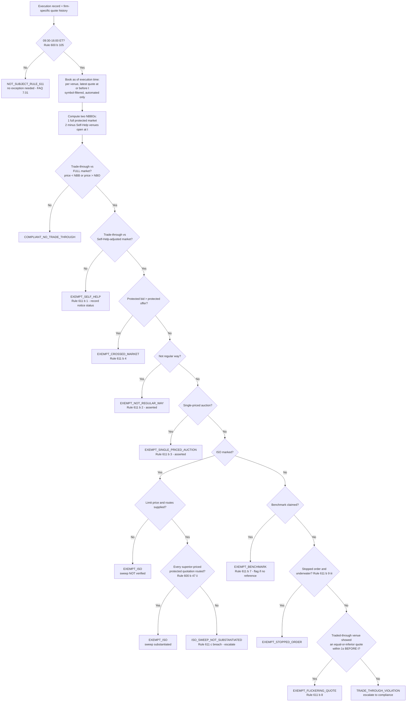
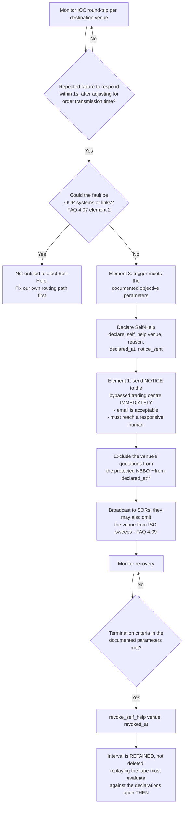

# SEC Regulation NMS Rule 611 Workflows

## Workflow 1: Evaluating one execution

The order of the branches matters and follows the rule's own structure.
Rule 611(b) excepts "*the transaction that constituted the trade-through*", so
whether a trade-through occurred is settled **before** any exception is
considered. An ISO-marked print that never traded through the market is
compliant, not exempt — and the difference is the number an examiner asks for.

### Step notes

**Session gate first.** Convert to Eastern time — not UTC, not the host's local
zone. The offset changes twice a year and a UTC-only comparison silently shifts
the window by an hour for eight months of the year. Do this before anything
else: outside regular trading hours there is no trade-through to analyse and no
quote data is required.

**As-of book construction.** For each venue, keep only its most recent quote at
or before the execution timestamp, and discard quotes stamped after it. Without
this, an unordered list handed to `max`/`min` lets a quotation that did not yet
exist decide the outcome — look-ahead bias in a record an examiner will read.
Filter to the execution's own symbol: a mixed feed produces a numerically valid
and completely meaningless NBBO, silently.

**Two books, not one.** Compute the protected NBBO twice — once over the full
protected market, once with Self-Help venues removed. The comparison is what
separates `EXEMPT_SELF_HELP` from `COMPLIANT`, and the count of the former is
what tells you whether your Self-Help policy is being over-used.

**Price test, both directions, both sides.** `price > protected offer` trades
through the offer; `price < protected bid` trades through the bid. Apply both to
buys and to sells (Rule 600(b)(105)).

**Crossed market before anything else in the ladder.** When NBB > NBO every
price is through one side. Rule 611(b)(4) excepts the condition. A **locked**
market (NBB == NBO) is not crossed and gets no exception.

**ISO.** Rule 611(b)(5) lets the *receiving* trading centre rely on the marking.
Rule 611(c) does not let the *router* rely on it: it must have routed
simultaneous ISOs against the full displayed size of every protected quotation
priced superior to the ISO's **limit price** — offers for a buy, bids for a
sell. Venues under Self-Help may be omitted (FAQ 4.09).

**Flickering quote.** Per venue, strictly prior, equal-or-inferior. See
`references/standards.md` §4.

**Snapshot on every path.** Retain the protected NBB/NBO, the as-of instant, the
contributing venues, the Self-Help venues and their notice status — on exempt
outcomes too. An exempt record with a zeroed NBBO cannot be reconciled against
CAT.

---

## Workflow 2: Self-Help lifecycle (Rule 611(b)(1))

The three boxes on the left are the three elements FAQ 4.07 makes mandatory.
None of them is optional, and the notice is the one firms omit.

### Why intervals, not a boolean

A boolean "NYSE is under Self-Help" flag makes every historical evaluation
depend on the operational state at the moment the report is run. Replay
yesterday's tape after this morning's outage and yesterday's clean fills become
exempt; replay it after the outage clears and yesterday's exempt prints become
violations. Neither answer is reproducible, and reproducibility is the point of
the record. Store `(declared_at, revoked_at, reason, notice_sent)` and evaluate
at the execution timestamp.

### The narrower alternative — FAQ 4.08

If the problem is a *single* unanswered order against a *single* protected
quotation, a trading centre that routed to access that quotation's full
displayed size may continue trading without regard to it until a response
arrives — no Self-Help election, no notice. Electing Self-Help is for bypassing
a venue's protected quotations **generally**.

---

## Workflow 3: Periodic Rule 611(a)(2) surveillance review

Rule 611(a)(1) is a policies-and-procedures standard; Rule 611(a)(2) is the duty
to surveil their effectiveness and remedy deficiencies. Neither is satisfied by
a per-trade pass rate.

1. **Select the review period.** FAQ 6.03 does not require a comprehensive quote
   database. It permits periodic reviews over selected periods — the FAQ's own
   example is three trading days per month, chosen by compliance and known only
   to them — provided the firm retains enough firm-specific quotation data from
   those periods to demonstrate the reviews were reasonable.
2. **Run the evaluation on firm-specific data.** Firm receipt timestamps for
   quotes, firm execution timestamps for trades (FAQ 6.01).
3. **Screen against Network data too.** FAQ 6.04 warns that regulators will use
   SIP data as the common reference point and may open an inquiry on an
   exceptionally high apparent trade-through rate. Run the same period against
   SIP data, expect disagreement, and be able to explain each difference as a
   false positive with firm-specific evidence.
4. **Review exception *rates*, not just violations.** A rising share of
   `EXEMPT_ISO` without substantiating routes, of `EXEMPT_BENCHMARK` without a
   recorded benchmark reference, or of `EXEMPT_SELF_HELP` against one venue, is
   a policies-and-procedures deficiency even with zero violations. These are the
   metrics Rule 611(a)(2) is actually asking about.
5. **Escalate `ISO_SWEEP_NOT_SUBSTANTIATED` separately.** It is a Rule 611(c)
   routing failure, not a Rule 611(a) execution failure, and it usually points
   at the router configuration rather than the venue.
6. **Remedy and record.** "*Prompt action to remedy deficiencies*" is the
   operative phrase; the record of what was changed and when is the artefact
   that demonstrates it.
