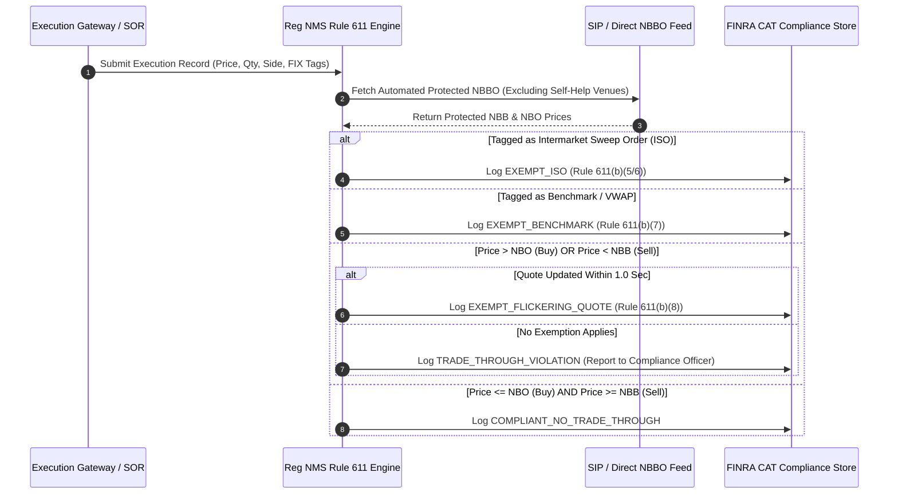

# Institutional SEC Regulation NMS Rule 611 Workflows

## Workflow 1: Real-Time Trade-Through Compliance Pipeline


---

## Workflow 2: Venue Self-Help Exemption Lifecycle (Rule 611(b)(1))
```mermaid
flowchart TD
    A[Monitor Venue Response Latency] --> B{Venue Response Time > 1.0 sec OR Outage?}
    
    B -- Yes --> C[Invoke declare_self_help(venue_id, reason)]
    B -- No --> D[Maintain Standard Protected NBBO Ingestion]
    
    C --> E[Exclude Venue Quotes from Protected NBBO Calculations]
    E --> F[Broadcast Self-Help Declaration to Smart Order Routers]
    
    F --> G[Monitor Venue Recovery & Latency Restoration]
    G --> H{Venue Performance Normal (< 1.0 sec)?}
    
    H -- Yes --> I[Invoke revoke_self_help(venue_id)]
    I --> J[Re-include Venue Quotes in Protected NBBO]
    H -- No --> G
```

