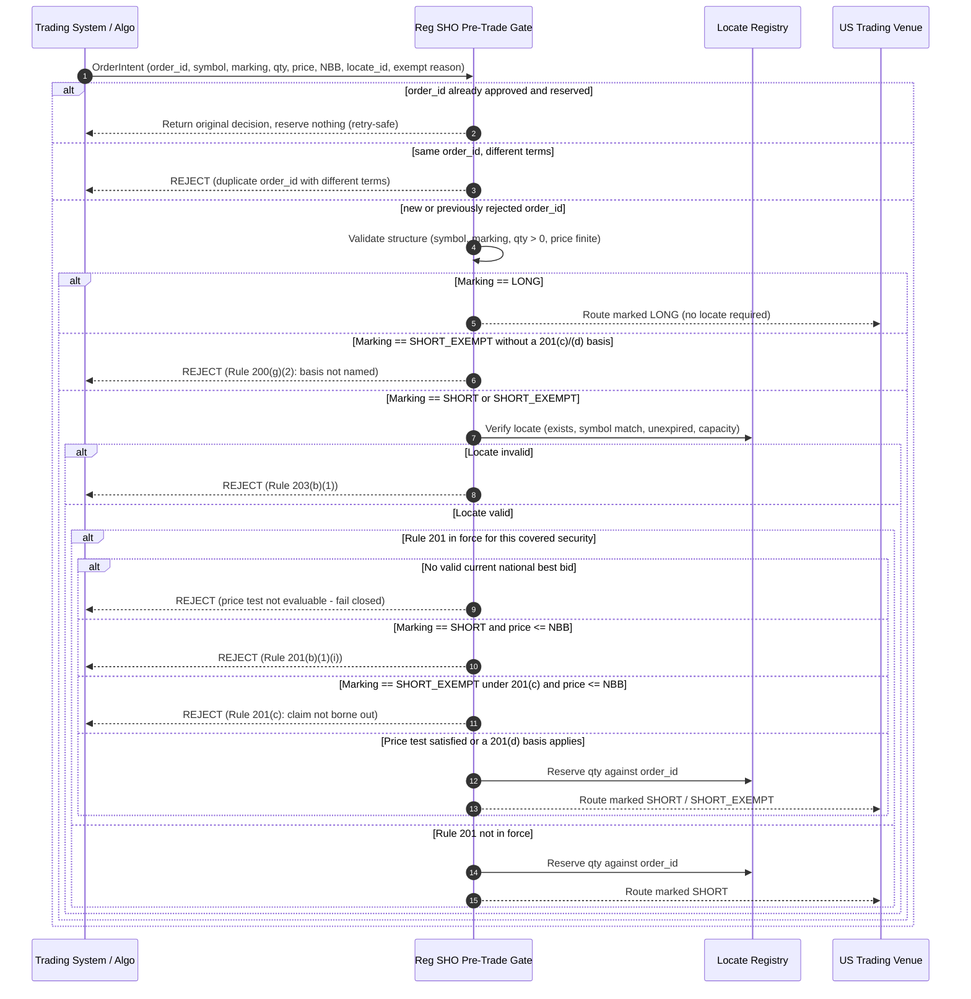
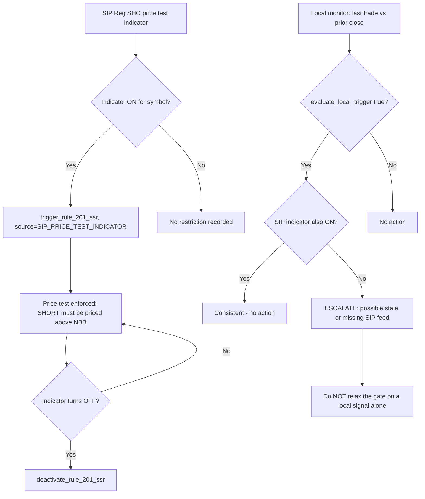
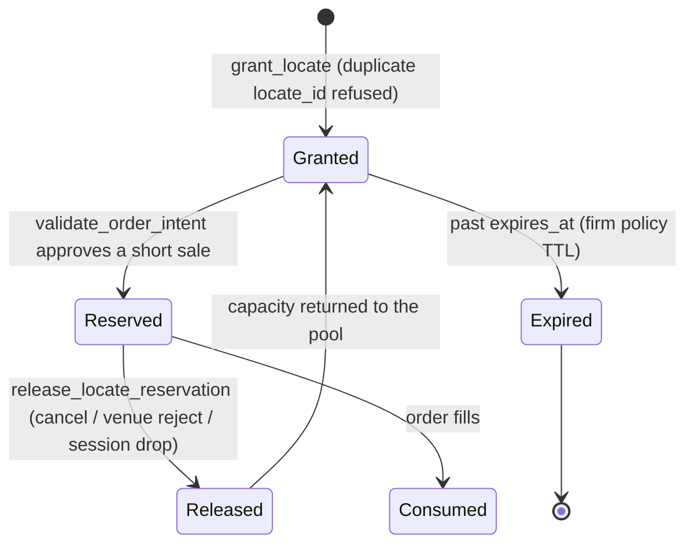

# SEC Regulation SHO Compliance Workflows

## Workflow 1: Pre-trade marking, locate and price test gate

Every branch above appends a `RegSHOValidationResult` to `engine.audit_log`, including the
rejections.

---

## Workflow 2: Rule 201 restriction lifecycle

The compliance trigger is the listing market's determination under 242.201(b)(3), disseminated
under 242.603(b). The local decline calculation exists only to detect that the SIP feed has
gone stale or silent.

`effective_through` is left unset by default. Rule 201(b)(1)(ii) runs the restriction for the
remainder of the trigger day *and the following day*, which needs a trading calendar this
module does not own. A guessed calendar that lifts the restriction early permits a prohibited
short sale; one that lifts it late only costs fills. Set `effective_through` explicitly when
an authoritative end time is available.

---

## Workflow 3: Locate reservation lifecycle

Notes on the transitions:

- **Reserve on approval, not on fill.** Between approval and fill the capacity must not be
  offered to another order.
- **Release is mandatory for anything that is not a fill.** A pool that only ever decreases
  silently starves the desk for the rest of the locate's life.
- **A released order ID cannot re-reserve.** Re-submitting it returns the original approval.
  Reusing locate capacity for a genuinely new short sale is only permissible under the narrow
  conditions in SEC Reg SHO FAQ 4.4 — quantity no greater than the original locate, locate good
  for the whole trading day — and never for threshold or hard-to-borrow securities. That is a
  firm policy decision with its own supervisory record, made outside this gate.
- **`RegSHOError` is for this lifecycle only.** Releasing an unknown order, releasing twice, or
  re-granting an existing `locate_id` raises. The order path never raises: it returns a
  non-compliant result so the rejection is logged and auditable.

---

## Workflow 4: Failure-mode drills to run before go-live

| Scenario | Expected gate behaviour |
| :--- | :--- |
| NBBO feed returns `0.0` or drops out while a restriction is in force | Reject the short sale; do not treat an absent bid as an unrestricted one |
| Price or NBB arrives as `NaN` / `Inf` | Reject; a NaN comparison silently satisfies the price test |
| Pre-trade check times out and the caller retries | Original decision returned, locate reserved exactly once |
| Same `order_id` resubmitted with a larger quantity after approval | Rejected as a duplicate with different terms |
| Rejected order resubmitted after its locate is granted | Evaluated afresh and approved; rejections reserve nothing and are not cached |
| `order_id` blank, whitespace, or not a string | Rejected; a reservation cannot be keyed or audited without one |
| Venue rejects an approved short sale | `release_locate_reservation` restores capacity |
| Locate feed supplies naive (non-UTC-aware) expiry timestamps | Interpreted as UTC; no exception on the order path |
| Locate granted twice under the same ID | `RegSHOError`; consumed capacity preserved |
| SSR flag set for `tsla` and order arrives for `TSLA` | Restriction applies (symbol comparison is case-normalised) |
| Order quantity of `0` or a negative number | Rejected; the pool is never credited |
