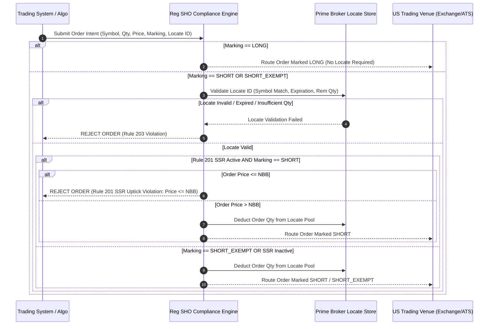

# Institutional SEC Regulation SHO Compliance Workflows

## Workflow 1: Pre-Trade Short Sale Locate & Order Marking Gate


---

## Workflow 2: Rule 201 SSR Circuit Breaker Lifecycle Workflow
```mermaid
flowchart TD
    A[Monitor Real-Time Intraday Price Change] --> B{Intraday Drop >= 10% vs Prior Close?}
    
    B -- Yes --> C[Invoke trigger_rule_201_ssr(symbol)]
    B -- No --> D[Maintain Normal Short Sale Processing]
    
    C --> E[Enforce Rule 201 Alternative Uptick Test: Short Price > NBB]
    E --> F{Order Marked SHORT_EXEMPT?}
    
    F -- Yes --> G[Bypass Uptick Test: Route Short Sale at or below NBB]
    F -- No --> H{Order Price > NBB?}
    
    H -- Yes --> I[Approve & Route Order Marked SHORT]
    H -- No --> J[REJECT ORDER: Rule 201 SSR Price Test Failure]
```

