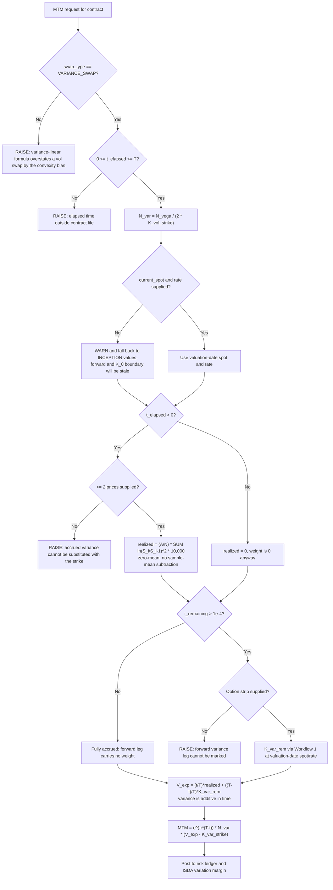

# Variance Swap & Volatility Derivative Workflows

## Workflow 1: Fair variance strike ($K_{\text{var}}$) static replication

The decision points that matter are the reference-strike anchor, the collapse to one
OTM quote per strike *before* the $\Delta K$ grid is built, and the two-wing check —
each one silently corrupts $K_{\text{var}}$ if skipped.

```mermaid
flowchart TD
    A[Ingest S_0, r, T, option chain] --> B[F = S_0 * e^(r*T)]
    B --> C{Any strike <= F?}
    C -- No --> X1[RAISE: put wing missing, log contract cannot be anchored]
    C -- Yes --> D["S* = K_0 = max strike <= F"]

    D --> E["Collapse chain to ONE quote per strike:<br/>K &lt; K_0 -> put · K &gt; K_0 -> call<br/>K = K_0 -> average of put and call<br/>ITM quotes discarded"]
    E --> F{Strikes on BOTH sides of K_0?}
    F -- No --> X2[RAISE: one-sided strip understates K_var with no error signal]
    F -- Yes --> G["Build Delta_K on the SELECTED grid<br/>interior: (K_i+1 - K_i-1)/2 · edges: one-sided"]

    G --> H["Sum = SUM (Delta_K_i / K_i^2) * Q(K_i)"]
    H --> I["K_var = (2/T)*e^(rT)*Sum<br/>+ (2/T)*[rT - (F/S* - 1) - ln(S*/S_0)]<br/>scaled by 10,000"]
    I --> J{K_var > 0?}
    J -- No --> X3[RAISE: arbitrageable or stale quotes, not a zero-vol market]
    J -- Yes --> K{Strike range covers 50%-200% of spot?}
    K -- No --> L[WARN: K_var is a lower bound, bias grows with maturity]
    K -- Yes --> M[Range adequate]
    L --> N
    M --> N{Pricing a volatility swap?}
    N -- No --> O[Return K_var and diagnostics]
    N -- Yes --> P["Require vol_of_vol input:<br/>K_vol = sqrt(K_var - volvol^2)<br/>NEVER strike at sqrt(K_var)"]
    P --> O
```

**Why $\Delta K$ comes after the collapse.** A two-sided chain lists every strike
twice. Computing $(K_{i+1} - K_{i-1})/2$ across `[90P, 90C, 100P, 100C, 110P, 110C]`
gives 5 where the true spacing is 10 — every interior weight is halved and
$K_{\text{var}}$ comes back roughly 50% light, with no error and no warning.

**Why the anchor term survives.** It is zero only when $S^* = F$ exactly. Anchoring on
a traded strike $K_0 \ne F$ — which a discrete grid forces — makes it live. It is
second-order equivalent to Cboe's $-\frac{1}{T}(F/K_0 - 1)^2$.

---

## Workflow 2: Seasoned variance swap mark-to-market



**Why every "missing data" branch raises instead of substituting.** Filling an
unmarkable leg with $K_{\text{var,strike}}$ makes that leg contribute exactly zero
P&L, which is indistinguishable on a blotter from a genuinely flat position. An
unmarked contract must look unmarked.

---

## Workflow 3: Deciding whether a quoted $K_{\text{var}}$ is trustworthy

Run before accepting a replicated strike as a fair mid.

| Check | Threshold | If it fails |
|---|---|---|
| Both wings present | $\ge 1$ strike either side of $K_0$ | Do not price; source the missing wing |
| Strike range | 50%–200% of spot (DDKZ Table 4) | Treat $K_{\text{var}}$ as a lower bound; size the gap against maturity |
| Maturity vs range | Narrow range costs ~0.1 vol pts at 3M, ~2.0 at 1Y | Widen the strip before quoting anything past ~6 months |
| $K_0$ vs $F$ | $K_0$ close below $F$ | A large $F - K_0$ gap means the anchor term is doing real work — do not drop it |
| Jump exposure | Event risk in the accrual window | Haircut per DDKZ Table 5: 7.2 variance points per 10% one-year gap |
| Quote staleness | Two-sided, non-zero premiums | A zero or crossed strip yields a non-positive $K_{\text{var}}$; the engine raises |
| Units | Strike in points, notional vega vs variance | Re-derive $N_{\text{var}} = N_{\text{vega}}/(2K_{\text{vol}})$ from the term sheet |
