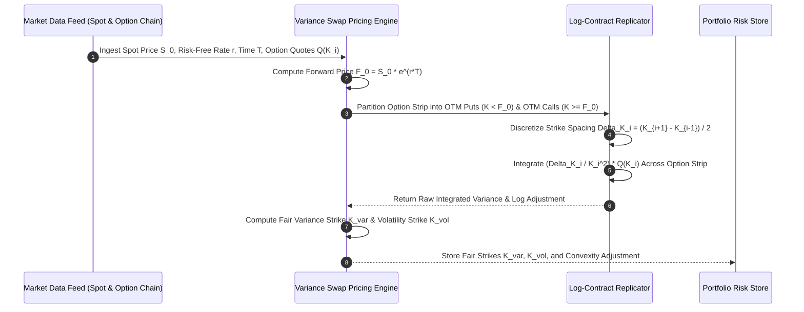

# Institutional Variance Swap & Volatility Derivatives Workflows

## Workflow 1: Fair Variance Strike ($K_{\text{var}}$) Static Replication Pipeline


---

## Workflow 2: Seasoned Variance Swap Mark-to-Market (MTM) Valuation
```mermaid
flowchart TD
    A[Initiate Seasoned Contract MTM Valuation] --> B[Fetch Contract Specs: N_vega, K_vol_initial, T]
    
    B --> C[Compute Variance Notional N_var = N_vega / 2*K_vol_initial]
    B --> D[Calculate Realized Variance so far: (252/N) * SUM( ln(S_i / S_{i-1})^2 )]
    B --> E[Calculate Fair Remaining Variance Strike K_var_remaining via Option Strip]
    
    C --> F[Blend Expected Total Variance: V_exp = (t/T)*Var_realized + ((T-t)/T)*K_var_rem]
    D --> F
    E --> F
    
    F --> G[Compute PV Difference: MTM = e^(-r*(T-t)) * N_var * (V_exp - K_var_initial)]
    G --> H[Update Risk Ledger & Margining Systems]
```
