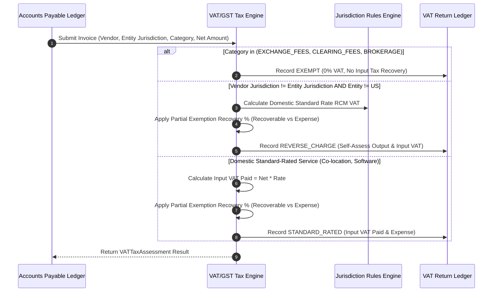

# Institutional VAT/GST Tax Assessment Workflows

## Workflow 1: Invoice Tax Classification & Reverse Charge Decision Pipeline


---

## Workflow 2: Partial Exemption Special Method (PESM) & Return Filing
```mermaid
flowchart TD
    A[Initiate Period-End VAT/GST Return] --> B[Calculate Turnover: Taxable vs Exempt Supplies]
    
    B --> C[Compute Pro-Rata Recovery Ratio %: Taxable / Total * 100]
    C --> D[Invoke set_partial_exemption_ratio(Ratio)]
    
    D --> E[Batch Process Invoices via generate_vat_return_summary()]
    E --> F[Sum Total Input VAT Paid, Reverse Charge VAT & Recoverable VAT]
    
    F --> G[Generate Official VAT Return Form (UK Box 1-9 / EU Return / SG GST F5)]
    G --> H[Submit Return & Post Unrecoverable Input VAT Expense to PnL]
```
