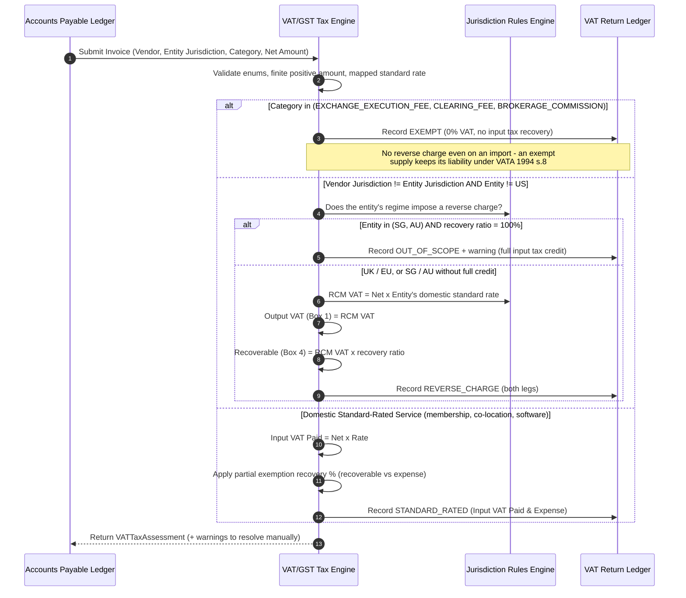
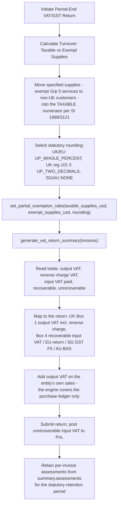

# Institutional VAT/GST Tax Assessment Workflows

## Workflow 1: Invoice Tax Classification & Reverse Charge Decision Pipeline

**Decision points that are not automatic.** The engine emits warnings rather
than silently deciding:

- An `EXCHANGE_EXECUTION_FEE` invoice that also carries membership, port,
  connectivity or technology lines must be **split**, with the standard-rated
  element re-booked as `EXCHANGE_MEMBERSHIP_CONNECTIVITY_FEE`
  (HMRC VAT Notice 701/49 para 6.9).
- A cross-border `COLOCATION_DATA_FEED` invoice is reverse-charged on the B2B
  general rule, but an **exclusive-use cage or suite** may instead be a supply
  connected with immovable property, taxable where the data centre sits
  (CJEU C-215/19 *A Oy*) — which requires local registration, not a reverse charge.
- The Singapore/Australia full-credit carve-out uses a 100% recovery ratio as a
  proxy for the statutory entitlement test. Confirm entitlement directly.

---

## Workflow 2: Partial Exemption & Period-End Return Filing

**Ordering matters.** Set the recovery ratio *before* generating the summary:
`generate_vat_return_summary` applies whatever ratio the engine currently holds,
and re-running it after a ratio change produces different figures for the same
invoices.
