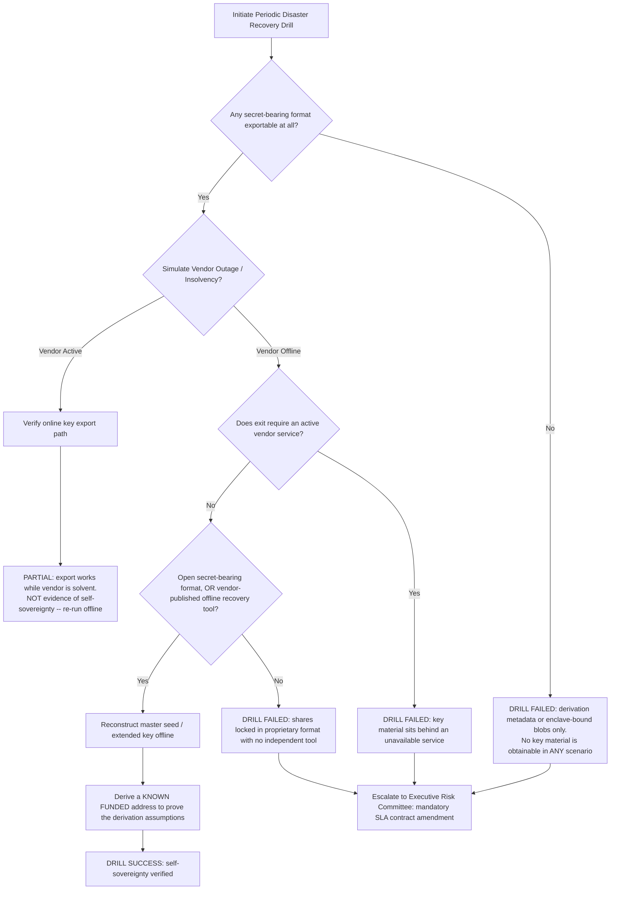

# Institutional Custody Vendor Lock-In & Disaster Recovery Workflows

## Workflow 1: Custody Provider Lock-In Risk Assessment Pipeline
```mermaid
sequenceDiagram
    autonumber
    participant Ops as Custody Operations Team
    participant Engine as Lock-In Risk Analyzer
    participant Profile as Custodian Profile Register
    participant Portfolio as Asset Portfolio Ledger

    Ops->>Engine: Initiate Custody Lock-In Assessment (Provider ID, Portfolio Specs)
    Engine->>Profile: Fetch Custodian Specs (Architecture, Key Formats, Recovery Tools)
    Engine->>Portfolio: Fetch Portfolio Specs (Wallets, Blockchain Networks, Gas Fees)

    Engine->>Engine: 0. Validate inputs (negative values raise CustodyAnalyzerError)
    Engine->>Engine: 1. Separate secret-bearing formats from derivation metadata
    Engine->>Engine: 2. Score portability from the BEST export path; gate bonuses on exportable material
    Engine->>Engine: 3. Assign Lock-In Risk Level (LOW additionally requires a locatable estate)
    Engine->>Engine: 4. Estimate exit cost and duration

    Engine-->>Ops: Output CustodyLockInAssessment (Risk Level, Risk Factors, Recommendations)
```

The risk factors are part of the output, not commentary on it. Caveats that a
single score cannot express — undisclosed derivation paths, SLIP-0039's BIP-39
incompatibility, WIF's per-address enumeration requirement — are emitted only
there, and a `LOW` score with an unread risk factor is how an unrecoverable
backup gets signed off.

---

## Workflow 2: Disaster Recovery Self-Sovereign Key Reconstruction Drill

The decisive question is not "is the format open" but "do I already hold, offline,
material I can reconstruct with the vendor uninvolved". The two are routinely
confused, because a custodian can offer a perfectly open export format that is
only reachable through its own API.



### Why an open format alone can pass without a vendor tool

A BIP-39 mnemonic or SLIP-0039 share set that you already hold is restorable with
any standards-compliant third-party wallet — no vendor software is involved, so
`open_source_recovery_tool_available=False` does not by itself fail the offline
drill. A proprietary MPC share is the opposite case: the format is useless
without reconstruction logic, so the drill succeeds only on the strength of a
published offline tool you have actually run.

### Step J is not optional

Reconstructing a seed proves you hold the secret. Deriving a known funded address
from it proves you also hold the *map*. BIP-39 defines no derivation structure,
so a drill that stops at "the mnemonic checksum validates" has verified an
encoding, not a recovery.

---

## Workflow 3: Exit Cost Modelling

1. Enumerate wallets and networks from the custodian's inventory export, not from
   the portfolio management system — the discrepancy between the two is itself a
   finding.
2. The engine multiplies wallets × networks × average gas fee, i.e. one sweep per
   wallet per network. Treat it as an upper bound where wallets are not funded on
   every network, and as an underestimate where token approvals, contract
   interactions or UTXO consolidation add transactions.
3. Where the estate is concentrated on expensive chains, model those networks
   separately rather than relying on a single blended average.
4. Add `RECOVERY_TOOL_DELAY_DAYS` (14, an engineering default) to the contractual
   notice period only where no independent offline recovery tool exists —
   substitute the real periods from your custody agreement when you have them.
