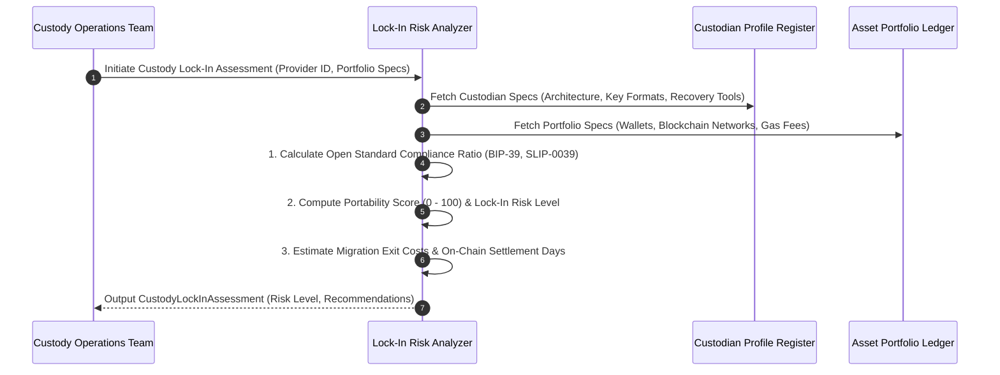

# Institutional Custody Vendor Lock-In & Disaster Recovery Workflows

## Workflow 1: Custody Provider Lock-In Risk Assessment Pipeline


---

## Workflow 2: Disaster Recovery Self-Sovereign Key Reconstruction Drill
```mermaid
flowchart TD
    A[Initiate Quarterly Disaster Recovery Drill] --> B{Simulate Vendor Outage / Insolvency?}
    
    B -- Vendor Active --> C[Verify Online Key Share Export API]
    B -- Vendor Offline --> D[Attempt Offline Key Recovery without Vendor API]
    
    D --> E{Custodian Supports Open Formats + Open Recovery Tools?}
    
    E -- Yes --> F[Reconstruct Master Seed using Open Offline Tool: BIP-39 / SLIP-0039]
    F --> G[RECOVERY DRILL SUCCESS: Self-Sovereignty Verified]
    
    E -- No --> H[RECOVERY DRILL FAILED: Key Shares Locked in Proprietary Format]
    H --> I[Escalate to Executive Risk Committee: Issue Mandatory SLA Contract Amendment]
```
