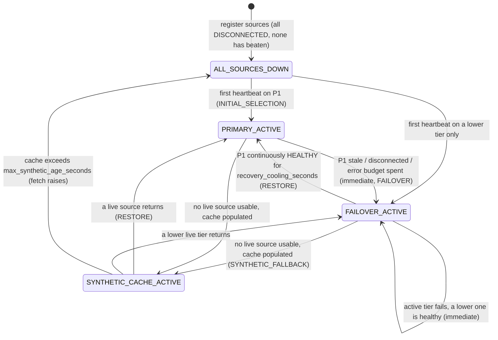
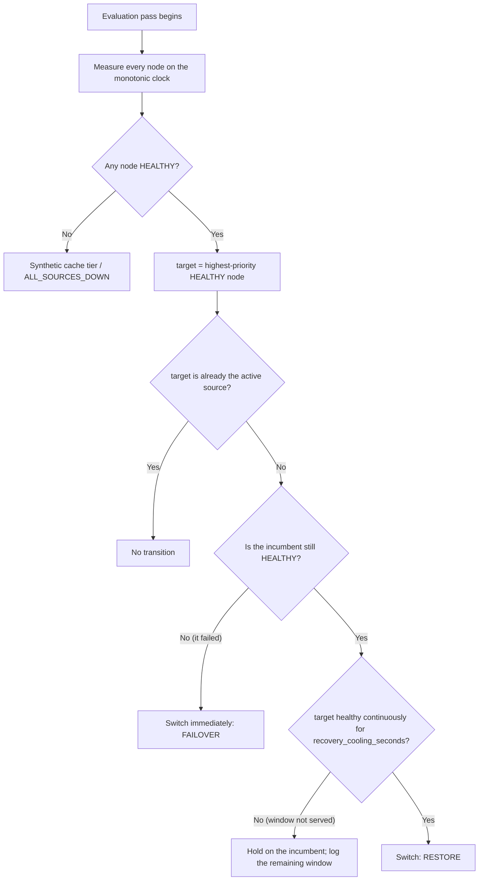

# Workflows — vendor-outage-fallback-data-source-hierarchy

## Workflow 1: Tick fetch and the walk down the hierarchy

Each source is attempted **at most once per fetch call**, so the walk terminates in one
pass regardless of how the vendors misbehave. A raising vendor and a vendor returning an
unusable quote are treated identically: charge an error, move down.

```mermaid
sequenceDiagram
    autonumber
    participant Strat as Strategy / feed consumer
    participant Eng as Fallback hierarchy engine
    participant P1 as Priority 1 (direct exchange feed)
    participant P2 as Priority 2 (enterprise aggregator)
    participant Cache as Last-known-price cache

    Strat->>Eng: fetch_market_data_tick(symbol, fetch_func)
    Eng->>Eng: Re-measure every node (disconnect, error budget, staleness on monotonic clock)
    Eng->>Eng: Select highest-priority HEALTHY node, subject to the promotion hold

    alt Priority 1 selected
        Eng->>P1: fetch_func(symbol, "P1")
        P1-->>Eng: (price, volume)
        Eng->>Eng: Validate: finite, sign, arity
        alt Quote valid
            Eng->>Cache: Overwrite cached quote (price, volume, both clocks)
            Eng-->>Strat: MarketDataTick(source=P1, is_synthetic=False, age_seconds=0.0)
        else Quote rejected (NaN / inf / bad sign / bad shape)
            Eng->>Eng: record_error(P1); do not cache; P1 excluded from this call
            Eng->>P2: fetch_func(symbol, "P2")
            P2-->>Eng: (price, volume)
            Eng-->>Strat: MarketDataTick(source=P2, is_synthetic=False)
        end
    else No live source is usable
        Eng->>Cache: Read cached quote for symbol
        alt Nothing cached
            Eng-->>Strat: raise FallbackEngineError (complete outage)
        else age > max_synthetic_age_seconds, or allow_synthetic=False
            Eng-->>Strat: raise FallbackEngineError (refusing an obsolete price)
        else Cache within bound
            Eng-->>Strat: MarketDataTick(is_synthetic=True, timestamp=observed_at, age_seconds=N)
        end
    end
```

Note what the diagram does **not** show: no arrow ever goes back up to retry P1 within
the same call, and the cache is written only from a quote that passed validation.

## Workflow 2: Failover and promotion state machine



Failover transitions are unconditional. Only the `FAILOVER_ACTIVE -> PRIMARY_ACTIVE`
edge — and any other switch away from a still-healthy incumbent — is gated.

## Workflow 3: The promotion hold, in detail



The `H -- No` branch is the one that is easy to omit and dangerous to omit. Without it,
a hold started while the incumbent was healthy keeps routing pinned to that incumbent
*after* it dies, because the hold was only ever re-checked against the challenger. The
observable symptom is a strategy fetching from a feed whose last heartbeat was a minute
ago while a healthy Priority 1 sits idle beside it.

`healthy_since` is cleared on **every** unhealthy observation, so an interrupted run does
not accumulate credit. Two 25-second runs separated by one missed heartbeat are not a
50-second run; they are two runs, neither of which reached 30 seconds.

## Workflow 4: Wiring the engine into a feed handler

```
on session established        -> record_heartbeat(source_id)
on every tick / heartbeat     -> record_heartbeat(source_id, timestamp=vendor_stamp)   # stamp is audit-only
on protocol error / timeout   -> record_error(source_id, reason)
on socket close / logout      -> mark_disconnected(source_id, reason)
on supervised reconnect       -> reset_error_count(source_id)   # optional; the budget also decays
```

Plus, on a supervisor timer:

```
every T seconds, T << min(max_staleness_seconds) -> evaluate_health_and_failover()
```

The engine holds no timer of its own. Without that supervisor call, a total feed stall
is invisible until the next fetch — and if the strategy has stopped fetching *because*
the feed stalled, that is never.

### Choosing `allow_synthetic`

| Caller | `allow_synthetic` | Why |
|---|---|---|
| Order placement / routing | `False` | A fill priced off a quote that stopped existing minutes ago is not recoverable |
| Risk limit checks, margin, mark-to-market | `False` | A limit evaluated against an obsolete price is not a limit |
| Signal computation, monitoring, display | `True` | Continuity is worth more than precision here, provided `is_synthetic` is surfaced |

## Workflow 5: Failover drill

MiFID II RTS 6 Article 14(4) requires in-scope firms to review and test business
continuity arrangements annually. Run this against a staging deployment with recorded or
simulated feeds; do not test a fallback tier for the first time during an incident.

1. **Cold start.** Start with no heartbeats. Confirm `ALL_SOURCES_DOWN`, that fetches
   raise, and that no failover event is written — a restart is not an incident.
2. **Tier 1 stall (frozen, not disconnected).** Stop heartbeats on Priority 1 without
   closing the socket. Confirm the staleness timer, not the transport, is what triggers
   the switch, and record the measured detection latency.
3. **Tier 1 hard disconnect.** Close the socket. Confirm `mark_disconnected` switches
   faster than the staleness path would have.
4. **Cascading loss.** Fail tiers 1 and 2. Confirm routing reaches tier 3 in one pass and
   that each source was attempted once.
5. **Total outage.** Fail every tier. Confirm the synthetic tick carries
   `is_synthetic=True`, a non-zero `age_seconds`, and an observation `timestamp`. Confirm
   an order-path caller with `allow_synthetic=False` is refused a price.
6. **Cache expiry.** Hold the outage past `max_synthetic_age_seconds`. Confirm the engine
   raises rather than serving, and that the consuming system degrades safely when it
   does — this is the step most often skipped.
7. **Flapping recovery.** Bring Priority 1 back with an interrupted heartbeat pattern.
   Confirm it does not recapture routing until it serves an unbroken window, and that
   the incumbent's own failure during the hold releases it immediately.
8. **Bad ticks.** Inject `NaN`, `inf`, a zero price and a negative volume from the active
   vendor. Confirm each is rejected, charged as an error, and absent from the cache.
9. **Clock step.** Step the host wall clock forwards and backwards by several minutes
   mid-run. Confirm no state change — this is the check that proves the durations are
   monotonic.
10. **Record it.** Date, participants, measured detection and switch latencies per tier,
    and every deviation. That record is the artefact Article 14(4) asks for.
