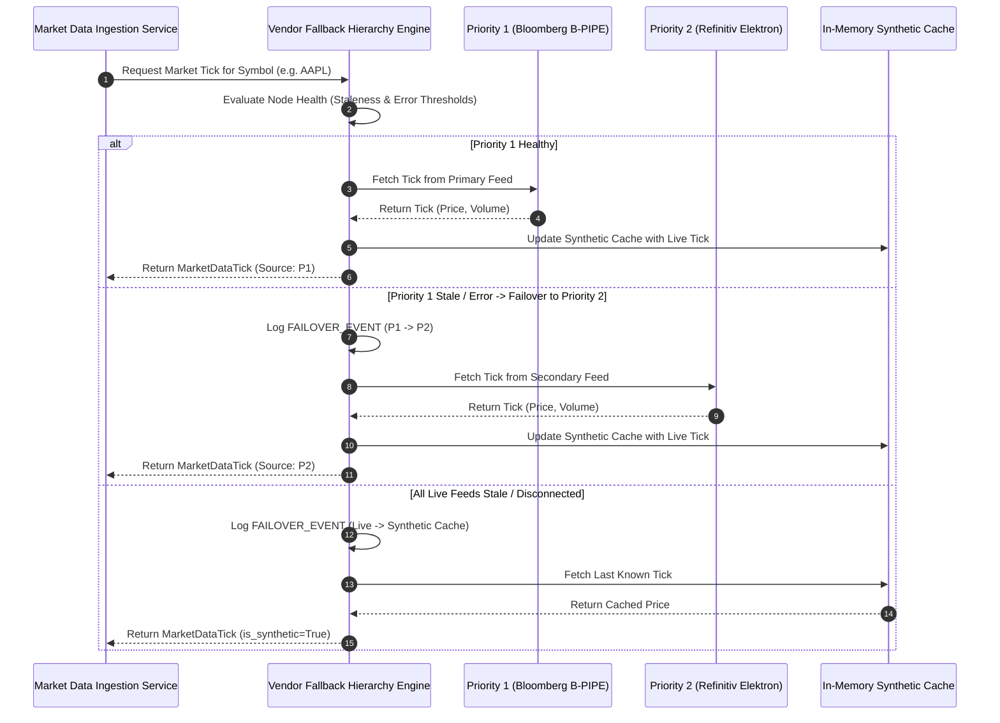
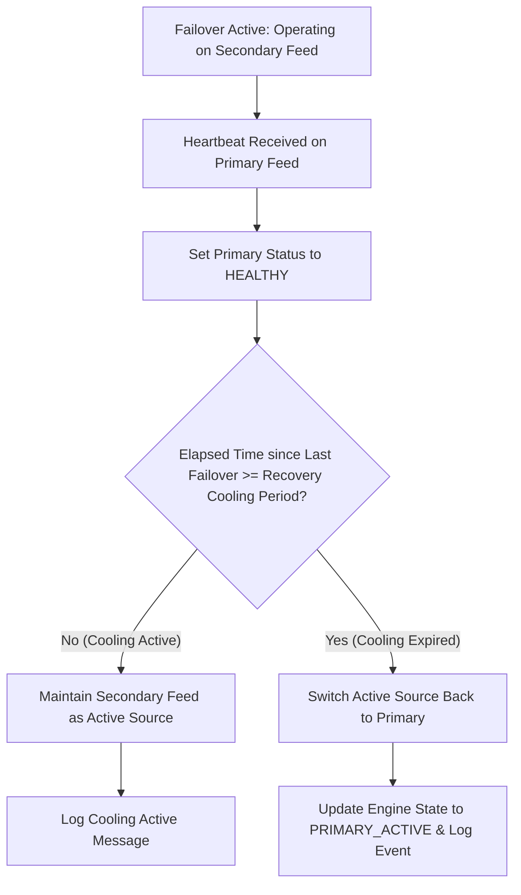

# Institutional Market Data Vendor Fallback Workflows

## Workflow 1: Real-Time Tick Ingestion & Automated Failover Pipeline

---

## Workflow 2: Anti-Flapping Recovery Cooling & Primary Restoration

