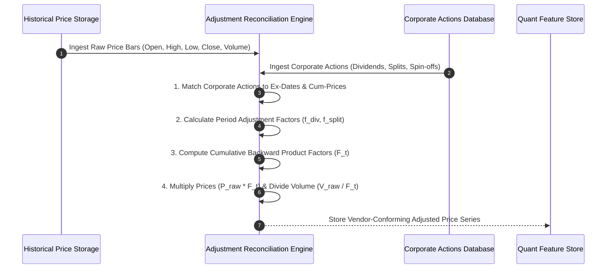

# Institutional Vendor Corporate Action Adjustment Workflows

## Workflow 1: Historical Price Adjustment & Factor Calculation Pipeline


---

## Workflow 2: Cross-Vendor Adjustment Reconciliation Pipeline
```mermaid
flowchart TD
    A[Initiate Cross-Vendor Price Reconciliation] --> B[Fetch Adjusted Price Series from Vendor A (e.g. CRSP)]
    A --> C[Fetch Adjusted Price Series from Vendor B (e.g. Bloomberg)]
    
    B --> D[Align Common Calendar Dates & Match Closing Prices]
    C --> D
    
    D --> E[Calculate Percentage Difference: |P_a - P_b| / Mean * 100]
    E --> F{Percentage Difference > Tolerance (0.5%)?}
    
    F -- No --> G[Log Date PASSED]
    F -- Yes --> H[Flag ReconciliationDivergence Anomaly]
    
    G --> I[Compile ReconciliationReport]
    H --> I
    
    I --> J{Report Status PASSED?}
    J -- Yes --> K[Approve Series for Quant Backtesting & Alpha Models]
    J -- No --> L[Quarantine Divergent Symbol & Trigger Data Audit Alert]
```

