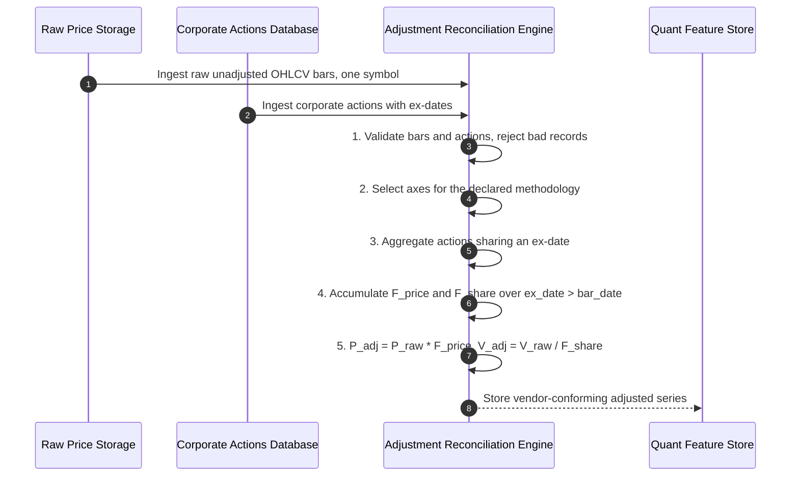
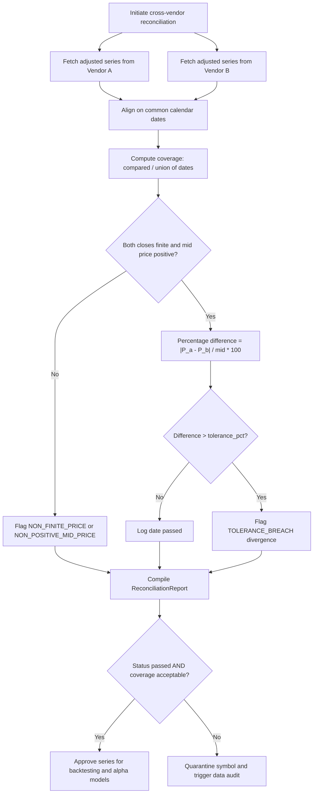
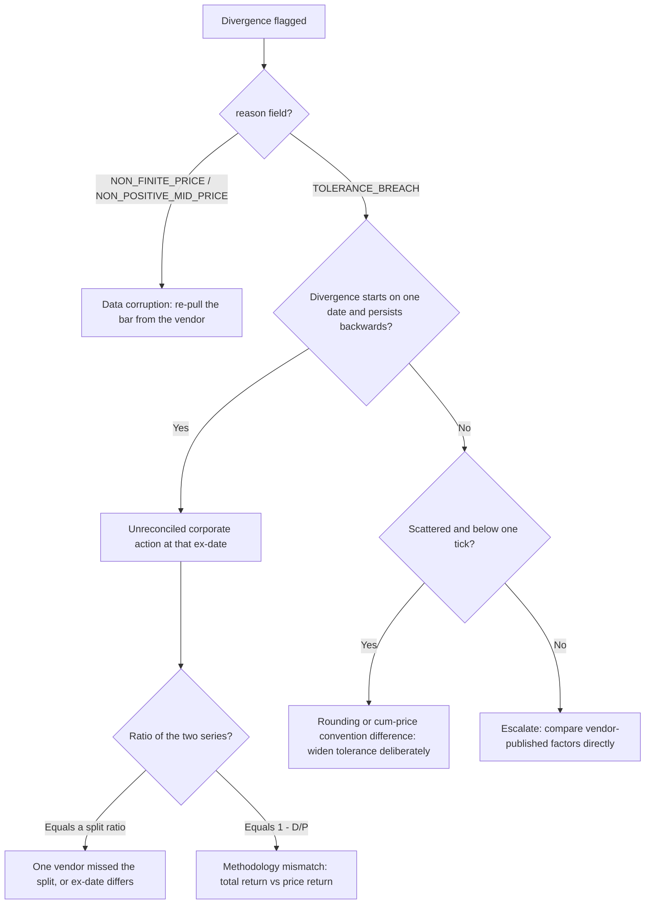

# Institutional Vendor Corporate Action Adjustment Workflows

## Workflow 1: Historical Price Adjustment & Factor Calculation Pipeline

Note the two independent cumulative products. `F_price` accumulates every applicable action;
`F_share` accumulates only actions that change shares outstanding, and it alone drives volume.

---

## Workflow 2: Cross-Vendor Adjustment Reconciliation Pipeline

---

## Workflow 3: Triaging a Divergence

