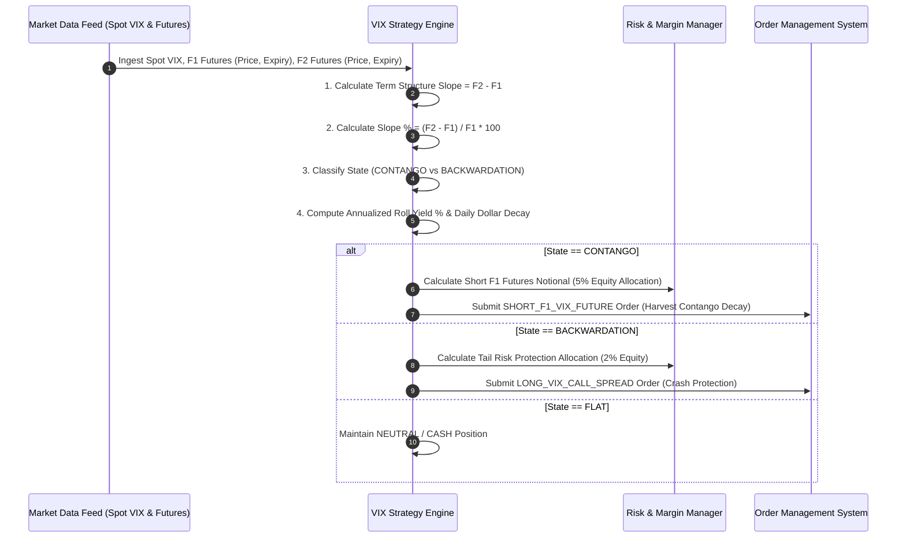

# Institutional VIX & Volatility Derivative Workflows

## Workflow 1: VIX Term Structure Analysis & Signal Generation


---

## Workflow 2: Monthly VIX Futures Roll Protocol
```mermaid
flowchart TD
    A[Monitor Active Front-Month VIX Future F1] --> B{Days to Expiration D_expiry <= 3 Days?}
    
    B -- No --> C[Maintain Active Position & Track Daily Roll Decay]
    B -- Yes --> D[Initiate Futures Calendar Roll Protocol]
    
    D --> E[Buy Back Short F1 Contract / Sell Long F1 Contract]
    E --> F[Establish New Position in F2 Contract (New Front-Month)]
    
    F --> G[Update Portfolio Position Registers & Reset Expiry Timers]
```