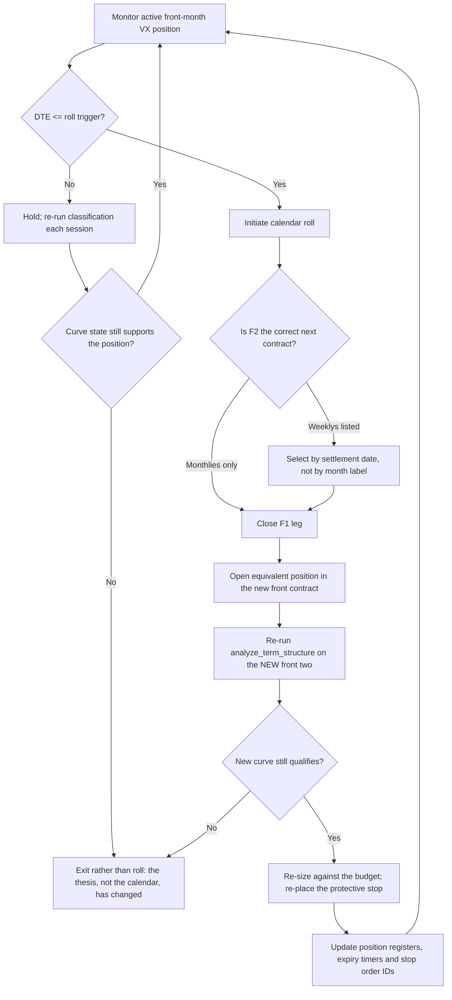
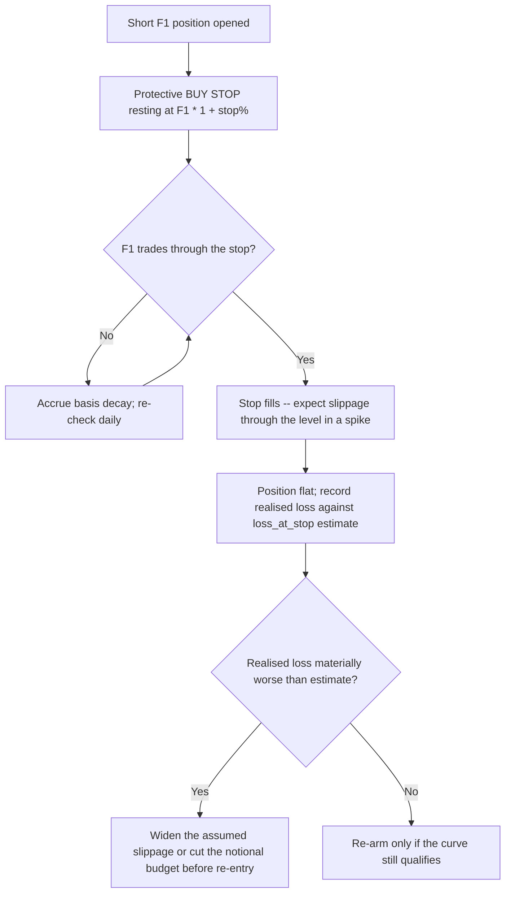

# VIX Derivative Operational Workflows

## Workflow 1: Curve classification, sizing and the refusal paths

The branches that produce **no position** matter as much as the ones that produce
a trade. A budget too small to fund one lot sizes to zero, and a tail hedge with no
priced spread sizes to zero — neither is rounded up or filled with an assumption.

```mermaid
sequenceDiagram
    autonumber
    participant Feed as Market Data (spot VIX, VX curve, option chain)
    participant Engine as VIXStrategyEngine
    participant Risk as Risk & Margin Manager
    participant OMS as Order Management System

    Feed->>Engine: spot VIX, F1 (price, expiry, DTE), F2 (price, expiry, DTE)
    Engine->>Engine: Validate: finite spot > 0, DTE >= 1, F2 expiry strictly after F1
    Note over Engine: Reversed contracts invert the slope sign and<br/>flip short vol into long vol -- raise, do not classify
    Engine->>Engine: slope = F2 - F1; slope% = slope / F1 * 100, rounded before compare
    Engine->>Engine: basis = F1 - spot; annualized basis = basis / spot * 365 / DTE

    alt slope% >= contango threshold
        Engine->>Engine: contracts = floor(equity * notional_budget% / (F1 * $1,000))
        alt contracts == 0
            Engine-->>Risk: NONE_INSUFFICIENT_CAPITAL -- budget below one lot, not rounded up
        else contracts >= 1
            Engine->>Engine: stop price = F1 * (1 + stop%); loss_at_stop = (stop - F1) * $1,000 * N
            Engine->>Risk: notional exposure, daily carry, stop price, loss at stop
            Risk->>Risk: Compare loss_at_stop against daily carry and the drawdown limit
            Risk->>OMS: SHORT F1 + resting protective BUY STOP, entered together
        end
    else slope% <= backwardation threshold
        Engine->>Feed: Require per-strike IVs or an observed net debit
        alt no priced spread
            Engine-->>Risk: LONG_VIX_CALL_SPREAD_PENDING_QUOTE -- premium unknown, size nothing
        else priced spread
            Engine->>Engine: debit = C(K1, iv1) - C(K2, iv2) via Black-76 off F1
            Engine->>Engine: max profit = (width - debit) * $100; max loss = debit * $100
            Engine->>Engine: contracts = floor(equity * premium_budget% / (debit * $100))
            Engine->>Risk: premium outlay, protection net of premium, breakeven SOQ
            Risk->>OMS: LONG VIX CALL SPREAD (K1/K2)
        end
    else
        Engine->>Risk: NEUTRAL / CASH -- slope inside the dead band
    end
```

---

## Workflow 2: Monthly VX roll, ahead of the SOQ auction

The roll deadline is set by the loss of a continuous two-sided market, not by the
settlement date itself. VX settles to the SOQ of the constituent SPX options at the
special opening auction; a position carried into that morning is marked to an
auction print rather than to a quote.



**Why the roll re-runs the classifier.** Rolling is not a neutral operation: the
new front contract has a different price, a different basis and a different slope
against the contract behind it. A roll that carries the old contract count forward
carries a position sized for a curve that no longer exists, and leaves the old
stop attached to a contract that is gone.

---

## Workflow 3: Short-volatility stop discipline



**The stop is on F1, not on spot.** F1 prices the expected VIX at settlement rather
than today's level, so in a spike it moves proportionally less than spot. A
"+30% on spot VIX" rule and a "+30% on F1" rule are different triggers, and only
the second can rest as an order against the contract actually held.

**A stop is not a loss bound.** In a volatility spike the market gaps through
resting levels; `loss_at_stop_usd` is the loss at a clean fill and understates the
loss at a real one. Size so that a stop filled several points late is still
survivable, and put the position behind an out-of-band control —
`kill-switch-and-drawdown-circuit-breakers`.
