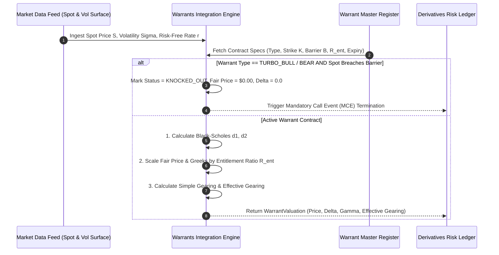

# Institutional Warrants & Structured Product Workflows

## Workflow 1: Warrant Valuation & Greeks Calculation Pipeline


---

## Workflow 2: Market Maker Delta-Neutral Rebalancing Pipeline
```mermaid
flowchart TD
    A[Monitor Active Warrant Position] --> B[Fetch Latest Spot Price & Compute Warrant Delta]
    
    B --> C[Calculate Required Underlying Shares: N_warrants * Delta]
    C --> D[Calculate Net Rebalance: Required Shares - Currently Hedged Shares]
    
    D --> E{Abs(Net Rebalance) >= Threshold (1.0 Share)?}
    
    E -- No --> F[Maintain Current Hedge (Action: HOLD)]
    E -- Yes --> G{Net Rebalance > 0?}
    
    G -- Yes --> H[Submit BUY Order for Underlying Equity]
    G -- No --> I[Submit SELL Order for Underlying Equity]
    
    H --> J[Update Hedged Position Registers]
    I --> J
```