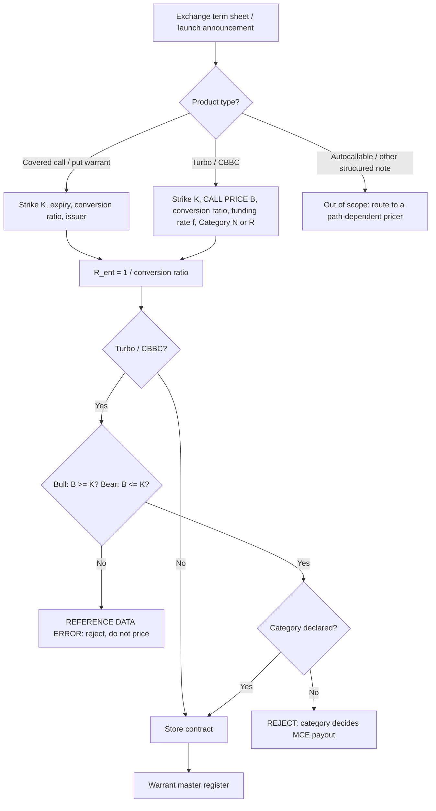
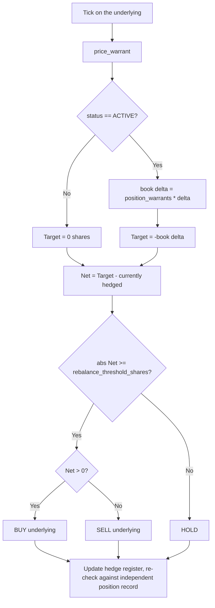

# Warrants & Structured Product Workflows

## Workflow 1: Term-sheet onboarding

The single highest-consequence step is the entitlement ratio inversion. Do it
once, at onboarding, and store the inverted value.



**Why the guards are hard failures, not warnings.** A bull CBBC whose call price
sits below its strike is not a tradable term sheet — it would let a live contract
price below zero intrinsic. A CBBC with no declared category cannot have its MCE
payout computed at all, and defaulting to "pays nothing" or "pays residual" both
misstate a real recovery. Both raise `WarrantEngineError`.

---

## Workflow 2: Valuation and Greeks

```mermaid
sequenceDiagram
    autonumber
    participant Feed as Market data (spot, rates, vol)
    participant Reg as Warrant master register
    participant Eng as WarrantsIntegrationEngine
    participant Risk as Derivatives risk ledger

    Feed->>Eng: spot S, r, q, sigma, traded warrant price
    Reg->>Eng: contract (type, K, B, R_ent, f, category, days)

    Eng->>Eng: validate inputs (positive, finite, integer days, barrier invariant)

    alt Turbo/CBBC AND spot has breached the call price
        Eng->>Eng: status = KNOCKED_OUT, delta = 0, gamma = 0
        Eng->>Eng: residual = Cat R ? max(0, S - K) * R_ent : 0   [PROVISIONAL]
        Eng-->>Risk: Mandatory Call Event -- unwind hedge, await settlement fixing
    else days_to_expiry <= 0
        Eng->>Eng: status = EXPIRED, price = intrinsic, all Greeks 0
        Eng-->>Risk: settlement event, not a pricing event
    else Turbo/CBBC, live
        Eng->>Eng: price = R_ent * [intrinsic + K * f * n/365], delta = +/- R_ent
        Eng->>Eng: gamma = vega = 0 (delta-one convention)
        Eng-->>Risk: valuation + distance to call price
    else Covered warrant, live
        Eng->>Eng: d1, d2 with (r - q); price and Greeks scaled by R_ent
        Eng->>Eng: theta uses N(d2) for calls, +rKe^-rT N(-d2) for puts
        Eng->>Eng: gearing on market_price when supplied, else fair price
        Eng-->>Risk: valuation + simple / effective gearing
    end
```

**Model selection is recorded, not inferred.** Every valuation carries
`pricing_model` (`BLACK_SCHOLES_MERTON`, `CBBC_INTRINSIC_PLUS_FUNDING`, or
`TERMINATED`) so a mark can be audited back to the model that produced it.

**Order of the terminal checks matters.** The MCE check runs *before* the expiry
check: a CBBC can be called on its last trading day, and the call — not expiry —
determines what the holder receives.

---

## Workflow 3: Market-maker delta-neutral rebalancing



**Signing.** `position_warrants` is signed — positive long, negative issued. The
target is the *negation* of the book's delta exposure. An issuer short 1,000,000
bull CBBCs at $R_{\text{ent}} = 0.1$ carries a book delta of $-100{,}000$ shares
and hedges **long** 100,000 shares. A retail-style book long the same line hedges
**short**. The engine cannot detect a sign error; it will produce a plausible
instruction that doubles the exposure.

**Threshold.** The default of `1.0` share exists so the engine has a defined
behaviour, not because one share is a sensible trading threshold. Set it to the
underlying's board lot. Too small and the engine churns commission on noise; too
large and delta drift accumulates between rebalances.

**On a Mandatory Call Event the hedge unwind is the whole hedge, at once.** There
is no glide path: the warrant's delta is zero from the tick that touched the call
price. A partial unwind leaves an outright position, and for a bull CBBC that
position is long equity into a falling market — the exact scenario the barrier
existed to terminate.

---

## Workflow 4: MCE settlement reconciliation

```mermaid
sequenceDiagram
    autonumber
    participant Eng as Engine
    participant Desk as Hedging desk
    participant Ex as Exchange / issuer

    Eng->>Desk: MCE triggered at tick S_trigger; PROVISIONAL residual
    Desk->>Desk: unwind 100% of the underlying hedge immediately
    Note over Desk: Do NOT book the provisional residual as a receivable

    Ex->>Ex: MCE valuation period -- calling session + following session
    Ex-->>Desk: settlement price S_settle (bull: the LOWEST price of that window)

    Desk->>Eng: mandatory_call_residual_value(contract, S_settle)
    Eng-->>Desk: Cat R: max(0, S_settle - K) * R_ent;  Cat N: 0
    Desk->>Desk: book the settled residual; reconcile against the provisional
```

The provisional figure computed at the trigger tick is a **ceiling**: the
exchange fixes a bull contract on the lowest underlying price of the valuation
window, which cannot exceed the triggering price. Category N contracts recover
nothing regardless of where the underlying settles, because their call price
equals their strike and there is no buffer between them.

---

## Workflow 5: What this pipeline does not cover

| Gap | Why it is out of scope | Where to go |
| :--- | :--- | :--- |
| CBBC convexity near the call price | The delta-one convention has $\Gamma = \text{Vega} = 0$ by construction | Barrier-option model; monitor distance-to-call |
| Volatility smile / term structure on covered warrants | Single flat $\sigma$ | `options-implied-volatility-surface-construction` |
| Early exercise on American-style warrants | European exercise only | `american-vs-european-style-option-exercise-handling`, `early-exercise-assignment-risk-management` |
| Issuer default | Non-collateralised structured products are unsecured issuer obligations | `counterparty-credit-risk-for-otc-derivatives` |
| Dilutive corporate warrants | Share-count adjustment not modelled | Out of scope for this skill |
| Autocallables and path-dependent notes | Require observation schedules and a barrier model | Raises `WarrantEngineError` by design |
| Multi-currency books | The engine never converts currency | `multi-currency-pnl-and-fx-conversion` |
