# US Wash Sale Tracking — Technical Workflows

## Workflow 1: Single chronological pass over one symbol's ledger

The pass is deliberately single-phase. A disallowed loss raises the replacement
lot's basis under § 1091(d), and if those shares are sold later in the same
ledger, that raised basis is the basis of the later sale. Computing realized P&L
from unadjusted basis and adding the disallowance back afterwards reports the
deferral twice.

```mermaid
flowchart TD
    A[Sort symbol trades by trade_date, stable] --> B{Next execution}

    B -->|BUY| C[Open lot at purchase price]
    C --> C2[Split off any slices already assigned<br/>a pending 1091&#40;d&#41; adjustment from an<br/>earlier loss and set their basis]
    C2 --> B

    B -->|SELL| D[Deplete open lots FIFO<br/>using each lot's ADJUSTED basis]
    D --> E{Sell fully matched?}
    E -->|No| F[raise WashSaleError:<br/>short sale &#40;1091&#40;e&#41;&#41; or incomplete ledger]
    E -->|Yes| G[Accumulate proceeds &#40;Box 1d&#41;<br/>and adjusted basis &#40;Box 1e&#41;]

    G --> H{Any slice sold below its basis?}
    H -->|No| B
    H -->|Yes, in FIFO lot order| I[Scan acquisitions in acquisition order<br/>Treas. Reg. 1.1091-1&#40;c&#41;]

    I --> J{Candidate is not the origin lot<br/>AND within +/-30 days<br/>AND has unused capacity?}
    J -->|No| I
    J -->|Yes| K{Acquired before this sell?}

    K -->|Yes| L[Cap capacity at the quantity<br/>STILL HELD after this sell]
    K -->|No| M[Queue a pending adjustment<br/>for that future acquisition]

    L --> N[Split the open lot and add<br/>loss-per-share to the matched shares]
    M --> O[Record WashSaleMatch,<br/>decrement replacement capacity]
    N --> O
    O --> P{Loss slice fully absorbed?}
    P -->|No| I
    P -->|Yes| B

    B -->|Ledger exhausted| Q[Box 1g = sum of disallowed;<br/>Net = 1d - 1e + 1g;<br/>Deferred = adjustment still in open lots]
```

### Why each guard exists

| Guard | Authority | Failure it prevents |
| :--- | :--- | :--- |
| Deplete FIFO using the lot's **adjusted** basis | § 1091(d) | Double counting the deferral when the replacement lot is sold later in the same period. |
| Candidate is not the origin acquisition | Shares retained from one acquisition were not bought to replace shares sold from it | Phantom wash sale on a partial sale of a single lot. |
| Pre-existing acquisitions capped at the quantity **still held after** the sell | Shares this sell disposed of are not stock acquired to replace the loss | Phantom disallowance when a multi-lot position is fully liquidated and never repurchased. |
| Capacity decremented and never reused | Treas. Reg. § 1.1091-1(e) | One replacement lot absorbing two different losses. |
| Losses processed in disposition order, replacements in acquisition order | Treas. Reg. § 1.1091-1(b), (c) | Non-deterministic and non-conforming matching. |
| Unmatched sell raises | § 1091(e) is not modelled | Silently understating realized P&L and Box 1g. |

---

## Workflow 2: Year-end reporting and reconciliation

```mermaid
flowchart TD
    A[Start year-end US tax reporting] --> B[Scope: ONE account, ONE security identifier]
    B --> C[Load executions from<br/>Dec 1 prior year through Jan 31 following year<br/>so both sides of the 61-day window are present]

    C --> D[evaluate_wash_sales_for_symbol per symbol]
    D --> E[Box 1d = total_proceeds_usd<br/>Box 1e = total_cost_basis_usd &#40;adjusted&#41;<br/>Box 1g = total_disallowed_wash_loss_usd]
    E --> F[Net taxable = 1d - 1e + 1g]

    F --> G[Emit Form 8949 rows:<br/>code W in column &#40;f&#41;,<br/>disallowed loss positive in column &#40;g&#41;]
    G --> H[Reconcile against the broker's 1099-B]

    H --> I{Difference?}
    I -->|Broker higher| J[Investigate: engine missed a replacement,<br/>or the ledger is incomplete]
    I -->|Engine higher| K[Expected if the caller mapped<br/>substantially identical instruments<br/>to one symbol]
    I -->|None| L[Sign off]

    L --> M[Carry deferred_loss_in_open_lots_usd<br/>into next year's opening basis]
    M --> N[Separately assess exposure the engine cannot see:<br/>other accounts, spouse accounts, IRA &#40;Rev. Rul. 2008-5&#41;,<br/>options and contracts &#40;Treas. Reg. 1.1091-1&#40;f&#41;&#41;]
```

### Loading window

Evaluating a calendar year in isolation is wrong in both directions:

- A **December** loss can be washed by a **January** purchase in the next year.
- A **January** loss can be washed by a **December** purchase in the prior year.

Load from 30 days before the period start to 30 days after the period end, then
report only the dispositions that fall inside the period.

---

## Workflow 3: Worked example — chained wash sale

| Date | Action | Effect |
| :--- | :--- | :--- |
| Jan 1 | Buy 100 @ $50 | Lot B1, basis $50 |
| Jan 10 | Sell 100 @ $40 | Realized −$1,000 against basis $50 |
| Jan 15 | Buy 100 @ $42 | Inside the window: $1,000 disallowed; lot B2 basis becomes $52 |
| Mar 1 | Sell 100 @ $45 | Realized (45 − 52) × 100 = −$700; no acquisition within ±30 days |

Result: Box 1d $8,500, Box 1e $10,200, Box 1g $1,000, net taxable −$700,
deferred loss in open lots $0. The economic loss is $700 and the whole of it is
deductible, because nothing is held at the end. An engine that computes P&L from
unadjusted basis reports −$1,700 + $1,000 = **+$300**, a sign flip on a $1,000
error.

## Workflow 4: Worked example — full liquidation is not a wash sale

| Date | Action |
| :--- | :--- |
| Jan 1 | Buy 100 @ $50 |
| Jan 5 | Buy 100 @ $50 |
| Jan 10 | Sell all 200 @ $40, never repurchase |

Both acquisitions fall inside the other's 61-day window, but neither is
replacement stock: every share was disposed of by the sale. Box 1g is $0 and the
full −$2,000 is deductible. An engine that only excludes the origin lot reports
$2,000 disallowed and a net of $0.
