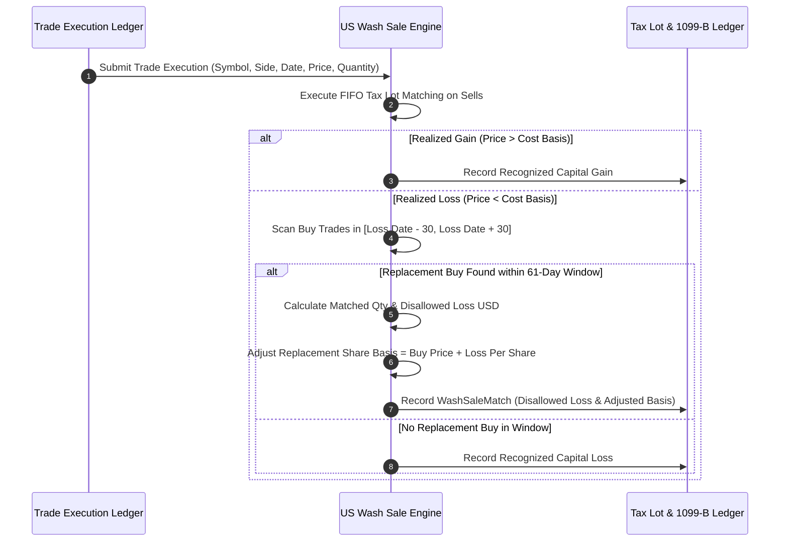

# Institutional US IRS Wash Sale Tax Workflows

## Workflow 1: Realized Loss Identification & 61-Day Window Matching Pipeline


---

## Workflow 2: Form 1099-B Year-End Tax Summary Generation
```mermaid
flowchart TD
    A[Initiate Year-End US Tax Reporting] --> B[Fetch All Symbol Trade Executions for Tax Year]
    
    B --> C[Execute evaluate_wash_sales_for_symbol() per Symbol]
    C --> D[Sum Gross Realized PnL & Total Disallowed Wash Losses]
    
    D --> E[Calculate Net Allowed Taxable PnL = Gross PnL + Disallowed Losses]
    E --> F[Generate IRS Form 1099-B Disclosure Records]
    
    F --> G[Populate Box 1d Proceeds, Box 1e Cost Basis, Box 1g Wash Sale Disallowed]
    G --> H[Export Audit Ledger for IRS Tax Submission]
```
